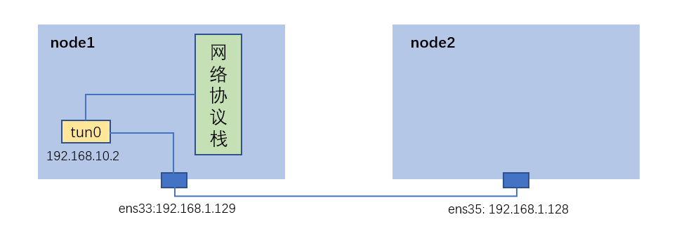

## DPDK+TUN 将报文交付内核协议栈处理

## 实验环境搭建

其中，node1与node2为wmware workstation16上安装的ubuntu20的虚拟机。
网卡配置如上图所示。

## 实验目标
node2可以ping通node1的TUN网卡。
node2可以与node1绑定TUN网卡的应用通过tcp进行通信。

## 初始代码如下
[ dpdk源码 ](dpdk_sourcecode.md)
其中注意，tun是三层虚拟网卡，接受的与发送的是完整的ip数据报文。
dpdk从网卡获取的是完整的mac报文，接收并发到tun必须将mac的头部去掉，同样从tun中读取并从网卡发送时，需要将mac头部加上。

## 测试调试与分析

### node2 ping node1不通
node2 ping node1的192.168.10.2 ip
1. node2 进行tcpdump抓包，未发现从ens35发送的icmp报文。
    查看node2的ip route，发现缺少发往192.168.10.0/24的路由
    添加路由：`sudo ip route add 192.168.10.0/24 via 192.168.1.129`
    查看node2的ip neigh：
    
    发现发往192.168.1.129的arp表项失效了，手动更新新的表项：
    ```
    sudo ip neigh del 192.168.1.129 dev ens35
    sudo ip neigh add 192.168.1.129 dev ens35 lladdr 00:0C:29:4A:36:96
    ```
    目前路由表与arp表项均已经正常。
    
    

2. node2 进行tcpdump抓包，发现从ens35发送的icmp报文只有request报文。
    查看dpdk程序输出，发现只有receive报文，没有send报文。
    
    用tcpdump对node1的tun0进行抓包，发现仅有icmp request报文
    
    此时说明，dpdk从网卡中获取到了icmp报文，通过write写入到了tun0设备。
    查找tun0的路由表，发现没有到192.168.1.0/24的路由表。
    添加路由表项：`sudo ip route add 192.168.1.0/24 dev tun0`
    为了方便，在`int create_tun_device(const char *dev_name)`添加如下代码，避免每一次运行dpdk程序都要重复添加路由表。
    `system("sudo ip route add 192.168.1.0/24 dev tun0");`

3. 此时发现node1 tun0发送了icmp reply报文
    
    但是reply报文时连续接收的。
    查看node2 ping的输出，发现延迟、丢包均非常严重
    
    node1 dpdk的程序输出显示，连续地接收了若干报文后，也连续地发送了若干报文。中间间隔时间非常大。
    上述现象说明，dpdk的while循环时执行了的，但是执行速度过慢。
    通过在while中加入计时器，发现一次循环cpu运行时间只有不到0.00001秒。但是每次循环实际时间大概3-5分钟。猜测执行到某些函数，dpdk主动放弃了运行，进入了等待状态，
    此时进一步猜测write、read为阻塞操作。
    为此，将dpdk接收、发送数据包从原来地一个while循环中，分别拆分到两个函数中。
    ```cpp
    rte_eal_remote_launch((lcore_function_t *)receive_packets, &args, 3);
    rte_eal_remote_launch((lcore_function_t *)send_packets, &args, 4);
    ```
    此时经过编译与运行，ping输出正常！
    
    在node1与node2进行tcp测试，结果正常
    

    终版源码如下
    [ dpdk源码 ](dpdk_sourcecode2.md)


