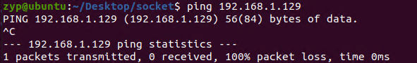

在转发功能实现的基础上，实现arp协议。
这样即可不用手动配置邻居的arp表项。

## 环境准备
拓扑以及环境要求如实验1所示
首先删除原本client1与client2上arp表项
删除后效果如下：
client1:

client2:


## 一、实现源码
主要源码如下：
```c
#define MY_IP_ADDR2 0xC0A80281  // 192.168.2.129, in hex form
#define MY_IP_ADDR1 0xC0A80181  // 192.168.1.129, in hex form
#define MY_MAC_ADDR2 {0x00,0x0C,0x29,0x4A,0x36,0xAA}
#define MY_MAC_ADDR1 {0x00,0x0C,0x29,0x4A,0x36,0x96}

// 构造 ARP 回复
void send_arp_reply(struct rte_mbuf *pkt, struct rte_arp_hdr *arp_req, uint16_t port_id, struct rte_ring **ring_buf) {
    struct rte_ether_hdr *eth_hdr = rte_pktmbuf_mtod(pkt, struct rte_ether_hdr *);

    // 交换源和目的 MAC 地址
    struct rte_ether_addr my_mac;
    if (port_id == 0) {
    // 使用 MY_MAC_ADDR1 作为 MAC 地址
        static const uint8_t mac1[6] = MY_MAC_ADDR1;
        rte_memcpy(&my_mac.addr_bytes, mac1, RTE_ETHER_ADDR_LEN);
    } else {
        // 使用 MY_MAC_ADDR2 作为 MAC 地址
        static const uint8_t mac2[6] = MY_MAC_ADDR2;
        rte_memcpy(&my_mac.addr_bytes, mac2, RTE_ETHER_ADDR_LEN);
    }
    rte_ether_addr_copy(&eth_hdr->src_addr, &eth_hdr->dst_addr);  // 请求者的 MAC 变为目的 MAC
    rte_ether_addr_copy(&my_mac, &eth_hdr->src_addr);  // 自己的 MAC 变为源 MAC

    // 获取 ARP 头部
    struct rte_arp_hdr *arp_resp = (struct rte_arp_hdr *)(eth_hdr + 1);
    // 填写 ARP 响应内容
    arp_resp->arp_opcode = rte_cpu_to_be_16(RTE_ARP_OP_REPLY);  // 设置为 ARP 响应
    rte_ether_addr_copy(&my_mac, &arp_resp->arp_data.arp_sha);  // 自己的 MAC 地址作为发送方
    arp_resp->arp_data.arp_sip = arp_req->arp_data.arp_tip;  // 发送方 IP 设置为请求的目的 IP
    rte_ether_addr_copy(&eth_hdr->dst_addr, &arp_resp->arp_data.arp_tha);  // 请求者的 MAC 作为目标方
    arp_resp->arp_data.arp_tip = arp_req->arp_data.arp_sip;  // 目标 IP 设置为请求的源 IP

    // 发送 ARP 回复报文
    rte_ring_enqueue(ring_buf[port_id], pkt);
}

// 处理 ARP 请求
bool handle_arp_request(struct rte_mbuf *pkt, uint16_t port_id, struct rte_ring **ring_buf) {
    struct rte_ether_hdr *eth_hdr = rte_pktmbuf_mtod(pkt, struct rte_ether_hdr *);
    // 确认以太网类型为 ARP
    if (eth_hdr->ether_type == rte_cpu_to_be_16(RTE_ETHER_TYPE_ARP)) {
        struct rte_arp_hdr *arp_hdr = (struct rte_arp_hdr *)(eth_hdr + 1);
        // 确认是 ARP 请求
        if (rte_be_to_cpu_16(arp_hdr->arp_opcode) == RTE_ARP_OP_REQUEST) {
            uint32_t dst_ip = rte_be_to_cpu_32(arp_hdr->arp_data.arp_tip);
            // 检查请求的目的 IP 是否匹配我们的 IP
            if (dst_ip == MY_IP_ADDR1 || dst_ip == MY_IP_ADDR2) {
                printf("Received ARP request for our IP. Sending reply.\n");
                send_arp_reply(pkt, arp_hdr, port_id, ring_buf);
                return true;
            }
        }
    }
    return false;
}
```

在l3fwd.c中，修改rx_process()如下
```c
static __rte_noreturn void rx_process()
{
    uint16_t port; // 端口 ID
    for (;;) {
        RTE_ETH_FOREACH_DEV(port) { // 遍历所有以太网设备
            ......
            for(int i=0; i<nb_rx; i++){
                bool flag =  handle_arp_request(bufs[i], port, ring_buf); 
                if( flag ){
                    continue;
                }
                l3fwd(bufs[i], port); 
            }      
        }
    }
}
```

## 二、测试
在client1处ping`192.168.1.129`:

发现ping不通，现象很正常，因为dpdk没有对icmp报文进行处理
此时，查看arp表项，即发现，arp表项已经生成：

此时说明上面的两个函数`handle_arp_request`以及`send_arp_reply`已经正常运行。
下面将实现dpdk的icmp报文回复功能。