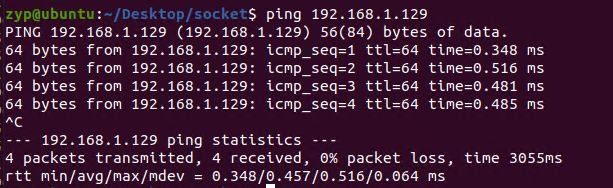

在转发功能实现的基础上，实现icmp回复功能。
在此情况下，client可以直接ping server ip可以直接ping通。

## 环境准备
拓扑以及环境要求如实验2，
此时arp已经生效，通过`ip neighbor show`可以看到server对应的ip以及mac地址。

而此时client 无法ping 通server。


## 代码
```c
uint16_t
icmp_checksum(const void *data, size_t len)
{
    const uint16_t *buf = data;
    uint32_t sum = 0;
    for (sum = 0; len > 1; len -= 2) {
        sum += *buf++;
    }
    if (len == 1) {
        sum += *(const uint8_t *)buf;
    }
    sum = (sum >> 16) + (sum & 0xFFFF);
    sum += (sum >> 16);
    return ~sum;
}


bool handle_icmp(struct rte_mbuf *pkt, uint16_t port, struct rte_ring **ring_buf){
    struct rte_ether_hdr *eth_hdr = rte_pktmbuf_mtod(pkt, struct rte_ether_hdr *);
    // 解析以太网类型字段
    uint16_t ether_type = rte_be_to_cpu_16(eth_hdr->ether_type);
    // 判断是否为 ARP 报文
    if (ether_type == RTE_ETHER_TYPE_IPV4) {
        struct rte_ipv4_hdr *ipv4_hdr;
        ipv4_hdr = (struct rte_ipv4_hdr *)(eth_hdr + 1);
        if (ipv4_hdr->next_proto_id == IPPROTO_ICMP) {
            printf("Packet Type: ICMP\n");
            struct rte_icmp_hdr *icmp_hdr;
            icmp_hdr = (struct rte_icmp_hdr *)(ipv4_hdr + 1);
            struct rte_ipv4_hdr *ipv4_hdr;
            ipv4_hdr = (struct rte_ipv4_hdr *)(eth_hdr + 1);
            char dst_ip[INET_ADDRSTRLEN];
            inet_ntop(AF_INET, &ipv4_hdr->dst_addr, dst_ip, sizeof(dst_ip));
            const char *target_ip1 = "192.168.1.129";
            const char *target_ip2 = "192.168.2.129";
            if( strcmp(dst_ip, target_ip1) == 0 || strcmp(dst_ip, target_ip2) == 0 ){
                struct rte_icmp_hdr *icmp_hdr;
                icmp_hdr = (struct rte_icmp_hdr *)(ipv4_hdr + 1);
                if (icmp_hdr->icmp_type == RTE_IP_ICMP_ECHO_REQUEST){
                    // 修改 ICMP 报文为回显应答
                    icmp_hdr->icmp_type = RTE_IP_ICMP_ECHO_REPLY;
                    icmp_hdr->icmp_cksum = 0;
                    icmp_hdr->icmp_cksum = icmp_checksum(icmp_hdr, pkt->data_len - sizeof(struct rte_ipv4_hdr) - sizeof(struct rte_ether_hdr));
                    // 交换源 MAC 和目的 MAC
                    struct rte_ether_addr tmp_mac;
                    rte_ether_addr_copy(&eth_hdr->src_addr, &tmp_mac);
                    rte_ether_addr_copy(&eth_hdr->dst_addr, &eth_hdr->src_addr);
                    rte_ether_addr_copy(&tmp_mac, &eth_hdr->dst_addr);
                    // 交换源 IP 和目的 IP
                    uint32_t tmp_ip = ipv4_hdr->src_addr;
                    ipv4_hdr->src_addr = ipv4_hdr->dst_addr;
                    ipv4_hdr->dst_addr = tmp_ip;
                    // 更新 IP 头部的校验和
                    ipv4_hdr->hdr_checksum = 0;
                    ipv4_hdr->hdr_checksum = rte_ipv4_cksum(ipv4_hdr);

                    rte_ring_enqueue(ring_buf[port], pkt); 
                    return true;
                }
            }
        } 
    }
    return false;
} 
```

将其添加到`rx_process()`中如下：
```c
static __rte_noreturn void rx_process()
{
    uint16_t port; // 端口 ID
    for (;;) {
        RTE_ETH_FOREACH_DEV(port) { // 遍历所有以太网设备
            ......
            for(int i=0; i<nb_rx; i++){
                bool flag = handle_icmp(bufs[i], port, ring_buf);
                if( flag ){
                    // rte_pktmbuf_free(bufs[i]);
                    continue;
                }
                flag = handle_arp_request(bufs[i], port, ring_buf); 
                if( flag ){
                    // rte_pktmbuf_free(bufs[i]);
                    continue;
                }
                l3fwd(bufs[i], port); 
            }      
        }
    }
}
```
针对发往本地的icmp报文，dpdk生成回复报文并发送回去。

## 测试
此时client1 ping `192.168.1.129`可以看到server端的回复

