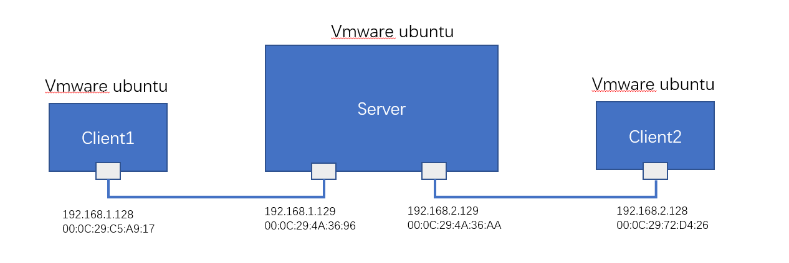
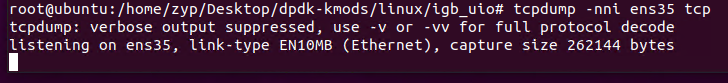
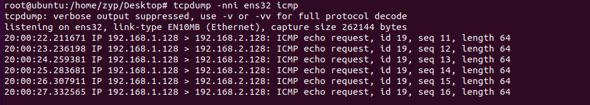
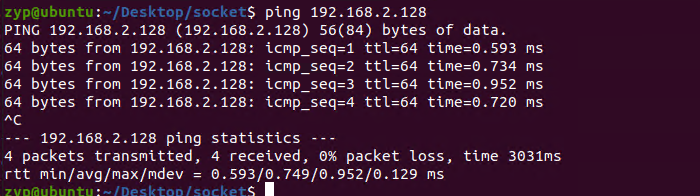

系统环境
操作系统: Win11
虚拟机软件：VMware Workstation 16
虚拟机系统：Ubuntu20.04，CPU个数8，内存8G，网卡个数 3
要安装的 DPDK 版本：22.11

## 一、实验环境搭建

拓扑关系如上图所示，Server端实现简单的转发操作，即将根据目的ip，将数据包原封不动地转发出去。最终实现的效果：client1可以ping通client2.
其中，转发表`endpoinet.db`设置如下：
```
192.168.1.128 0
192.168.2.128 1
```

## 二、在client添加路由表项并测试
client1：
```
ip route add 192.168.2.0/24 via 192.168.1.129
```
client2:
```
ip route add 192.168.1.0/24 via 192.168.2.129
```
此时client1 ping client2是ping不通的。
通过tcpdump抓包发现，client1的端口并没有将`icmp`报文发送出去。

通过排查发现client1并没有arp表项
将arp表项添加进client1，和client2
client1:
```
ip neighbor add 192.168.1.129 dev ens35 lladdr 00:0C:29:4A:36:96
```
client2:
```
ip neighbor add 192.168.2.129 dev ens32 lladdr 00:0C:29:4A:36:AA
```
此时client1 ping client2 下一跳的mac为与之相连的server的mac，client2同理。
验证client1 ping client2 经过测试发现依然不通。
此时进行抓包，发现client1的网卡已经将icmp报文发送出去了，但是没有收到回复报文。
由于server端的两个网卡已经被dpdk接管，无法在server端网卡进行抓包。
在client2端进行抓包发现client2收到了icmp请求报文，但是并未回复。

此时，将client的允许转发打开、允许ping回复打开，均未产生回复。
## 三、最后一步
经过排查，client2收到icmp请求报文后，由于client1发送的请求报文经过server端的直接转发，mac地址并未进行处理，目的mac地址为server的mac地址。在转发到client2时，被直接丢弃并未进入协议栈处理。此时修改client1与client2的arp表项
client1:
```
ip neighbor add 192.168.1.129 dev ens35 lladdr 00:0C:29:72:D4:26
```
client2:
```
ip neighbor add 192.168.2.129 dev ens32 lladdr 00:0C:29:C5:A9:17
```
之后进行ping测试，发现即可ping通。
