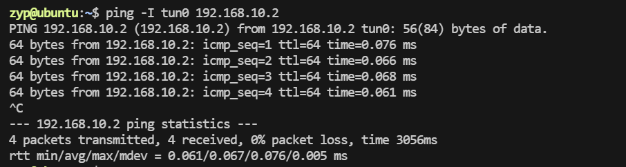
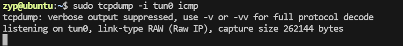
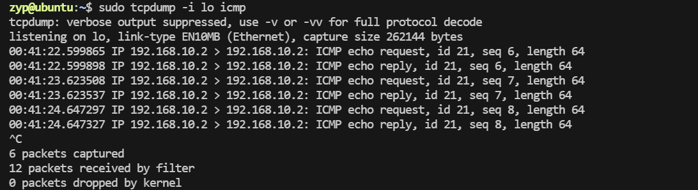
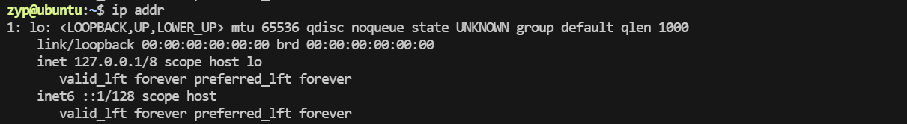
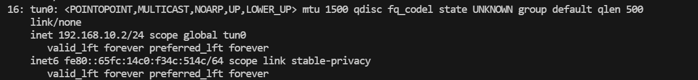
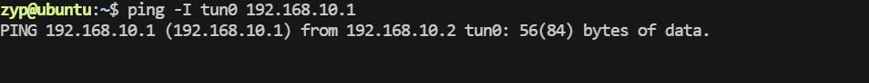
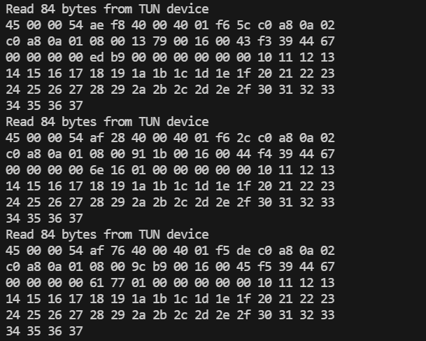
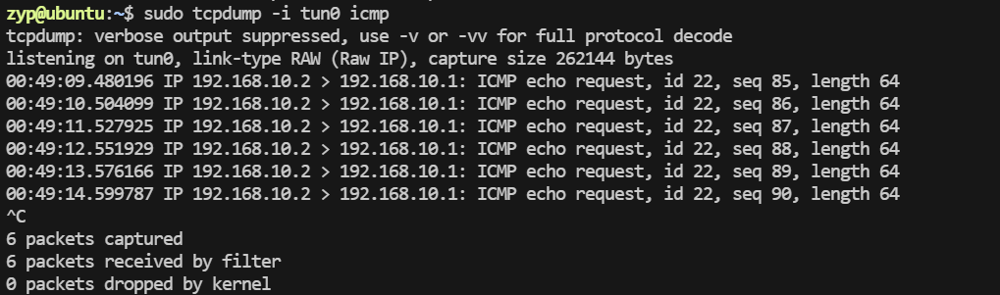

要实现一套使用 TUN 设备的程序，通常的目标是通过 TUN 设备传递 IP 数据包，可以实现例如简单的 VPN 隧道或数据包转发系统。下面将演示一个简单的程序，它会创建一个 TUN 设备，读取通过该设备的 IP 数据包并将其转发到其他地方（例如简单的打印或转发）。

### **步骤概述**
1. 创建 TUN 设备并配置。
2. 读取数据包。
3. 处理数据包（比如打印，或者进行转发）。
4. 写入数据包（如果需要）。

### **1. 环境准备**

确保你的 Linux 系统已经启用了 TUN 设备，并且有足够的权限来创建虚拟网卡设备。可以使用以下命令检查：
```bash
ls /dev/net/tun
```

如果没有找到 `/dev/net/tun`，需要启用 TUN 模块：
```bash
sudo modprobe tun
```

确保网络转发功能启用（如果需要转发数据包）：
```bash
sudo sysctl -w net.ipv4.ip_forward=1
```

### **2. 创建 TUN 设备的程序**

以下是一个简单的 C 语言程序，使用 TUN 设备读取和写入 IP 数据包。

#### **代码实现**

```c
#include <stdio.h>
#include <stdlib.h>
#include <string.h>
#include <unistd.h>
#include <fcntl.h>
#include <sys/ioctl.h>
#include <sys/socket.h>
#include <netinet/in.h>
#include <net/if.h>
#include <linux/if_tun.h>

#define MAX_BUF 1500

// 函数：创建 TUN 设备
int tun_alloc(const char *dev) {
    struct ifreq ifr;
    int fd, err;

    // 打开 /dev/net/tun 设备
    if ((fd = open("/dev/net/tun", O_RDWR)) < 0) {
        perror("Opening TUN device failed");
        return fd;
    }

    memset(&ifr, 0, sizeof(ifr));

    // 设置设备名
    ifr.ifr_flags = IFF_TUN | IFF_NO_PI;  // 设置为 TUN 模式，Iff_NO_PI 防止添加协议标识符
    strncpy(ifr.ifr_name, dev, IFNAMSIZ);

    // 创建 TUN 设备
    if ((err = ioctl(fd, TUNSETIFF, &ifr)) < 0) {
        perror("ioctl TUNSETIFF failed");
        close(fd);
        return err;
    }

    printf("TUN device %s created\n", dev);
    return fd;
}

// 主程序：读取和写入数据包
int main() {
    char dev[] = "tun0";  // TUN 设备名称
    char buffer[MAX_BUF];
    int fd, nread;

    // 创建 TUN 设备
    fd = tun_alloc(dev);
    if (fd < 0) {
        exit(1);
    }

    // 配置 IP 地址（手动配置，假设 tun0 被配置为 192.168.10.2/24）
    system("sudo ip addr add 192.168.10.2/24 dev tun0");
    system("sudo ip link set tun0 up");

    // 进入数据包读取和处理循环
    while (1) {
        // 读取数据包（通过 TUN 设备接收到的 IP 数据包）
        nread = read(fd, buffer, MAX_BUF);
        if (nread < 0) {
            perror("Reading from TUN device failed");
            close(fd);
            exit(1);
        }

        printf("Read %d bytes from TUN device\n", nread);

        // 这里可以对数据包进行处理
        // 例如打印原始数据
        for (int i = 0; i < nread; i++) {
            printf("%02x ", (unsigned char)buffer[i]);
            if ((i + 1) % 16 == 0) {
                printf("\n");
            }
        }
        printf("\n");

        // 如果你想将数据包转发出去，可以在这里做，例如发送到另一个网络接口
        // 例如可以使用 sendto() 或者 write() 将数据包发送到其他地方
        // 这里只是一个简单的示例，表示接收到数据后可以进行一些处理。
    }

    // 关闭 TUN 设备
    close(fd);
    return 0;
}
```

#### **程序功能说明**
1. **创建 TUN 设备**：通过 `tun_alloc()` 函数创建一个虚拟的 TUN 设备 `tun0`。这个设备将工作在 L3 层（即 IP 层），我们可以读取和写入 IP 数据包。
2. **读取数据包**：程序进入一个无限循环，调用 `read()` 从 TUN 设备读取数据包。读取的数据是原始的 IP 数据包（没有链路层头部）。
3. **打印数据**：读取到的数据包会被打印出来（以十六进制的格式），你可以在这里处理数据包，例如转发或者解析。
4. **配置 IP 地址**：使用 `system()` 调用手动配置 TUN 设备的 IP 地址，并使设备启动。
5. **写入数据**：虽然示例中没有做数据包的写入操作，但如果需要可以通过 `write()` 将处理后的数据包写回到 TUN 设备或其他地方。

### **3. 编译程序**

保存代码为 `tun_example.c`，并使用以下命令进行编译：

```bash
gcc tun_example.c -o tun_example
```

### **4. 运行程序**

运行程序之前，确保你具有管理员权限（需要创建 TUN 设备和配置 IP 地址）。使用以下命令运行：

```bash
sudo ./tun_example
```

### **5. 测试程序**

你可以用 `ping` 命令测试 TUN 设备的连通性。假设你配置了 `tun0` 的 IP 地址为 `192.168.10.2`，你可以尝试 ping 启动该设备的主机：

```bash
ping 192.168.10.2
```

## 测试结果分析

ping测试结果

此时tun_example没有任何输出，意味着tun0没有捕获任何ip报文。但是又能ping通！

此时用tcpdump抓包tun0，没有任何输出：

而用tcpdump抓包lo端口，竟然可以抓到icmp报文

此时ip配置、路由表项均正常。




### 原因分析

出现这种情况的原因是 **ICMP 请求和应答数据包直接被本机的网络栈处理了**，并没有通过 `tun0` 设备流转。这种行为源于 Linux 网络栈对本地流量的特殊处理机制。以下是详细原因和原理：

---

### **为什么流量在 lo 接口捕获到**

#### 形象的类比
**正常的网络流量** ：
想象你把一封信交给邮递员（网卡），邮递员把信送到目标地址，再收到回信。这个过程需要邮递员参与，代表数据真正通过网卡传输。

**本地通信的优化** ：
如果你发信的目标地址其实就是你自己，邮递员会说：“你这不是折腾我吗？信件直接给我，我自己在家转交给你不就行了吗？”于是信件从“发送方”直接转给“接收方”，根本没经过邮递员。这就是内核的本地通信优化。

通俗来说，Linux 的网络栈设计就是多个网卡（无论是物理的还是虚拟的）共用一个网络协议栈。具体来说，内核会根据目标 IP 地址和路由表判断数据包应该通过哪个网卡发送或处理，但它不会为每个网卡都单独维护一套网络协议栈。


1. **本地通信的优化机制**：
   - 当在本地发起 `ping 192.168.10.2` 时，ICMP 数据包的目标地址是本机的一个 IP 地址（`192.168.10.2`）。
   - 内核会判断这个 IP 地址属于本机的某个接口（即 `tun0`），于是直接将请求送入网络栈处理，而不实际发送到 `tun0` 设备。
   - 因此，ICMP 请求和应答都在内核中完成，数据只在 `lo`（回环接口）中流转，而不会通过 `tun0`。

2. **路由规则的影响**：
   - 虽然路由表指示 `192.168.10.0/24` 网段的流量应该走 `tun0`，但对于属于本机的 IP 地址（`192.168.10.2`），Linux 网络栈会优先处理为本地流量，而不经过实际的接口。

3. **回环接口（lo）的作用**：
   - 本地地址之间的通信（即发送给本机的流量）会通过回环接口（`lo`）完成。
   - 因此，你会在 `lo` 上捕获到 ICMP 请求和应答，而不会经过 `tun0`。

---

### **为什么 `tun_example` 没有输出**

`tun_example` 的逻辑是监听和处理通过 `tun0` 的数据包。如果数据包直接被内核处理为本地流量，它就不会经过 `tun0`，所以 `tun_example` 无法捕获这些数据包。

---

### **解决方法**

如果你希望这些流量经过 `tun0`，而不是直接被内核处理，你可以尝试以下方法：

#### 1. **ping 对端地址**
   - 如果你发起 `ping` 的目标地址是 `192.168.10.1`（一个不属于本机的地址，但在 `tun0` 网段内），流量会通过 `tun0` 设备。
   - 此时，`tun_example` 会捕获这些数据包，因为它们必须通过 `tun0` 发送和接收。

#### 2. **禁用本地地址优化**
   - 通过一些配置，可以强制内核将本地地址的数据包也通过 `tun0`。例如：
     ```bash
     sysctl -w net.ipv4.conf.all.rp_filter=0
     sysctl -w net.ipv4.conf.tun0.rp_filter=0
     ```
     但这可能会对网络栈的正常行为产生一定影响，需谨慎操作。

#### 3. **使用源地址和设备绑定**
   - 发起 `ping` 时显式绑定源地址和设备：
     ```bash
     ping -I tun0 192.168.10.2
     ```
     这样可以强制流量经过 `tun0`，从而被 `tun_example` 捕获。

#### 4. **在用户空间模拟发送本地流量**
   - 使用专门的测试工具模拟跨设备的流量，避免本地流量的内核优化。例如，通过 `socat` 或 `netcat` 发送自定义的 IP 包。

### 测试
1. 发起 `ping` 的目标地址是 `192.168.10.1`

此时ping不通，应该是路由表将其转发至了tun0
查看 `tun_example` 确实捕获了相关报文：

此时用tcpdump捕获tun0端口的报文，也可以捕获icmp报文。

