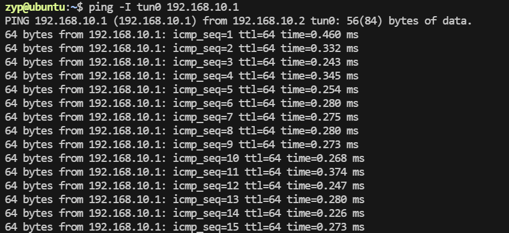
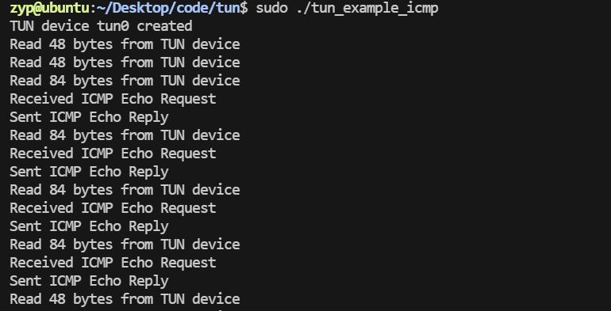
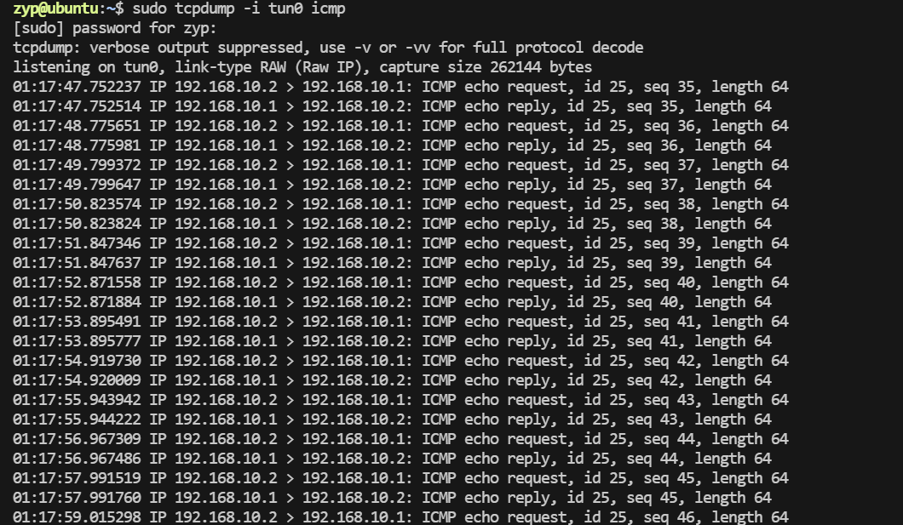

基于上面的 `tun_example` 程序，可以扩展功能实现以下步骤：

1. **判断报文类型**：
   - 解析接收到的数据包的协议头（IP 头部），判断是否是 ICMP 报文。
   
2. **处理 ICMP 请求**：
   - 如果是 ICMP 请求报文，解析其类型字段，确认是否是 `echo request`（类型值为 `8`）。
   - 构造一个 ICMP 响应报文（类型值为 `0`），并将其发送回去。

3. **发送回复**：
   - 使用写回 `TUN` 设备的方式，将构造好的响应报文发送出去。

---

以下是实现的代码示例：

```c
#include <stdio.h>
#include <stdlib.h>
#include <string.h>
#include <fcntl.h>
#include <unistd.h>
#include <sys/ioctl.h>
#include <linux/if.h>
#include <linux/if_tun.h>
#include <arpa/inet.h>

#define BUF_SIZE 1500

// IP Header
struct ip_header {
    unsigned char version_ihl;    // Version and header length
    unsigned char tos;            // Type of service
    unsigned short total_length;  // Total length
    unsigned short id;            // Identification
    unsigned short flags_offset;  // Flags and fragment offset
    unsigned char ttl;            // Time to live
    unsigned char protocol;       // Protocol
    unsigned short checksum;      // Header checksum
    unsigned int src_addr;        // Source address
    unsigned int dst_addr;        // Destination address
};

// ICMP Header
struct icmp_header {
    unsigned char type;           // ICMP type
    unsigned char code;           // ICMP code
    unsigned short checksum;      // ICMP checksum
    unsigned short id;            // Identifier
    unsigned short sequence;      // Sequence number
};

// Checksum calculation
unsigned short calculate_checksum(unsigned short *buf, int len) {
    unsigned long sum = 0;
    while (len > 1) {
        sum += *buf++;
        len -= 2;
    }
    if (len) {
        sum += *(unsigned char *)buf;
    }
    sum = (sum >> 16) + (sum & 0xffff);
    sum += (sum >> 16);
    return ~sum;
}

// TUN device allocation
int tun_alloc(char *dev) {
    struct ifreq ifr;
    int fd = open("/dev/net/tun", O_RDWR);
    if (fd < 0) {
        perror("Opening /dev/net/tun");
        return fd;
    }
    memset(&ifr, 0, sizeof(ifr));
    ifr.ifr_flags = IFF_TUN | IFF_NO_PI; // Configure as TUN device
    if (*dev) {
        strncpy(ifr.ifr_name, dev, IFNAMSIZ);
    }
    if (ioctl(fd, TUNSETIFF, (void *)&ifr) < 0) {
        perror("ioctl(TUNSETIFF)");
        close(fd);
        return -1;
    }
    strcpy(dev, ifr.ifr_name);
    return fd;
}

int main() {
    char tun_name[IFNAMSIZ] = "tun0";
    char buffer[BUF_SIZE];
    int nread;

    int tun_fd = tun_alloc(tun_name);
    if (tun_fd < 0) {
        exit(1);
    }
    printf("TUN device %s created\n", tun_name);
    
    // 配置 IP 地址（手动配置，假设 tun0 被配置为 192.168.10.2/24）
    system("sudo ip addr add 192.168.10.2/24 dev tun0");
    system("sudo ip link set tun0 up");

    while (1) {
        nread = read(tun_fd, buffer, BUF_SIZE);
        if (nread < 0) {
            perror("Reading from TUN device");
            close(tun_fd);
            return 1;
        }

        printf("Read %d bytes from TUN device\n", nread);

        struct ip_header *ip = (struct ip_header *)buffer;
        if ((ip->version_ihl >> 4) != 4) {
            continue; // Not an IPv4 packet
        }

        if (ip->protocol != 1) {
            continue; // Not an ICMP packet
        }

        struct icmp_header *icmp = (struct icmp_header *)(buffer + ((ip->version_ihl & 0x0F) * 4));
        if (icmp->type == 8) { // ICMP Echo Request
            printf("Received ICMP Echo Request\n");

            // Swap source and destination IP
            unsigned int temp_addr = ip->src_addr;
            ip->src_addr = ip->dst_addr;
            ip->dst_addr = temp_addr;

            // Modify ICMP header for Echo Reply
            icmp->type = 0; // Echo Reply
            icmp->checksum = 0;
            icmp->checksum = calculate_checksum((unsigned short *)icmp, nread - ((ip->version_ihl & 0x0F) * 4));

            // Write the modified packet back to the TUN device
            if (write(tun_fd, buffer, nread) < 0) {
                perror("Writing to TUN device");
                close(tun_fd);
                return 1;
            }

            printf("Sent ICMP Echo Reply\n");
        }
    }

    close(tun_fd);
    return 0;
}
```

---

### **实现细节解释**

1. **读取数据包**：
   - 从 `TUN` 设备读取数据包到缓冲区。

2. **解析 IP 和 ICMP 头部**：
   - 检查数据包是否是 IPv4 (`version == 4`) 且协议类型是 ICMP (`protocol == 1`)。
   - 确认 ICMP 的类型是否为 `Echo Request` (`type == 8`)。

3. **构造响应包**：
   - 交换源地址和目标地址。
   - 修改 ICMP 类型为 `Echo Reply` (`type == 0`)。
   - 重新计算 ICMP 校验和。

4. **发送响应包**：
   - 使用 `write` 函数将响应包写回 `TUN` 设备，内核网络栈会负责后续处理。

---

### **运行效果**

1. 程序运行后监听 `TUN` 设备流量。
2. 如果检测到 ICMP 请求，程序会打印日志并自动回复 ICMP 响应。
3. 使用 `ping` 测试：
   ```bash
   ping -I tun0 192.168.10.1
   ```
   程序会捕获 `ping` 请求并自动回复，表现为正常的 `ping` 成功。



此时tun_example正常输出


tcpdump输出正常
