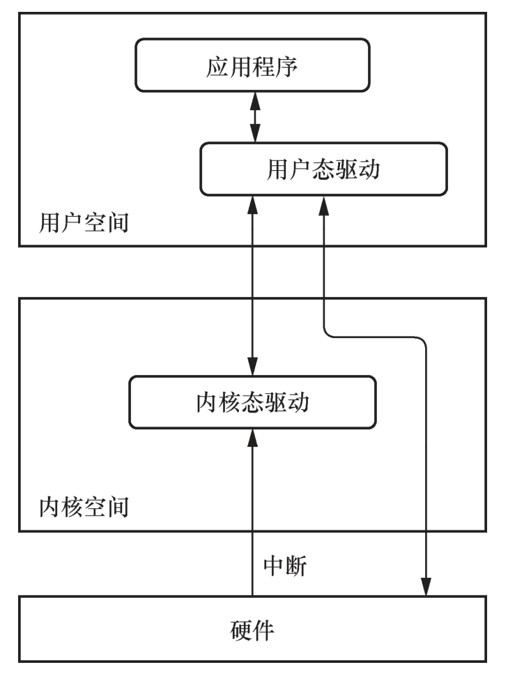
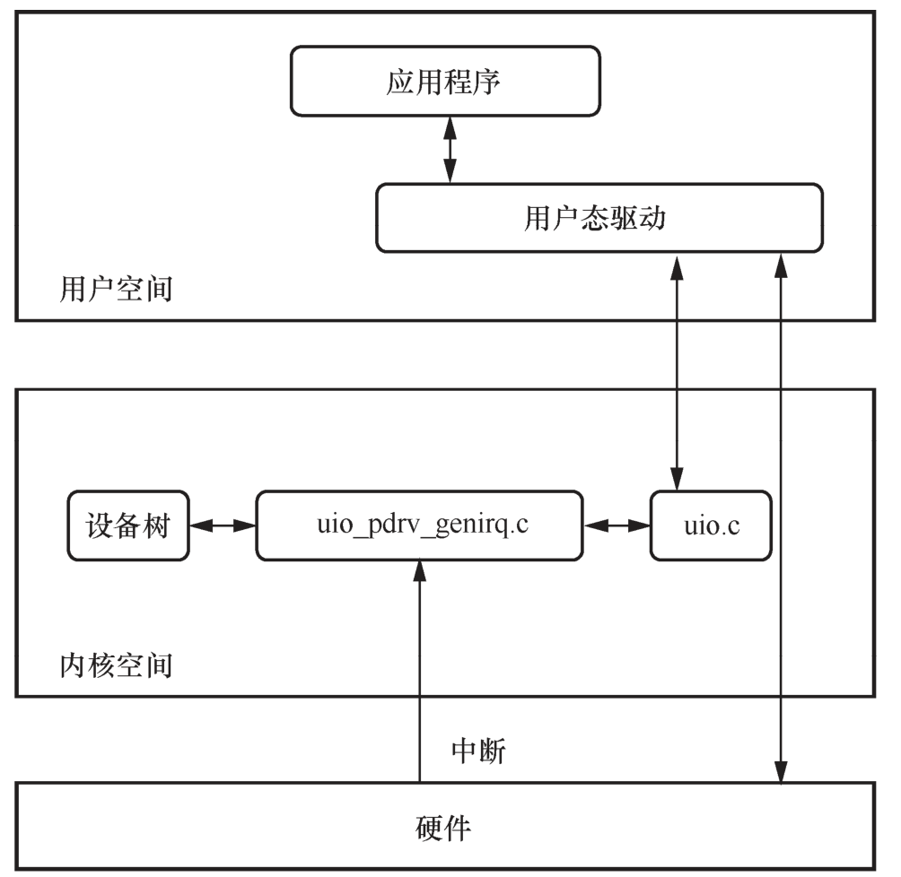
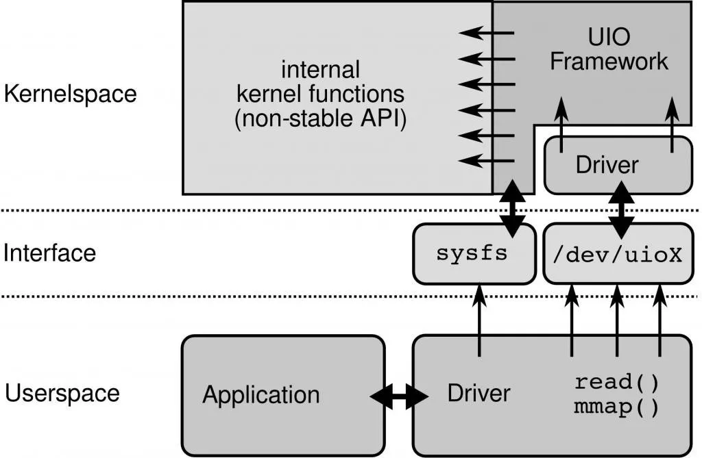
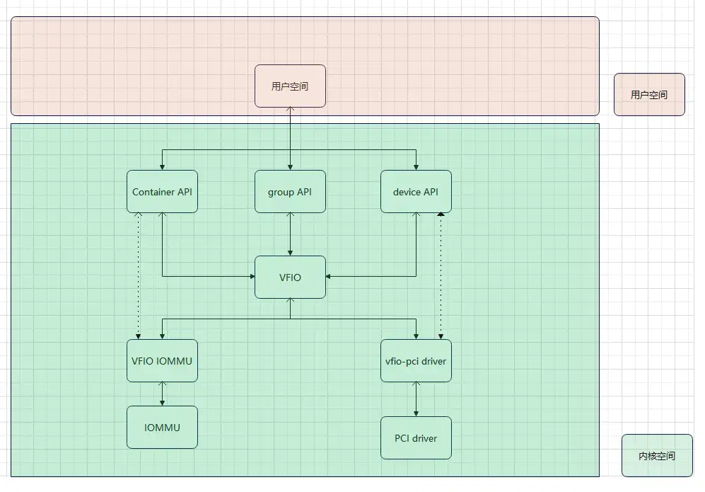

## 一、UIO
### 1. **什么是 UIO？**
**UIO**（User-space I/O，用户态 I/O）是一种机制，它允许用户空间程序直接访问硬件设备，而不需要完全依赖于内核态的驱动程序。通过 UIO，硬件设备的中断处理仍然可以在内核态进行，而数据处理则可以在用户空间进行。这种机制可以简化驱动程序的开发，并提高数据处理的效率，尤其是在高性能应用场景下，如 DPDK。
### 2. **UIO 的实现原理**

在传统的设备驱动模型中，所有与硬件设备交互的操作必须通过内核态的设备驱动来完成，用户空间程序需要通过系统调用与设备驱动交互。这种方式虽然安全，但有较大的性能开销，特别是对于频繁的 I/O 操作和低延迟的场景，如网络数据包的处理。
**UIO 的实现原理** 可以概括为：内核态的驱动只负责管理设备的中断和资源映射，具体的 I/O 操作由用户空间程序完成。这样，用户空间程序可以直接访问设备的寄存器和内存，从而减少内核态和用户态之间的上下文切换，提升性能。
UIO 机制主要涉及以下几个方面：
1. **设备的内存映射**：通过 UIO，设备的寄存器和内存区域可以直接映射到用户空间。用户空间程序通过内存映射（`mmap`）访问设备的寄存器和内存，实现高速的 I/O 操作。
2. **中断处理**：虽然数据传输在用户空间进行，但设备的中断处理仍然由内核驱动完成。UIO 内核模块会捕获设备中断，并将其通知用户空间程序。用户空间程序可以通过文件描述符（`fd`）来等待中断事件。
3. **sysfs 和文件接口**：通过 `sysfs`，UIO 设备的信息（如设备的内存区域、中断信息等）可以暴露给用户空间程序，用户空间程序通过标准的文件 I/O 接口与设备交互。
### 3. **UIO 主要组成部分**


1. **UIO 内核驱动模块**：UIO 内核模块提供了对设备内存的映射和中断管理，它将设备的中断、设备寄存器等资源映射到用户空间。
2. **用户空间应用**：用户空间的程序通过 `open()`、`read()`、`write()` 和 `mmap()` 等标准的系统调用来访问设备的寄存器、内存区域，并等待中断。
3. **sysfs 文件系统**：UIO 驱动通过 `sysfs` 暴露设备信息，如设备的内存映射区域、中断号等，用户空间程序可以通过读取这些信息来获取设备的资源。
### 4. **UIO 的基本工作流程**
UIO 的典型工作流程如下：
1. **设备初始化**：设备被内核探测到后，UIO 内核驱动（例如 `uio_pci_generic`）将设备的寄存器和内存区域映射到用户空间，并管理设备的中断。
2. **用户空间程序访问设备**：
   - 用户空间程序通过 `open()` 打开 UIO 设备文件（例如 `/dev/uio0`）。
   - 使用 `mmap()` 将设备的寄存器和内存区域映射到用户空间，用户程序通过该映射区域直接访问硬件。
   - 通过 `read()` 等操作监听设备的中断事件。
3. **中断处理**：当设备发生中断时，UIO 内核驱动捕获到中断，并通知用户空间程序。用户程序可以通过 `poll()` 或 `read()` 等操作来获取中断信号，然后根据中断做进一步的处理。
### 5. **UIO 用法示例**
以下是一个使用 UIO 机制的简单示例：
#### 1. **加载 UIO 驱动**
要使用 UIO，首先需要加载内核的 UIO 驱动模块。例如，对于 PCI 设备，常用的驱动是 `uio_pci_generic`。
```bash
sudo modprobe uio_pci_generic
```
#### 2. **绑定设备到 UIO**
假设你有一个 PCI 设备，你可以通过 `uio_pci_generic` 将该设备绑定到 UIO 驱动。以下命令将指定的 PCI 设备绑定到 UIO 驱动：
```bash
echo "8086 100e" > /sys/bus/pci/drivers/uio_pci_generic/new_id
```
`8086` 是厂商 ID，`100e` 是设备 ID。
#### 3. **访问设备资源**
设备绑定成功后，系统会在 `/dev/` 下创建一个相应的 UIO 设备节点，如 `/dev/uio0`。
用户空间程序可以通过以下方式访问设备的资源：
- **打开设备**：
```c
int fd = open("/dev/uio0", O_RDWR);
if (fd < 0) {
    perror("Cannot open /dev/uio0");
    return -1;
}
```
- **映射设备寄存器**：

```c
void *bar0 = mmap(NULL, size, PROT_READ | PROT_WRITE, MAP_SHARED, fd, 0);
if (bar0 == MAP_FAILED) {
    perror("mmap failed");
    return -1;
}
```
通过 `mmap()`，设备的寄存器被映射到用户空间，程序可以直接访问设备寄存器。
- **处理中断**：
```c
uint32_t interrupt_count;
read(fd, &interrupt_count, sizeof(interrupt_count));
```
通过 `read()`，程序可以等待设备的中断信号。
#### 4. **释放资源**
使用完设备后，关闭文件描述符并解除映射：
```c
munmap(bar0, size);
close(fd);
```
### 6. **UIO 的优缺点**
#### 优点：
1. **简化驱动开发**：UIO 让开发者无需编写复杂的内核驱动程序，可以将大部分设备控制逻辑放在用户空间实现，降低了开发难度。
2. **提升性能**：通过 `mmap()` 将设备寄存器直接映射到用户空间，减少了用户态与内核态的上下文切换，提高了 I/O 操作的性能。
3. **减少内核模块复杂性**：内核只负责设备的中断和内存映射，逻辑处理移到了用户空间，使得内核态部分更加简洁，用户态部分更灵活。
#### 缺点：
1. **安全性问题**：由于设备寄存器直接暴露给用户空间，用户程序可能错误地操作硬件寄存器，导致系统不稳定。因此，UIO 适合于对系统熟悉并对安全性有一定控制的场景。
2. **实时性要求**：中断处理尽管由内核接管，但如果对实时性有严格要求，UIO 的用户空间中断处理可能无法满足极高的实时性需求。

## 二、VFIO

### 1. 什么是 VFIO？
**VFIO**（Virtual Function I/O）是一种用户空间驱动框架，允许用户态程序安全、直接地访问 PCIe 设备。VFIO 通过内核提供设备的内存映射、中断处理和 DMA（Direct Memory Access）管理，将设备的控制权交给用户空间应用程序，而不会牺牲安全性。VFIO 主要用于虚拟化环境（例如 QEMU/ KVM）以及高性能 I/O 应用场景（如 DPDK），它通过 IOMMU 提供设备隔离和内存管理，使得用户态程序可以安全地访问硬件设备。
### 2. 为什么需要 VFIO？
在传统的 I/O 设备驱动中，设备通常是由内核管理，用户空间程序通过系统调用与设备驱动交互。这种方式性能较低，尤其是在高性能场景下，比如网络设备的大规模数据传输。UIO 提供了一种用户空间访问设备的方法，但它的安全性和功能较弱，无法满足复杂场景下的需求，例如硬件设备共享、隔离等。而 VFIO 解决了这些问题，提供了更高的安全性和灵活性。
VFIO 的关键特性包括：
1. **设备的用户态控制**：将设备控制权交给用户空间程序，实现直接、高效的硬件访问。
2. **IOMMU 支持**：通过 IOMMU（Input-Output Memory Management Unit）实现设备的内存隔离，防止错误的内存访问，提高系统安全性。
3. **设备隔离和多用户支持**：允许多个虚拟机或用户安全地共享和访问同一物理设备，而不会产生资源冲突。
4. **中断管理**：支持硬件中断管理，提供高效的中断处理机制。
### 3. VFIO 实现原理
VFIO 的实现基于以下几项核心技术和机制：
1. **IOMMU 支持**：
   - IOMMU 是一种硬件支持的内存管理单元，它能够将设备访问的物理地址映射到实际的物理内存。VFIO 使用 IOMMU 来隔离设备访问的内存，防止用户空间程序错误地访问系统的其他内存区域。
   - VFIO 为每个设备分配一个独立的 IOMMU 上下文，确保设备只能访问合法的内存区域，保证了安全性。
2. **设备映射**：
   - VFIO 将 PCIe 设备的寄存器、内存等资源映射到用户空间，通过 `mmap` 机制，用户态程序可以直接访问设备的寄存器和内存，从而高效地进行设备控制和数据处理。
3. **中断管理**：
   - VFIO 支持硬件中断，设备的中断可以通过内核传递到用户空间。用户空间程序可以通过 `poll()` 或 `epoll()` 等机制等待设备中断，并在中断到达时做出相应的处理。
   - VFIO 还支持 MSI（Message Signaled Interrupts）和 MSI-X 中断机制，提供高效的中断管理能力。
4. **安全性和隔离性**：
   - VFIO 的设计初衷是提供用户态的设备访问，同时确保系统的安全性。通过 IOMMU 和设备隔离机制，VFIO 允许多个用户或虚拟机共享设备，而不会发生资源竞争或内存冲突。
5. **DMA 支持**：
   - VFIO 通过 IOMMU 管理 DMA，用户态程序可以通过 VFIO 实现安全、高效的 DMA 操作，确保 DMA 不会越界访问系统的其他内存。
### 4. VFIO 的主要组件
1. **vfio_pci 内核模块**：
   - `vfio_pci` 是 VFIO 用于管理 PCI 设备的内核模块，它负责将设备资源暴露给用户空间程序。用户态程序通过它可以控制和操作 PCI 设备。
2. **/dev/vfio 文件系统**：
   - VFIO 设备通过 `/dev/vfio` 文件系统暴露给用户空间。每个 PCI 设备会映射到 `/dev/vfio` 下的一个文件，用户空间程序通过文件操作（如 `open()`、`mmap()` 等）来与设备交互。
3. **IOMMU 和 DMA 管理**：
   - IOMMU 管理设备的内存映射，确保设备只能访问用户态程序分配的内存区域，防止恶意或错误的 DMA 访问。
4. **中断处理**：
   - VFIO 支持 PCI 设备的中断处理。用户空间程序可以通过 `poll()` 等系统调用等待设备中断。
### 5. VFIO 的使用方法
#### 1. **加载 VFIO 内核模块**
要使用 VFIO，首先需要加载相关的内核模块，包括 `vfio` 和 `vfio_pci`：
```bash
sudo modprobe vfio
sudo modprobe vfio_pci
```
#### 2. **设备绑定到 VFIO 驱动**
要使用 VFIO 操作 PCI 设备，首先需要将设备绑定到 `vfio_pci` 驱动。可以通过以下命令绑定设备：
1. 查找设备的 PCI 地址：
   ```bash
   lspci -nn
   ```
2. 绑定设备到 `vfio_pci` 驱动：
   ```bash
   sudo echo "0000:00:1f.2" > /sys/bus/pci/devices/0000:00:1f.2/driver/unbind
   sudo echo "8086 10fb" > /sys/bus/pci/drivers/vfio-pci/new_id
   ```
其中 `0000:00:1f.2` 是设备的 PCI 地址，`8086 10fb` 是设备的厂商 ID 和设备 ID。
#### 3. **通过 `/dev/vfio` 访问设备**
设备绑定成功后，系统会在 `/dev/vfio/` 下创建相应的设备文件，例如 `/dev/vfio/0`。用户空间程序可以通过这个设备文件来访问 PCI 设备的资源。
```c
int fd = open("/dev/vfio/0", O_RDWR);
if (fd < 0) {
    perror("Failed to open VFIO device");
    return -1;
}
```
#### 4. **内存映射**
设备的 BAR（Base Address Register）区域可以通过 `mmap()` 映射到用户空间，从而实现直接访问设备的寄存器。
```c
void *bar0 = mmap(NULL, size, PROT_READ | PROT_WRITE, MAP_SHARED, fd, 0);
if (bar0 == MAP_FAILED) {
    perror("mmap failed");
    return -1;
}
```
#### 5. **处理中断**
VFIO 支持设备的中断处理，用户程序可以通过 `poll()` 或 `select()` 等机制等待设备中断。
```c
struct pollfd pfd = {fd, POLLIN};
poll(&pfd, 1, -1);  // 等待中断
```
当设备中断发生时，`poll()` 会返回，用户程序可以进行相应的中断处理。
#### 6. **解除设备绑定**
使用完 VFIO 设备后，可以通过以下命令将设备解除绑定：
```bash
sudo echo "0000:00:1f.2" > /sys/bus/pci/drivers/vfio-pci/unbind
```
### 5. VFIO 的典型应用场景
1. **虚拟化（KVM/QEMU）**：
   - VFIO 在虚拟化场景中应用广泛。通过 VFIO，虚拟机（如 QEMU）可以将物理设备（如 PCIe 网卡或 GPU）直接分配给虚拟机中的用户空间程序，允许虚拟机以接近原生的性能访问硬件设备。
2. **高性能 I/O 应用（如 DPDK）**：
   - 在 DPDK 等高性能 I/O 应用中，VFIO 被用于将物理网卡绑定到用户空间驱动，以绕过内核网络栈，实现高效的用户态数据包处理。
3. **多用户设备共享**：
   - VFIO 支持通过 IOMMU 提供设备隔离和多用户共享，使得多个应用或虚拟机能够同时安全地访问同一个物理设备。
## 三、VFIO 与 UIO 的区别

|**特性**|**UIO**|**VFIO**|
|---|---|---|
|**安全性**|较低，没有设备隔离和内存保护|高，通过 IOMMU 实现设备隔离和内存保护|
|**IOMMU 支持**|不支持|支持，通过 IOMMU 实现设备的内存和 DMA 隔离|
|**中断处理**|简单的中断处理机制，性能有限|高效的中断处理，支持 MSI 和 MSI-X|
|**适用场景**|简单的硬件设备，开发和调试方便|高性能、高复杂度设备，适合虚拟化和高带宽设备|
|**设备隔离和共享**|不支持多个进程或用户共享设备|支持多用户、虚拟机设备隔离和共享|
|**硬件要求**|对硬件要求较低，几乎可以在任何硬件上使用|需要 IOMMU 支持的硬件（如 Intel VT-d、AMD-Vi）|
|**虚拟化支持**|支持有限，无法安全高效地用于虚拟化|广泛应用于虚拟化场景，支持虚拟机直接访问物理设备|
|**开发复杂性**|简单，适合快速开发|较为复杂，适合高性能和复杂的硬件设备|
|**性能**|性能有限，尤其在高性能场景下不适用|高性能，适用于网络、存储和 GPU 等高带宽、低延迟的设备|

- **UIO**：适合对安全性要求不高的简单设备驱动开发，开发成本低、实现简单，但在高性能场景下受限，缺乏设备隔离和内存保护，通常不适合虚拟化和复杂设备。
- **VFIO**：适合虚拟化和高性能场景，特别是在设备隔离、安全性和性能要求较高的环境中。它通过 IOMMU 实现设备的隔离和内存保护，提供高效的 DMA 和中断管理，但开发复杂度较高。