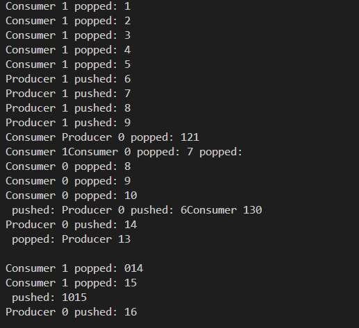

## 无锁环

### 什么是无锁环

无锁环（Lock-free ring）是一种在并发环境中实现高效访问的数据结构，常用于队列或缓冲区的实现。与传统的基于锁的同步方法不同，无锁环通过原子操作（如CAS—Compare and Swap）来保证多个线程可以同时安全地读写共享数据结构，而不需要使用互斥锁。

#### 原理
无锁环通常基于**环形缓冲区**（circular buffer）实现，利用**原子操作**来管理队列头部和尾部的更新。核心思想是使用原子操作来检查和修改队头和队尾指针，以保证并发操作的安全性。

- **队头和队尾指针**：多个线程可以并发地对队头和队尾进行读写操作，但每次操作前会通过CAS来确保更新是原子的，避免多个线程同时修改指针导致数据竞争。
- **环形缓冲区**：缓冲区采用环形结构，当队尾指针到达缓冲区的末端时，会自动绕回到起始位置。

#### 特点
- **高效**：避免了传统锁机制的上下文切换开销，能显著提升多线程环境中的性能。
- **无死锁**：由于没有使用锁，不会发生线程因等待锁而产生的死锁问题。
- **较为复杂**：实现比传统锁机制复杂，需要精细的内存管理和原子操作支持。

无锁环结构适用于要求高并发的场景，如高性能消息队列、缓冲区管理等。


### 无锁环实现

无锁环（Lock-free ring buffer）的读写流程是基于**原子操作**和**环形缓冲区**的设计，用于确保多个线程并发访问时，能够安全地读写数据而无需加锁。下面是无锁环的具体读写流程，涉及生产者和消费者线程的操作。

#### 1. **数据结构**
无锁环的核心数据结构通常包含以下几个元素：

- **缓冲区**：一个固定大小的数组，用于存储数据项。
- **队头指针**（`head`）：指向队列中即将被消费的元素位置。
- **队尾指针**（`tail`）：指向队列中下一个要写入的空位置。
- **最大容量**：环形缓冲区的最大容量，通常是2的幂次方，方便使用位运算进行快速模运算。

#### 2. **关键操作：原子操作**
无锁环的关键在于通过**原子操作**（如CAS，即Compare-and-Swap）来保证队头和队尾指针在多个线程间的安全更新，避免竞争条件。

- **CAS操作**：通过原子操作确保只有一个线程能够成功地更新队头或队尾指针。CAS操作会将内存中的某个值与期望值进行比较，如果相等则更新为新值，并返回操作是否成功。

#### 3. **生产者写入流程**
生产者线程负责将数据项写入环形缓冲区。

1. **检查队列是否满**：生产者首先需要检查缓冲区是否已满。一个简单的检查方法是：
   - `next_tail = (tail + 1) % capacity`
   - 如果`next_tail == head`，表示队列满，生产者需要等待或者重试。
   
2. **写入数据**：如果队列未满，生产者将数据写入缓冲区。
   - 生产者线程将数据放入`buffer[tail]`。
   
3. **更新队尾指针**：生产者使用CAS原子操作尝试更新`tail`指针。
   - CAS操作：`if tail == old_tail then update tail to new_tail`
   - 如果CAS成功，则更新队尾指针；否则，生产者需要重试，直到成功。

4. **环形结构**：如果队尾指针达到缓冲区末尾，队尾会绕回到缓冲区的起始位置，保持环形结构。

#### 4. **消费者读取流程**
消费者线程负责从环形缓冲区中读取数据。

1. **检查队列是否空**：消费者首先检查队列是否为空。
   - `if head == tail`，表示队列空，消费者需要等待或重试。

2. **读取数据**：如果队列不为空，消费者从`buffer[head]`读取数据。
   - 消费者线程获取并处理`buffer[head]`中的数据。

3. **更新队头指针**：消费者使用CAS原子操作尝试更新`head`指针。
   - CAS操作：`if head == old_head then update head to new_head`
   - 如果CAS成功，则更新队头指针；否则，消费者需要重试，直到成功。

4. **环形结构**：如果队头指针达到缓冲区末尾，队头会绕回到缓冲区的起始位置，保持环形结构。

#### 5. **无锁环的内存顺序问题**
为了确保多线程环境下的正确性，通常会使用**内存屏障**（Memory Barriers）来确保操作的顺序性，防止重排。具体来说：
- **生产者操作**：当生产者更新`tail`时，应该确保之前的数据写入缓冲区的操作在更新`tail`之前完成。
- **消费者操作**：当消费者更新`head`时，应该确保之前的数据读取操作在更新`head`之后完成。

这些内存顺序控制通常通过**原子操作**或**内存屏障**来实现，确保线程安全和数据一致性。

#### 6. **示意图**

假设有一个容量为5的环形缓冲区，初始时`head`和`tail`都指向位置0。

```
Index:   0   1   2   3   4
Buffer: [   ][   ][   ][   ][   ]  <- Initially empty.
Head:   -> 0
Tail:   -> 0
```

##### 生产者写入
1. 生产者将数据写入`buffer[tail]`。
2. 更新`tail`：`tail = (tail + 1) % 5`。
3. 重复直到队列满。

```
Index:   0   1   2   3   4
Buffer: [A  ][B  ][C  ][   ][   ]
Head:   -> 0
Tail:   -> 3
```

##### 消费者读取
1. 消费者读取`buffer[head]`的数据。
2. 更新`head`：`head = (head + 1) % 5`。
3. 重复直到队列空。

```
Index:   0   1   2   3   4
Buffer: [A  ][B  ][C  ][   ][   ]
Head:   -> 3
Tail:   -> 3
```

#### 7. **无锁环的优势与挑战**
#### 优势：
- **高效并发**：无需加锁，减少了线程竞争和上下文切换的开销。
- **实时性强**：因为没有锁的等待和阻塞，适合对延迟敏感的应用，如实时数据处理和高频交易系统。

#### 挑战：
- **实现复杂性**：需要精确控制原子操作和内存屏障，代码较为复杂。
- **适用场景限制**：适用于需要低延迟和高并发的场景，但不适合所有类型的应用，尤其是数据不规则或负载波动较大的情况。


### 示例

```cpp
#include <iostream>
#include <atomic>
#include <thread>
#include <vector>

template <typename T, size_t N>
class LockFreeRingBuffer {
public:
    LockFreeRingBuffer() {
        head.store(0);
        tail.store(0);
    }

    // 生产者：向环形缓冲区写数据
    bool push(const T& value) {
        size_t current_tail = tail.load(std::memory_order_relaxed);
        size_t next_tail = (current_tail + 1) % N;

        // 如果缓冲区已满，返回 false
        if (next_tail == head.load(std::memory_order_acquire)) {
            return false; // 缓冲区满
        }

        // 将数据写入缓冲区
        buffer[current_tail] = value;

        // 更新尾指针
        tail.store(next_tail, std::memory_order_release);

        return true;
    }

    // 消费者：从环形缓冲区读取数据
    bool pop(T& value) {
        size_t current_head = head.load(std::memory_order_relaxed);

        // 如果缓冲区为空，返回 false
        if (current_head == tail.load(std::memory_order_acquire)) {
            return false; // 缓冲区空
        }

        // 读取数据
        value = buffer[current_head];

        // 更新头指针
        head.store((current_head + 1) % N, std::memory_order_release);

        return true;
    }

private:
    std::atomic<size_t> head;  // 指向队列头部（消费者读取）
    std::atomic<size_t> tail;  // 指向队列尾部（生产者写入）
    T buffer[N];               // 环形缓冲区
};

// 测试无锁环形缓冲区
void producer(LockFreeRingBuffer<int, 10>& ring, int id) {
    for (int i = 0; i < 20; ++i) {
        while (!ring.push(i)) {
            // 如果环满，等待重试
            std::this_thread::yield();
        }
        std::cout << "Producer " << id << " pushed: " << i << std::endl;
    }
}

void consumer(LockFreeRingBuffer<int, 10>& ring, int id) {
    for (int i = 0; i < 20; ++i) {
        int value;
        while (!ring.pop(value)) {
            // 如果环空，等待重试
            std::this_thread::yield();
        }
        std::cout << "Consumer " << id << " popped: " << value << std::endl;
    }
}

int main() {
    LockFreeRingBuffer<int, 10> ring;

    // 创建多个生产者和消费者线程
    std::vector<std::thread> producers;
    std::vector<std::thread> consumers;

    for (int i = 0; i < 2; ++i) {
        producers.push_back(std::thread(producer, std::ref(ring), i));
        consumers.push_back(std::thread(consumer, std::ref(ring), i));
    }

    // 等待所有线程完成
    for (auto& t : producers) t.join();
    for (auto& t : consumers) t.join();

    return 0;
}

```

输出:


