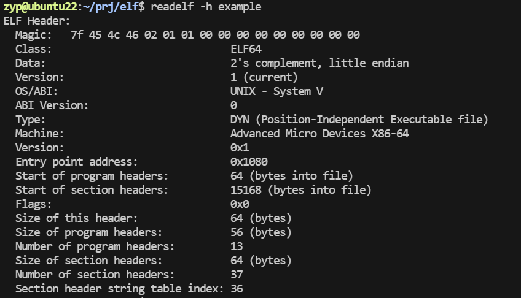
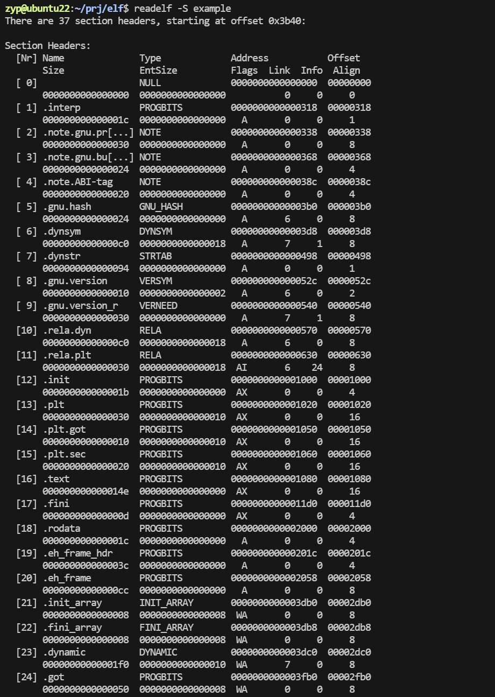
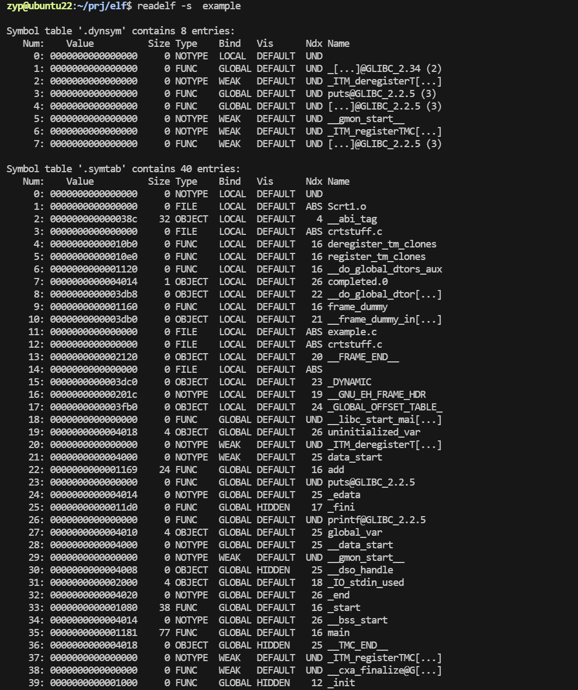
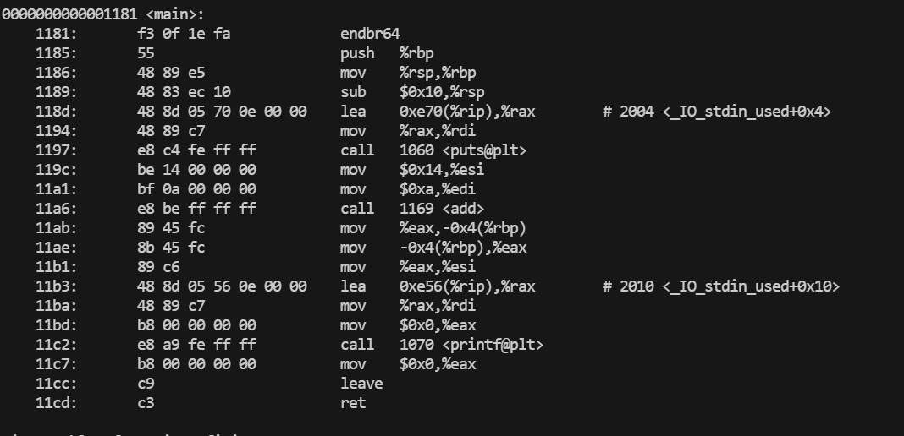

# ELF文件解析
**ELF（Executable and Linkable Format）文件**是一种通用的文件格式，主要用于存储程序代码、数据、共享库以及调试信息。它是现代类 UNIX 系统（如 Linux、FreeBSD 等）上可执行文件、目标文件、动态链接库和核心转储文件的标准格式。

### 什么是ELF文件

#### **ELF 文件的用途**
1. **可执行文件**：包含可直接运行的程序。
2. **目标文件**：中间文件，通常是编译但未链接的文件。
3. **共享库文件**：可动态加载的共享对象（动态链接库）。
4. **核心转储文件**：程序崩溃时的内存快照，用于调试。

---

#### **ELF 文件的基本结构**
ELF 文件由以下部分组成：
1. **ELF 头部**：描述文件类型、目标架构、入口点地址等元数据。
2. **程序头表（Program Header Table）**：描述运行时所需的段信息，如代码段和数据段的位置。
3. **节头表（Section Header Table）**：描述编译时所需的节信息，如符号表、字符串表等。
4. **数据段**：存储代码、数据或调试信息。

---

#### **ELF 文件的类型**
ELF 文件根据其用途可以分为以下几种：
1. **ET_REL（可重定位文件）**
   - 描述：目标文件，通常是编译阶段生成的中间文件。
   - 用途：需要链接才能生成可执行文件或共享库。

2. **ET_EXEC（可执行文件）**
   - 描述：包含完整的程序，可以直接加载到内存中运行。
   - 用途：最终的可执行程序。

3. **ET_DYN（共享对象文件）**
   - 描述：动态链接库文件（.so），可以在运行时被加载。
   - 用途：提供可复用的代码或数据。

4. **ET_CORE（核心转储文件）**
   - 描述：程序崩溃时生成的文件，记录内存快照。
   - 用途：调试和故障分析。

5. **ET_NONE（未知文件）**
   - 描述：未指定类型的文件。
   - 用途：一般用作占位，少见。

---

#### **如何查看 ELF 文件的信息**
可以使用以下工具查看 ELF 文件的具体信息：
1. **`file` 命令**  
   - 描述：检测文件类型。
   - 用法：`file <文件名>`

2. **`readelf` 命令**  
   - 描述：深入分析 ELF 文件的头部、段表和节表。
   - 用法：
     - 查看 ELF 头部：`readelf -h <文件名>`
     - 查看程序头表：`readelf -l <文件名>`
     - 查看节头表：`readelf -S <文件名>`

3. **`objdump` 命令**  
   - 描述：反汇编和查看 ELF 文件内容。
   - 用法：`objdump -d <文件名>`


### ELF文件头

**ELF 文件头**是 ELF 文件的起始部分，包含关于文件整体结构的重要元信息。它定义了 ELF 文件的类型、目标平台、入口点、程序头表和节头表的位置与大小等。

---

#### **ELF 文件头结构**
ELF 文件头的定义通常在 `<elf.h>` 中描述，以下是主要字段的解释：

| 字段名                  | 字节大小 | 描述                                                                                 |
|-------------------------|----------|------------------------------------------------------------------------------------|
| **e_ident**            | 16       | 文件标识符，包含 ELF 魔数、文件类型、目标架构、版本等信息。                            |
| **e_type**             | 2        | 文件类型（如可执行文件、目标文件、动态库等）。                                         |
| **e_machine**          | 2        | 指定目标架构（如 x86、ARM）。                                                         |
| **e_version**          | 4        | ELF 文件格式版本，一般为 1。                                                         |
| **e_entry**            | 4/8      | 程序入口点的虚拟地址（可执行文件的起始地址）。                                          |
| **e_phoff**            | 4/8      | 程序头表（Program Header Table）的偏移（相对于文件起始位置的字节偏移）。                 |
| **e_shoff**            | 4/8      | 节头表（Section Header Table）的偏移。                                                |
| **e_flags**            | 4        | 特定架构的标志（如硬件处理器标志）。                                                  |
| **e_ehsize**           | 2        | ELF 文件头的大小（通常是 64 字节或 52 字节，依架构而定）。                               |
| **e_phentsize**        | 2        | 程序头表中每个条目的大小。                                                            |
| **e_phnum**            | 2        | 程序头表中的条目数。                                                                  |
| **e_shentsize**        | 2        | 节头表中每个条目的大小。                                                              |
| **e_shnum**            | 2        | 节头表中的条目数。                                                                    |
| **e_shstrndx**         | 2        | 节头字符串表的索引。                                                                  |

---

#### **e_ident 字段详解**
`e_ident` 是一个 16 字节的数组，定义了 ELF 文件的一些关键属性：
1. **[0:3] 魔数**：
   - 定值：`0x7F 0x45 0x4C 0x46`（即 `\x7FELF`），用于识别 ELF 文件。
2. **[4] 文件类**：
   - `0x01`：32 位文件。
   - `0x02`：64 位文件。
3. **[5] 数据编码**：
   - `0x01`：小端序（Little Endian）。
   - `0x02`：大端序（Big Endian）。
4. **[6] ELF 版本**：
   - `0x01`：当前版本。
5. **[7] 操作系统 ABI**：
   - 定义目标平台的 ABI，例如 `0x00` 表示 System V，`0x03` 表示 Linux。
6. **[8-15] 填充**：
   - 保留字段，用于对齐和扩展。

---

#### **查看 ELF 文件头**
使用 `readelf` 工具可以查看 ELF 文件头信息：
```bash
readelf -h <文件名>
```

示例输出：
```plaintext
ELF Header:
  Magic:   7f 45 4c 46 02 01 01 00 ...
  Class:                             ELF64
  Data:                              2's complement, little endian
  Version:                           1 (current)
  OS/ABI:                            UNIX - System V
  ABI Version:                       0
  Type:                              EXEC (Executable file)
  Machine:                           Advanced Micro Devices X86-64
  Entry point address:               0x400080
  Start of program headers:          64 (bytes into file)
  Start of section headers:          192 (bytes into file)
  Flags:                             0x0
  Size of this header:               64 (bytes)
  Size of program headers:           56 (bytes)
  Number of program headers:         8
  Size of section headers:           64 (bytes)
  Number of section headers:         12
  Section header string table index: 11
```

### ELF节

在 ELF 文件中，**节（Sections）** 是构成文件的逻辑单位，每个节包含特定类型的数据（例如代码、符号表、调试信息等）。这些节在编译和链接阶段非常重要，用于组织和管理程序的各个部分。

---

#### **节的结构**
每个节由 **节头表（Section Header Table）** 描述。节头表是 ELF 文件中的一个表格，包含所有节的元信息。每个条目描述一个节，包括节名、类型、地址、大小等。

---

#### **ELF 文件中的常见节**
以下是 ELF 文件中常见的节及其用途：

| **节名**            | **用途**                                                                 |
|---------------------|--------------------------------------------------------------------------|
| `.text`            | 存储程序的可执行指令（代码段）。                                           |
| `.data`            | 存储程序中已初始化的全局变量和静态变量（数据段）。                           |
| `.bss`             | 存储未初始化的全局变量和静态变量（未分配空间，只占位，程序加载时分配内存）。 |
| `.rodata`          | 存储只读数据，例如字符串常量。                                              |
| `.symtab`          | 存储符号表，用于链接和调试。                                               |
| `.strtab`          | 存储字符串表，包括符号名等字符串。                                           |
| `.shstrtab`        | 存储节名字符串表。                                                        |
| `.rel.text` / `.rela.text` | 存储 `.text` 节的重定位信息（对于可重定位文件）。                            |
| `.debug_*`         | 存储调试信息（例如源代码行号、变量信息等），用于调试器。                      |
| `.comment`         | 存储编译器的注释信息（例如编译器版本）。                                    |
| `.note`            | 存储额外的注释或元数据，例如 ABI 信息。                                     |

---

#### **节头表 (Section Header Table)**
每个节都有一个对应的节头，用于描述节的元数据。这些信息存储在节头表中，节头表由 `e_shoff` 字段指定其在文件中的偏移位置。

##### **节头表条目结构**
以下是节头表条目的主要字段：

| 字段名        | 大小       | 描述                                                                            |
|---------------|------------|---------------------------------------------------------------------------------|
| `sh_name`     | 4          | 节名在 `.shstrtab`（节名字符串表）中的偏移量。                                   |
| `sh_type`     | 4          | 节的类型（如代码、数据、符号表等）。                                              |
| `sh_flags`    | 4/8        | 节的标志（如是否可执行、是否可写）。                                              |
| `sh_addr`     | 4/8        | 节在内存中的地址（如果加载）。                                                    |
| `sh_offset`   | 4/8        | 节在文件中的偏移量（从文件开头算起）。                                            |
| `sh_size`     | 4/8        | 节的大小（字节）。                                                               |
| `sh_link`     | 4          | 与节相关联的索引，例如符号表与字符串表的关联。                                    |
| `sh_info`     | 4          | 额外的信息，依节类型而不同。                                                      |
| `sh_addralign`| 4/8        | 节的对齐要求。                                                                   |
| `sh_entsize`  | 4/8        | 如果节是固定大小的条目数组，每个条目的大小。                                       |

---

#### **常见节类型 (`sh_type`)**
`sh_type` 字段定义节的类型，以下是常见的类型：

| **类型名**        | **值**       | **描述**                                                        |
|-------------------|--------------|-----------------------------------------------------------------|
| `SHT_NULL`        | 0x0          | 无效节。                                                       |
| `SHT_PROGBITS`    | 0x1          | 存储程序代码或数据（如 `.text`、`.data` 等）。                  |
| `SHT_SYMTAB`      | 0x2          | 存储符号表（通常用于调试）。                                    |
| `SHT_STRTAB`      | 0x3          | 存储字符串表（如 `.strtab`、`.shstrtab`）。                     |
| `SHT_RELA`        | 0x4          | 存储带地址的重定位信息（Rela 格式）。                           |
| `SHT_NOBITS`      | 0x8          | 节不占用文件空间（如 `.bss`）。                                 |
| `SHT_DYNAMIC`     | 0x6          | 动态链接信息（如 `.dynamic`）。                                 |
| `SHT_NOTE`        | 0x7          | 存储注释信息（如 `.note`）。                                    |
| `SHT_DYNSYM`      | 0xB          | 存储动态链接的符号表（如 `.dynsym`）。                          |

---

#### **如何查看 ELF 文件的节**
可以使用工具查看 ELF 文件的节信息：

1. **`readelf`**
   - 查看节头表：
     ```bash
     readelf -S <文件名>
     ```
   - 示例输出：
     ```plaintext
     Section Headers:
     [Nr] Name              Type             Address           Offset
          Size              EntSize          Flags  Link  Info  Align
     [ 0]                   NULL             0000000000000000  00000000
          0000000000000000  0000000000000000           0     0     0
     [ 1] .text             PROGBITS         00000000004000b0  000000b0
          000000000000024a  0000000000000000  AX       0     0     16
     [ 2] .data             PROGBITS         00000000006002f0  000002f0
          0000000000000018  0000000000000000  WA       0     0     8
     ...
     ```

2. **`objdump`**
   - 查看所有节：
     ```bash
     objdump -h <文件名>
     ```
   - 示例输出：
     ```plaintext
     Sections:
     Idx Name          Size      VMA       LMA       File off  Algn
       0 .text         0000024a  004000b0  004000b0  000000b0  2**4
       1 .data         00000018  006002f0  006002f0  000002f0  2**3
       ...
     ```

### 示例

以下是一个完整示例，包括 **C 程序源码**、生成 ELF 文件的步骤，以及结合生成的 ELF 文件解析其各部分的说明。

---

#### **1. 示例 C 程序**

保存以下代码为 `example.c`：
```c
#include <stdio.h>

int global_var = 42;          // 已初始化的全局变量
int uninitialized_var;        // 未初始化的全局变量（BSS 段）

int add(int a, int b) {
    return a + b;             // 一个简单的函数
}

int main() {
    printf("Hello, ELF!\n");  // 打印字符串
    int result = add(10, 20);
    printf("Result: %d\n", result);
    return 0;
}
```

---

#### **2. 编译并生成 ELF 文件**
运行以下命令：
```bash
gcc -g -o example example.c
```

- **`-g`**：生成调试信息。
- **`-o example`**：指定输出文件名为 `example`。
- 输出结果：生成一个名为 `example` 的 ELF 可执行文件。

---

#### **3. 使用工具解析 ELF 文件**

##### **查看文件基本类型**
```bash
file example
```

示例输出：
```plaintext
example: ELF 64-bit LSB pie executable, x86-64, version 1 (SYSV), dynamically linked, interpreter /lib64/ld-linux-x86-64.so.2, BuildID[sha1]=2d0aafc3fbd7ac9b81dea62112de9b31413cc7e2, for GNU/Linux 3.2.0, with debug_info, not stripped
```

这表明文件是一个 64 位小端序 ELF 可执行文件，动态链接到 Linux 的标准 C 库。

---

##### **查看 ELF 文件头**
```bash
readelf -h example
```
输出示例：

```plaintext
ELF Header:
  Magic:   7f 45 4c 46 02 01 01 00 ...
  Class:                             ELF64
  Data:                              2's complement, little endian
  Version:                           1 (current)
  OS/ABI:                            UNIX - System V
  Type:                              EXEC (Executable file)
  Machine:                           Advanced Micro Devices X86-64
  Entry point address:               0x401120
  ...
```

关键字段说明：
- **Entry point address**：程序的入口点地址，指向 `main()` 的位置。
- **Type**：文件类型为可执行文件。
- **Machine**：目标架构为 x86-64。

---

##### **查看节头表**
```bash
readelf -S example
```
输出示例：

```plaintext
Section Headers:
  [Nr] Name              Type             Address           Offset
       Size              EntSize          Flags  Link  Info  Align
  [ 0]                   NULL             0000000000000000  00000000
       0000000000000000  0000000000000000           0     0     0
  [ 1] .interp           PROGBITS         0000000000000238  00000238
       000000000000001c  0000000000000000   A       0     0     1
  [ 2] .text             PROGBITS         0000000000401130  00001130
       00000000000001c2  0000000000000000  AX       0     0     16
  [ 3] .rodata           PROGBITS         0000000000401300  00001300
       0000000000000028  0000000000000000   A       0     0     4
  [ 4] .data             PROGBITS         0000000000602000  00002000
       0000000000000010  0000000000000000  WA       0     0     8
  [ 5] .bss              NOBITS           0000000000602010  00002010
       0000000000000008  0000000000000000  WA       0     0     4
  ...
```

关键节解析：
- **.text**：程序代码段，包含函数（如 `main` 和 `add`）。
- **.rodata**：只读数据段，包含字符串常量（如 `"Hello, ELF!"`）。
- **.data**：已初始化全局变量段，包含 `global_var`。
- **.bss**：未初始化全局变量段，包含 `uninitialized_var`。
- **.interp**：指定动态链接器的位置。

---

##### **符号表**
```bash
readelf -s example
```
输出示例：

```plaintext
Symbol table '.symtab' contains 20 entries:
   Num:    Value          Size Type    Bind   Vis      Ndx Name
     1: 0000000000000000     0 NOTYPE  LOCAL  DEFAULT  UND 
     2: 0000000000401130     0 SECTION LOCAL  DEFAULT    2 
     7: 0000000000602010     4 OBJECT  GLOBAL DEFAULT    5 global_var
     8: 0000000000602014     4 OBJECT  GLOBAL DEFAULT    5 uninitialized_var
    13: 0000000000401130   38 FUNC    GLOBAL DEFAULT    2 add
    14: 0000000000401160  148 FUNC    GLOBAL DEFAULT    2 main
```

符号解析：
- **global_var**：存储于 `.data` 段。
- **uninitialized_var**：存储于 `.bss` 段。
- **add** 和 **main**：函数入口点地址，存储在 `.text` 段。

---

##### **反汇编程序代码**
```bash
objdump -d example
```
输出示例（部分）：

```plaintext
0000000000401130 <add>:
  401130:       55                      push   %rbp
  401131:       48 89 e5                mov    %rsp,%rbp
  401134:       89 7d fc                mov    %edi,-0x4(%rbp)
  401137:       89 75 f8                mov    %esi,-0x8(%rbp)
  40113a:       8b 55 fc                mov    -0x4(%rbp),%edx
  40113d:       8b 45 f8                mov    -0x8(%rbp),%eax
  401140:       01 d0                   add    %edx,%eax
  401142:       5d                      pop    %rbp
  401143:       c3                      retq   
```

这段代码反汇编了 `add` 函数，可以逐条指令分析其实现。

