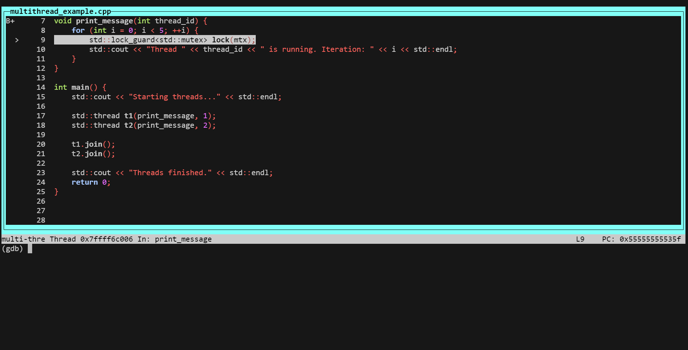
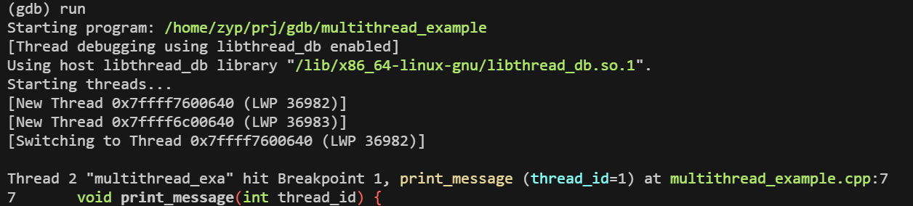
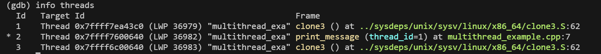
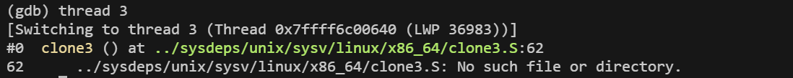
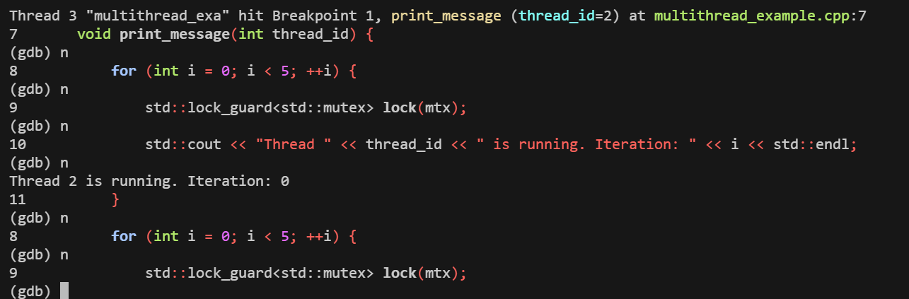
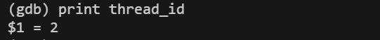

# `gdb` 的常见用法和技巧总结：

---

## 调试方法

### **1. 设置断点**
#### 常规断点
- **在函数处设置断点**：
  ```gdb
  break <function_name>
  ```
- **在文件的特定行设置断点**：
  ```gdb
  break <file_name>:<line_number>
  ```
- **设置条件断点**：
  当满足条件时触发断点：
  ```gdb
  break <function_name> if <condition>
  ```
  例如：
  ```gdb
  break my_function if x == 5
  ```

#### 动态断点
- **按地址设置断点**：
  ```gdb
  break *0x<address>
  ```

---

### **2. 控制程序执行**
- **运行程序**：
  ```gdb
  run [arguments]
  ```
- **继续运行**：
  ```gdb
  continue
  ```
- **单步执行**：
  - **进入函数**：
    ```gdb
    step
    ```
  - **跳过函数**：
    ```gdb
    next
    ```
- **运行到当前函数返回**：
  ```gdb
  finish
  ```
- **跳转到指定代码行**（慎用）：
  ```gdb
  jump <line_number>
  ```

---

### **3. 查看信息**
- **查看调用栈**：
  ```gdb
  backtrace
  ```
  或缩写：
  ```gdb
  bt
  ```
  显示更多帧：
  ```gdb
  backtrace full
  ```

- **查看变量值**：
  - 打印变量：
    ```gdb
    print <variable>
    ```
  - 自动追踪变量：
    ```gdb
    display <variable>
    ```

- **查看寄存器值**：
  ```gdb
  info registers
  ```

- **查看内存**：
  - 按十六进制查看内存：
    ```gdb
    x/10x <address>
    ```
  - 按字符串查看：
    ```gdb
    x/s <address>
    ```

- **查看线程**：
  ```gdb
  info threads
  ```

---

### **4. 修改运行时数据**
- **修改变量值**：
  ```gdb
  set variable <variable_name> = <new_value>
  ```
- **修改寄存器值**：
  ```gdb
  set $<register_name> = <new_value>
  ```

---

### **5. 调试多线程程序**
- 列出所有线程：
  ```gdb
  info threads
  ```
- 切换到指定线程：
  ```gdb
  thread <thread-id>
  ```
- 查看所有线程的调用栈：
  ```gdb
  thread apply all bt
  ```

---

### **6. 使用断点调试**
- **列出所有断点**：
  ```gdb
  info breakpoints
  ```
- **删除断点**：
  ```gdb
  delete <breakpoint_number>
  ```
- **禁用断点**：
  ```gdb
  disable <breakpoint_number>
  ```
- **启用断点**：
  ```gdb
  enable <breakpoint_number>
  ```

---

### **7. 记录和重现调试会话**
- **启用记录功能**：
  ```gdb
  record
  ```
- **查看记录信息**：
  ```gdb
  record instruction-history
  ```
- **在记录中回退**：
  ```gdb
  reverse-step
  ```

---

### **8. 调试动态库**
- **加载动态库符号**：
  ```gdb
  sharedlibrary
  ```
- **查看已加载的动态库**：
  ```gdb
  info sharedlibrary
  ```

---

### **9. 分析崩溃**
- **加载核心转储文件**：
  ```bash
  gdb <program> <core_file>
  ```
- **检查崩溃位置**：
  ```gdb
  bt
  ```

---

### **10. 调试优化后的代码**
优化后的代码可能导致调试困难，以下技巧可帮助调试：
- 使用 `set` 命令让变量值和优化后的寄存器保持一致：
  ```gdb
  set print object on
  set print pretty on
  ```
- 假如符号未加载，强制加载：
  ```gdb
  info functions
  ```

---

### **11. 自定义 gdb 调试体验**
- **添加脚本**：
  在 `~/.gdbinit` 文件中添加自定义脚本。
- **使用快捷键**：
  例如：
  ```gdb
  define hook-stop
      backtrace 1
  end
  ```
  每次暂停时自动打印调用栈。

---

### **12. 调试远程程序**
- **目标程序运行 gdbserver**：
  ```bash
  gdbserver :1234 ./program
  ```
- **本地连接 gdb**：
  ```gdb
  target remote <host>:1234
  ```

---

### **13. 调试汇编代码**
- 切换到汇编视图：
  ```gdb
  layout asm
  ```
- 查看寄存器和内存的变化。

---

### **14. 其他有用命令**
- 查看某个地址对应的源码位置：
  ```gdb
  info line *<address>
  ```
- 跟踪指令执行：
  ```gdb
  stepi
  ```
- 查看程序段：
  ```gdb
  info proc
  ```

---

### **15. gdb 插件**
使用插件可以扩展 `gdb` 的功能，例如：
- **pwndbg**：调试二进制漏洞。
- **gef (GDB Enhanced Features)**：增强的调试工具。

---

## TUI模式

在调试时，`gdb` 提供了一种名为 **TUI（Text User Interface）** 的模式，可以在窗口上方显示源码及执行位置，帮助你更直观地跟踪代码执行。以下是如何启用和使用该功能的详细说明：

---

### **1. 启用 TUI 模式**
在进入 `gdb` 后，运行以下命令进入 TUI 模式：
```gdb
layout src
```

#### **TUI 模式布局选项**
- `layout src`：显示源码窗口。
- `layout asm`：显示汇编代码窗口。
- `layout split`：同时显示源码和汇编代码。
- `layout regs`：显示寄存器和汇编代码。
- `layout next`：在不同布局之间循环切换。

#### **快速键切换 TUI**
按下 **`Ctrl+x`，然后按 `a`**，可在 TUI 模式和普通模式之间切换。

---

### **2. 调试时显示执行位置**
当启用了 TUI 模式后，当前正在执行的代码行会高亮显示在窗口的顶部。以下是确保代码和执行位置显示的步骤：

1. **设置断点**：
   ```gdb
   break <function_name>
   ```
   或者：
   ```gdb
   break <file_name>:<line_number>
   ```

2. **运行程序**：
   ```gdb
   run
   ```

3. **单步调试**：
   - 单步执行当前行：
     ```gdb
     step
     ```
   - 跳过函数调用：
     ```gdb
     next
     ```

   代码窗口会实时更新，并高亮显示当前执行的代码行。

---

### **3. 调整窗口大小**
- **切换窗口焦点**：按 **`Ctrl+x`，然后按 `o`** 切换到不同窗口。
- **调整窗口大小**：
  1. 切换到目标窗口（例如源码窗口）。
  2. 使用快捷键 **`Ctrl+x`，然后按 `^`**（增加高度）或 **`Ctrl+x`，然后按 `}`**（减少高度）。

---

### **4. 禁用 TUI 模式**
如果不需要 TUI 界面，可以退出 TUI 模式：
```gdb
layout none
```

---

### **5. 示例会话**
以下是一次实际调试中启用 TUI 的示例：

```bash
$ gdb ./multithread_example
```

**在 gdb 中运行以下指令：**
```gdb
(gdb) layout src                   # 启用源码窗口
(gdb) break print_message          # 在函数 print_message 处设置断点
(gdb) run                          # 运行程序
(gdb) step                         # 单步执行，源码窗口会更新
(gdb) next                         # 跳过函数调用
(gdb) layout split                 # 同时查看源码和汇编
(gdb) continue                     # 继续运行程序
```

---

### **TUI 模式的优势**
1. 代码执行位置实时更新，直观展示。
2. 可同时查看源码、汇编、寄存器等信息。
3. 提供更好的调试体验，无需频繁手动查看源码。


以下是一个简单的多线程 C++ 程序示例，使用了 `std::thread` 来创建多个线程，同时演示如何使用 `gdb` 进行调试。

---

### **C++ 多线程代码**
```cpp
#include <iostream>
#include <thread>
#include <mutex>

std::mutex mtx;

void print_message(int thread_id) {
    for (int i = 0; i < 5; ++i) {
        std::lock_guard<std::mutex> lock(mtx);
        std::cout << "Thread " << thread_id << " is running. Iteration: " << i << std::endl;
    }
}

int main() {
    std::cout << "Starting threads..." << std::endl;

    std::thread t1(print_message, 1);
    std::thread t2(print_message, 2);

    t1.join();
    t2.join();

    std::cout << "Threads finished." << std::endl;
    return 0;
}
```

---

### **编译代码**
使用 `g++` 编译并添加调试信息：
```bash
g++ -g -pthread -o multithread_example multithread_example.cpp
```

---

## 示例

以下是一个简单的多线程 C++ 程序示例，使用了 `std::thread` 来创建多个线程，同时演示如何使用 `gdb` 进行调试。

---

### **C++ 多线程代码**
```cpp
#include <iostream>
#include <thread>
#include <mutex>

std::mutex mtx;

void print_message(int thread_id) {
    for (int i = 0; i < 5; ++i) {
        std::lock_guard<std::mutex> lock(mtx);
        std::cout << "Thread " << thread_id << " is running. Iteration: " << i << std::endl;
    }
}

int main() {
    std::cout << "Starting threads..." << std::endl;

    std::thread t1(print_message, 1);
    std::thread t2(print_message, 2);

    t1.join();
    t2.join();

    std::cout << "Threads finished." << std::endl;
    return 0;
}
```

---

### **编译代码**
使用 `g++` 编译并添加调试信息：
```bash
g++ -g -pthread -o multithread_example multithread_example.cpp
```

---

### **调试步骤（gdb 指令）**

1. **启动 gdb**：
   ```bash
   gdb ./multithread_example
   ```

2. **设置断点**：
   在 `print_message` 函数中设置断点：
   ```gdb
   break print_message
   ```

3. **运行程序**：
   ```gdb
   run
   ```
   

4. **查看线程信息**：
   当程序运行到断点时，查看当前线程状态：
   ```gdb
   info threads
   ```
    

5. **切换到特定线程**：
   如果有多个线程，可切换到某个线程上下文：
   ```gdb
   thread <thread-id>
   ```
    

6. **查看调用栈**：
   查看当前线程的调用栈：
   ```gdb
   backtrace
   ```

7. **单步执行线程**：
   执行当前线程的下一条语句：
   ```gdb
   step
   next
   ```
   

8. **查看变量值**：
   打印局部变量或参数值：
   ```gdb
   print thread_id
   ```
   

9. **同时查看所有线程的状态**：
   打印所有线程的调用栈：
   ```gdb
   thread apply all bt
   ```

10. **继续运行**：
    让程序继续运行：
    ```gdb
    continue
    ```

---

### **示例调试会话**
以下是一次调试的交互式示例：

```bash
$ gdb ./multithread_example
```
