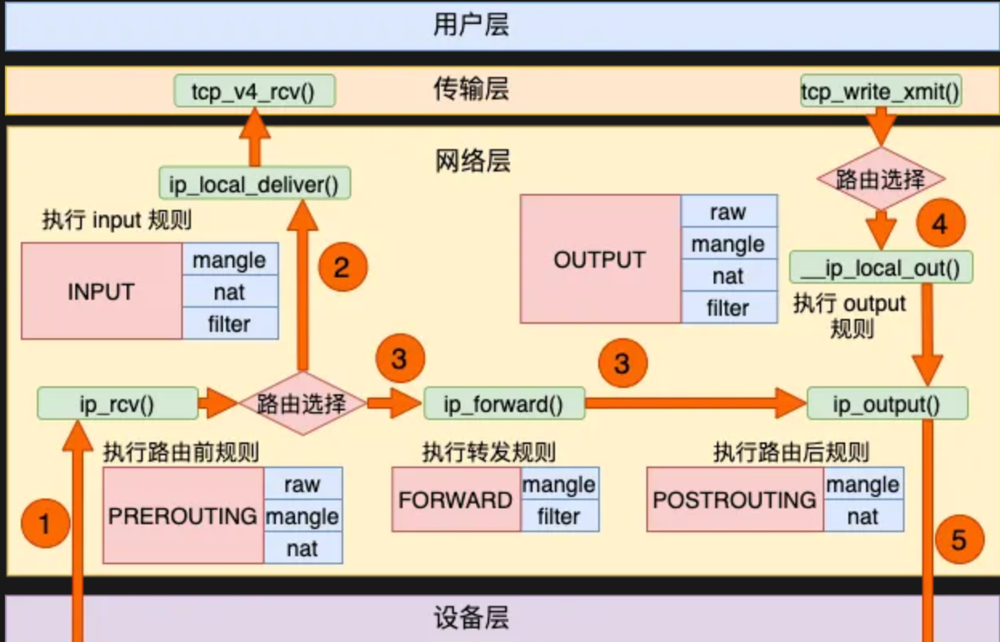
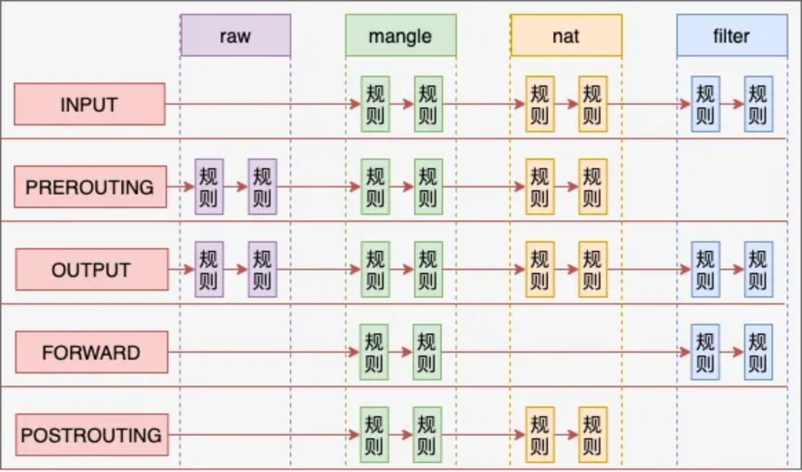

Netfilter 是 Linux 内核中的一个关键网络子系统，提供了数据包过滤、网络地址转换 (NAT) 和数据包修改的功能。Netfilter 的实现可以简单地归纳为四表五链。它在 Linux 网络堆栈中为网络数据包的进出和转发提供了控制点，用户可以通过定义规则来控制这些数据包的行为。

结合 Linux 5.4 的代码介绍 Netfilter 的机制，并结合代码说明。

### 1. Netfilter 的基本原理

Netfilter 使用了一组“钩子”（hooks）来拦截和处理网络数据包。每当网络数据包经过内核时，它会经过多个不同阶段，而 Netfilter 会在这些阶段提供钩子函数（hook functions），让开发者或管理员可以对数据包进行检查、修改或决定是否丢弃它。

在 Linux 5.4 内核中，Netfilter 主要有以下几类钩子点：

- **NF_INET_PRE_ROUTING**：数据包刚到达网卡，还未决定路由时。
- **NF_INET_LOCAL_IN**：数据包到达本地设备的阶段。
- **NF_INET_FORWARD**：数据包要被转发到其他主机时。
- **NF_INET_LOCAL_OUT**：数据包从本地主机发出时。
- **NF_INET_POST_ROUTING**：数据包即将离开网卡，准备发送到网络时。

### 2. Netfilter 的钩子函数与数据包路径

#### 2.1 什么是钩子函数
Netfilter 钩子函数是在数据包的生命周期中被调用的，它们在网络堆栈的不同阶段被触发。

- 从三层协议栈调用函数NF_HOOK开始
  NF_HOOK由以下函数调用:    

```c
ip_rcv()
ip_local_deliver()
ip_mc_output()
ipv6_rcv()
ip6_sublist_rcv()
```

- NF_HOOK函数先调用了nf_hook继续执行调用钩子函数处理，处理之后，如果接受，则调用输入的回调函数okfn，继续数据包的下一步处理

```c
static inline int
NF_HOOK(uint8_t pf, unsigned int hook, struct net *net, struct sock *sk, struct sk_buff *skb,
    struct net_device *in, struct net_device *out,
    int (*okfn)(struct net *, struct sock *, struct sk_buff *))
{
    /* 先执行钩子函数 */
    int ret = nf_hook(pf, hook, net, sk, skb, in, out, okfn);

    /* 返回成功，则继续执行成功回调 */
    if (ret == 1)
        ret = okfn(net, sk, skb);
    return ret;
}
```

`nf_hook_slow()` 是遍历所有已注册的钩子并依次调用它们的地方，这是真正执行 Netfilter 钩子逻辑的地方。

```c
int nf_hook_slow(struct sk_buff *skb, struct nf_hook_state *state,
		 const struct nf_hook_entries *e, unsigned int s)
{
	unsigned int verdict;
	int ret;

	for (; s < e->num_hook_entries; s++) {
		verdict = nf_hook_entry_hookfn(&e->hooks[s], skb, state);
		switch (verdict & NF_VERDICT_MASK) {
		case NF_ACCEPT:
			break;
		case NF_DROP:
			kfree_skb(skb);
			ret = NF_DROP_GETERR(verdict);
			if (ret == 0)
				ret = -EPERM;
			return ret;
		case NF_QUEUE:
			ret = nf_queue(skb, state, s, verdict);
			if (ret == 1)
				continue;
			return ret;
		default:
			/* Implicit handling for NF_STOLEN, as well as any other
			 * non conventional verdicts.
			 */
			return 0;
		}
	}

	return 1;
}

static inline int
nf_hook_entry_hookfn(const struct nf_hook_entry *entry, struct sk_buff *skb,
		     struct nf_hook_state *state)
{
	return entry->hook(entry->priv, skb, state);
}
```

当数据包经过 Netfilter 钩子时，钩子函数会被依次调用。`nf_hook_slow()` 函数遍历每个钩子，并执行相应的钩子函数，钩子函数可以决定是否继续处理数据包、修改数据包或丢弃数据包。

#### 2.2 NF_HOOK设置点

**`ip_rcv`调用**: 数据包到达，在此进行路由选择
```
int ip_rcv(struct sk_buff *skb, ......){  
    ......  
    return NF_HOOK(NFPROTO_IPV4, NF_INET_PRE_ROUTING, skb, dev, NULL,  
               ip_rcv_finish);  
  
}
```
**`ip_local_deliver` 调用**：
```
int ip_local_deliver(struct sk_buff *skb){  
 ......  
    return NF_HOOK(NFPROTO_IPV4, NF_INET_LOCAL_IN, skb, skb->dev, NULL,  
               ip_local_deliver_finish);  
  
```
**`ip_forward`调用**
```
int ip_forward(struct sk_buff *skb)  
{  
 ......  
 return NF_HOOK(NFPROTO_IPV4, NF_INET_FORWARD, skb, skb->dev,  
         rt->dst.dev, ip_forward_finish);  
}
```

**`__ip_local_out`调用**：
```
int __ip_local_out(struct sk_buff *skb)  
{  
 ......  
 return nf_hook(NFPROTO_IPV4, NF_INET_LOCAL_OUT, skb, NULL,  
         skb_dst(skb)->dev, dst_output);  
}
```
**`ip_output`调用**：
```
int ip_output(struct sk_buff *skb)  
{  
 ......
 return NF_HOOK_COND(NFPROTO_IPV4, NF_INET_POST_ROUTING, skb, NULL, dev,  
  ip_finish_output,  
  !(IPCB(skb)->flags & IPSKB_REROUTED));  
}
```
### 3. Netfilter 与四表五链

Netfilter 中的数据包处理规则是通过表（table）和链（chain）组织的。每个表包含多个链，每个链可以包含一组规则。
四表五链含义如下：
**四个表**
1. **filter**：这是默认的表，主要用于包过滤。它包含允许或拒绝网络流量的规则。
2. **nat**：这个表用于网络地址转换，通常用于设置端口转发或修改包的源/目的地址。
3. **mangle**：用于修改数据包的某些部分，比如 TTL（生存时间）或 TOS（服务类型）。
4. **raw**：用于处理某些包的状态，允许用户选择是否跳过连接跟踪。
**五条链**
每个表中有几条预定义的链：
1. **INPUT**：处理进入本地系统的流量（数据包即将被本地应用程序接收时）。
2. **OUTPUT**：处理从本地系统发出的流量。
3. **FORWARD**：处理通过本地系统转发的流量（数据包需要转发到其他主机时）。
4. **PREROUTING**：在路由决定之前处理入站流量，通常用于 NAT（数据包到达网络层之前）。
5. **POSTROUTING**：在路由决定之后处理出站流量，通常用于 NAT。
可以发现，五条链域linux的钩子点一一对应！

四表五链实现的功能如上图所示。

四表五链实现的对应关系如上图所示。
#### 3.1. raw 表
**原理**：`raw` 表主要用于在数据包处理的早期阶段进行一些简单的处理，例如决定数据包是否进行连接追踪（Connection Tracking）。这是 iptables 数据包过滤框架中的一个早期处理阶段。
**功能**：可以标记数据包不进行连接跟踪。通过在 `PREROUTING` 或 `OUTPUT` 链中设置规则，`raw` 表允许管理员跳过复杂的连接跟踪操作，减少开销。
**使用链**：
- `PREROUTING`：处理数据包在进入网络栈的早期阶段。
- `OUTPUT`：处理本地主机发出的数据包。
**常用场景**：
- 跳过连接跟踪机制，以提高性能。
#### 3.2. mangle 表
**原理**：`mangle` 表用于修改数据包的各种头部字段或对数据包进行标记。它允许对数据包的 IP 头部或其它协议字段进行低层次的修改，适用于需要改变数据包特定属性的场景。
**功能**： 修改数据包的 `TTL`（生存时间）。修改 `TOS`（服务类型）字段，用于服务质量控制（QoS）。数据包标记（marking）操作，这些标记可以在其他表或其他工具（例如 `tc`）中使用。
**使用链**：
- `PREROUTING`：在数据包进入路由决策之前修改。
- `INPUT`：修改进入本地主机的数据包。
- `FORWARD`：修改转发的数据包。
- `OUTPUT`：修改本地主机发出的数据包。
- `POSTROUTING`：在路由决策之后，发出数据包之前修改。
**常用场景**：
- 修改数据包的 `TTL` 或 `TOS` 值。
- 数据包打标记，用于 QoS 管理或其他规则。
#### 3.3. **nat 表**

**原理**：`nat` 表用于处理网络地址转换（NAT）。它主要用于修改数据包的源地址或目的地址，以实现地址重写功能，例如网络地址转换、端口映射等。
**功能**：
- **SNAT**（源地址转换）：修改数据包的源地址，常用于将内部网络的私有 IP 转换为公网 IP。
- **DNAT**（目的地址转换）：修改数据包的目的地址，常用于端口转发或负载均衡。
- **MASQUERADE**：一种动态的 SNAT，适用于临时分配的动态 IP 场景（如拨号上网）。
- **REDIRECT**：将数据包重定向到本地主机的其他端口。
**使用链**：
- `PREROUTING`：在数据包进入路由决策之前修改目的地址（DNAT）。
- `OUTPUT`：修改本地主机发出的数据包的目的地址。
- `POSTROUTING`：在路由决策之后修改源地址（SNAT）。
**常用场景**：
- 实现 NAT（源地址和目的地址转换）。
- 实现端口重定向（Port forwarding）。
#### 3.4. **filter 表**
**原理**：`filter` 表是 iptables 中的默认表，专门用于数据包的允许或拒绝（过滤）。它负责实际的防火墙过滤操作。
**功能**：
- **ACCEPT**：允许数据包通过。
- **DROP**：丢弃数据包，不发送任何回应。
- **REJECT**：拒绝数据包并发送拒绝信息给发起者。
- **LOG**：记录日志，但不改变数据包流向。
**使用链**：
- `INPUT`：处理进入本地主机的数据包。
- `FORWARD`：处理路由转发的数据包。
- `OUTPUT`：处理本地主机发出的数据包。
**常用场景**：
- 设置防火墙规则，允许或拒绝特定来源或目的地的数据包。
- 实现访问控制。
### 4. Netfilter 的规则匹配与动作

每个 Netfilter 规则都有两个主要部分：**匹配条件** 和 **动作**。

- **匹配条件**：检查数据包的某些字段，如源 IP 地址、目标端口、协议类型等。
- **动作**：当数据包符合匹配条件时，执行相应的动作，比如 `ACCEPT`（允许数据包通过）、`DROP`（丢弃数据包）、`DNAT`（目的地址转换）等。

在内核代码中，Netfilter 的钩子会调用用户配置的规则进行匹配。如果规则匹配成功，就会根据规则的定义采取相应的动作。

### 5. Netfilter 的用户空间交互

Netfilter 通过用户空间工具（如 `iptables`）进行规则配置和管理。用户可以通过 `iptables` 命令在不同的链中添加、修改或删除规则。比如，以下命令可以添加一条规则，允许来自特定 IP 地址的数据包通过：

```bash
iptables -A INPUT -s 192.168.1.100 -j ACCEPT
```

在内核中，当这条规则生效后，数据包到达时会匹配这条规则，满足条件的数据包将被允许通过。

### 6. Netfilter 的扩展与模块

Netfilter 支持通过加载模块进行扩展。例如，内核中的连接跟踪（Connection Tracking）是 Netfilter 的一个扩展模块，用于跟踪数据包的连接状态。防火墙可以利用连接跟踪来实现状态检测防火墙，只允许特定状态的数据包通过（如只允许已经建立的连接通过）。

连接跟踪模块在 `net/netfilter/nf_conntrack_core.c` 中实现，提供了数据包的状态跟踪功能。