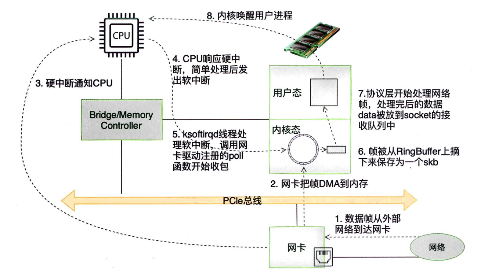
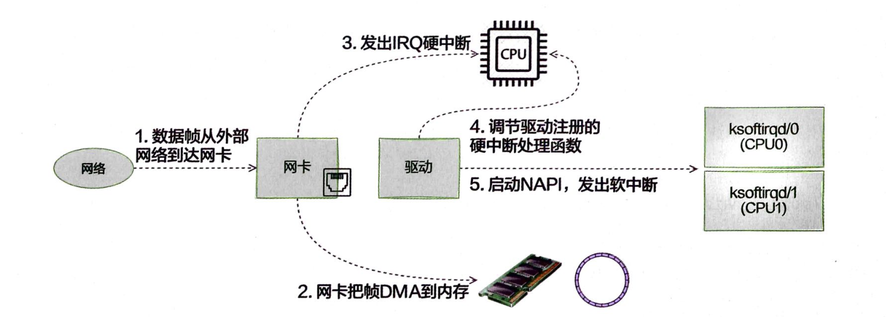

# 网卡接收过程：从网卡到linux协议栈

## 一、消息接收的基本流程
网卡接收数据并将其传递到Linux协议栈的过程包括了硬件和软件的多层协作，具体流程如下：
#### 1. 网卡接收数据
- **帧接收**：网卡通过物理层（如以太网、Wi-Fi等）接收到数据帧，这些数据帧通常是以太网帧。
- **硬件过滤**：在硬件层面，网卡会对接收到的帧进行初步过滤，如MAC地址的匹配、协议类型的检查等，确定是否需要处理该帧。
#### 2. 中断通知CPU
- **触发中断**：当网卡接收到有效的帧后，会通过触发中断的方式通知CPU。
- **中断处理程序**：CPU接收到中断信号后，会调用对应的中断处理程序（通常由网卡驱动程序提供）。这个中断处理程序的主要任务是将接收到的数据从网卡的接收缓冲区（RX Buffer）移动到内存中的适当位置，并执行后续的处理。
#### 3. 将数据移至内存
- **DMA传输**：网卡通常使用DMA（Direct Memory Access）将数据帧从网卡的接收缓冲区直接传输到系统内存中，减少CPU的负担。
- **驱动处理**：网卡驱动程序负责处理这些数据帧，将其移至系统内存的合适位置，并可能将多个帧组成一个缓冲区链表（sk_buff链表）以供协议栈后续处理。
#### 4. 数据进入内核协议栈
- **软中断**：驱动程序通常会通过软中断（softirq）或NAPI机制通知内核网络子系统有新数据可处理。NAPI（New API）是一种可以减少中断负载、提高性能的机制。
- **协议解析**：数据被传递到协议栈，首先由链路层（如Ethernet layer）处理。链路层会检查帧的类型（如IP、ARP等），然后将其传递给对应的上层协议（如IPv4、IPv6等）。
#### 5. 传递给上层协议
- **IP层处理**：如果帧是IP数据包，链路层会将其传递给IP层。IP层会对数据包进行进一步的处理，如检查IP头的校验和、检查路由表决定包的去向等。
- **传递到传输层**：如果数据包是传输层协议（如TCP或UDP），IP层会将其传递给传输层处理。传输层协议会处理端口号、分片重组（对于UDP）、连接管理（对于TCP）等。
#### 6. 数据交付到应用层
- **套接字接收**：传输层最终会将数据传递给对应的套接字（socket），并通过系统调用（如`recv()`或`read()`）将数据传递给用户空间的应用程序。
- **应用处理**：应用程序通过套接字API接收并处理数据，从而完成整个数据接收的过程。

#### 7. 后续处理和资源释放
- **ACK和流控**：如果是TCP连接，数据接收后还需要进行确认（ACK）以及流控等处理，确保数据可靠传输。
- **资源清理**：整个过程中使用的缓冲区、sk_buff等在数据处理完毕后会被释放，以供后续数据包使用。

本节主要描述数据从发送到网卡，到被协议栈处理的整个流程。


## 二、 linux收包过程




在这个详细流程中，数据帧从外部网络到达网卡，并最终被处理后交付到Linux内核的协议栈。下面我将逐步扩展每个步骤，详细解释每个过程的运作原理。

#### 0. 相关准备工作
- 网络子系统初始化阶段，会为每个CPU初始化，注册RX_SOFTIRQ和TX_SOFTIRQ。
- 注册软中断处理函数。
- 注册协议栈以及一些处理函数
- 初始化网卡驱动
- 启动网卡
- 创建若干接收队列

#### 1. 数据帧从外部网络到达网卡
- **物理信号接收**：数据帧首先以电信号（有线网络）或无线电波（无线网络）的形式到达网卡。网卡通过其物理层接口（如RJ45端口或Wi-Fi天线）接收这些信号。
- **帧解码**：网卡内的物理层芯片（PHY芯片）将这些物理信号转换为数字信号（比特流），并进一步解析出符合网络协议的数据帧。这个数据帧可能是以太网帧、Wi-Fi帧等，具体格式取决于所使用的网络协议。
- **MAC层处理**：在网卡的MAC层，网卡会检查帧的目的MAC地址，并判断这个帧是否需要进一步处理。如果目的MAC地址匹配（即与网卡的MAC地址相同，或网卡处于混杂模式下接收所有帧），网卡会继续处理该帧，否则直接丢弃。
#### 2. 网卡把数据帧通过DMA方式传输到内存
- **接收缓冲区（RX Buffer）**：在数据帧通过MAC层检查后，网卡会将其存放在网卡内部的接收缓冲区中。
- **DMA传输**：为了减少CPU的负担，网卡通常会使用DMA（Direct Memory Access）控制器将接收到的数据帧直接从网卡的接收缓冲区传输到系统内存中的特定位置。这一过程不需要CPU的直接参与，极大地提高了数据传输效率。
- **Ring Buffer**：在系统内存中，这些接收到的数据帧通常被存放在一个循环缓冲区（Ring Buffer）中。Ring Buffer是一个固定大小的缓冲区结构，能够高效地管理大量的网络数据帧。


#### 3. 网卡触发硬中断通知CPU
- **中断触发**：当网卡接收到数据帧并将其传输到系统内存后，网卡会通过发出硬件中断信号（IRQ）通知CPU。这一中断信号告诉操作系统，有新的数据需要处理。例如在`e1000`驱动中：
```cpp
static irqreturn_t e1000_intr(int irq, void *data)
```
	这个函数是硬中断处理程序，负责响应网卡的中断请求。
- **中断类型**：中断信号可以是多种类型的，例如一个专门为网络数据接收而设计的IRQ。每个中断信号都会与系统中的一个特定中断向量（interrupt vector）相关联，该向量决定了对应的中断处理程序。
#### 4. CPU响应硬中断，经过简单处理后产生软中断
- **硬中断处理程序**：当CPU接收到中断信号时，它会暂停当前正在执行的任务，切换到中断处理程序。这个处理程序通常由网卡驱动提供，负责处理基本的中断逻辑。
- **最小化硬中断处理时间**：为了避免长时间占用CPU资源，硬中断处理程序只进行必要的最小化处理，例如记录中断发生的状态，指示软中断需要执行，并可能执行一些快速的操作（如更新统计计数）。
- **触发软中断（SoftIRQ）**：为了避免硬中断处理程序长时间运行，影响系统响应速度，硬中断处理程序会触发一个软中断来完成更多复杂的工作。软中断在内核上下文中执行，并且可以被推迟到稍后处理，以减少对系统的影响。例如：
  ```c
  napi_schedule(&adapter->napi);
  ```
  会触发软中断，使得NAPI框架能够在稍后的时间点处理这些数据包。
#### 5. `ksoftirqd`线程处理软中断，调用网卡驱动注册的poll函数开始收包
- **软中断机制**：软中断机制允许内核推迟某些任务的执行，以避免在硬中断处理期间占用过多的时间。内核中有一个专门的线程（`ksoftirqd`）负责处理软中断。这个线程在系统负载较高时会被激活，以处理延迟的软中断任务。
- **NAPI和Poll机制**：NAPI（New API）是一种用于高效处理网络数据包的机制，它能够在中断和轮询之间进行切换。NAPI轮询机制中，网卡驱动会注册一个poll函数，当软中断触发时，`ksoftirqd`线程会调用这个poll函数，开始从Ring Buffer中提取数据包。
- **批量处理**：NAPI允许驱动程序批量处理多个数据包，这样可以显著减少中断的频率和开销，特别是在高流量情况下。通过轮询方式获取数据，避免了频繁的硬中断，提高了系统的处理效率。
- 例如，内核在软中断上下文中会调用NAPI的`poll`函数：
  ```c
  int napi_poll(struct napi_struct *napi, int budget)
  ```
	`net_rx_action` 是Linux内核网络子系统中的一个核心函数，它主要负责处理网络数据接收路径中的软中断。
##### 6. 帧被从Ring Buffer上摘取下来并被保存为`skb`
- **提取数据帧**：在NAPI poll函数中，驱动程序会从Ring Buffer中提取出一个或多个数据帧。每个数据帧会被封装到Linux内核中的`sk_buff`（简称`skb`）结构中。`igb_fetch_rx_buffer`和`igb_isnon_eop`的作⽤就是把数据帧⼈ RingButfer取下来。**驱动程序会创建一个`sk_buff`结构（`skb`），并将`skb`的 `data` 指针指向`Ring Buffer`中已经存在的数据包。这种方式避免了实际的数据拷贝，只是通过设置指针来引用数据。这种方法非常高效，因为它减少了不必要的内存拷贝。**
- **`sk_buff`结构**：`skb`是Linux内核中用于存储网络数据包的基本数据结构。它不仅保存了数据帧的内容，还包含了数据包的元信息（如数据包长度、头部信息、网络协议类型等）。
- **管理链表**：`skb`结构通常被组织成链表形式，这样可以方便地管理和处理多个数据帧。在处理过程中，`skb`链表中的每一个节点代表一个接收到的数据帧。
#### 7. 交付协议栈进行处理
- **交付链路层**：在`skb`结构被创建并填充数据后，它会被交付到Linux内核的网络协议栈的链路层进行处理。链路层负责进一步解析数据帧的头部信息，例如判断帧的类型（IP数据包、ARP请求等）。
- **协议类型判断**：链路层会根据帧的类型字段（如以太网帧中的EtherType）来判断该帧属于哪种上层协议。如果是IP数据包，帧会被传递给IP层；如果是ARP帧，则传递给ARP处理模块。
- **上层协议处理**：数据帧在被传递到对应的上层协议模块后（如IP层、传输层的TCP/UDP模块等），将继续进行详细的协议处理。这包括IP地址检查、数据包重组（对于TCP）、端口号检查、传输层校验和验证等。
- **应用层传递**：在传输层处理完成后，数据最终会通过套接字接口传递给用户空间的应用程序，完成整个网络数据接收的流程。
- **源码**：提取并封装好的`skb`需要提交给协议栈进行进一步处理。这通常是通过`netif_receive_skb`函数实现的：
  ```c
  int netif_receive_skb(struct sk_buff *skb)
  ```
  这个函数将`skb`交给内核网络协议栈进行处理，具体处理取决于数据包的协议类型。在协议栈内部，`skb`会依次通过链路层、网络层和传输层。例如，IP层处理函数`ip_rcv`会被调用：
  ```c
  int ip_rcv(struct sk_buff *skb, struct net_device *dev, struct packet_type *pt, struct net_device *orig_dev)
  ```
  这个函数负责解析IP包头并进行相关处理。


