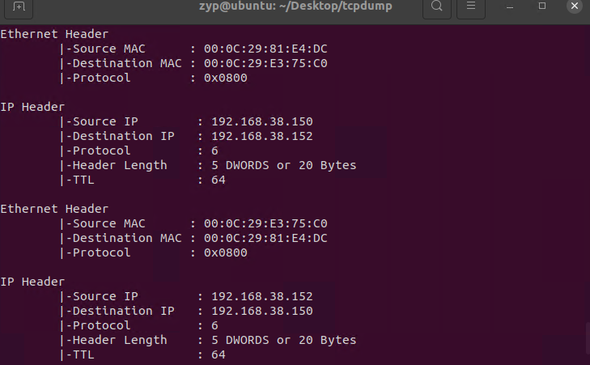

## 一、什么是原始套接字

**原始套接字（`SOCK_RAW`）** 是 Linux 网络编程中一种功能强大的套接字类型，它允许应用程序直接访问底层网络协议栈的传输层之下的层次（例如网络层或链路层）。通过使用原始套接字，开发者可以发送和接收包括链路层和网络层在内的完整数据包，而不需要依赖操作系统的 TCP/IP 协议栈处理。
## 二、工作原理
使用原始套接字，应用程序可以直接读写 IP 层（或更低层次）上的数据包。应用程序可以自己构造数据包，包括自定义 IP、TCP、UDP、ICMP 等协议头，并将这些完整的数据包通过网络发送出去。接收到的数据包通常是未经内核协议栈处理的原始数据包，应用程序可以手动解析这些数据包的头部信息。
- **发送数据包**：应用程序通过原始套接字发送一个完整的数据包，这个数据包包括用户手动构建的 IP 头（或其他协议头，如 TCP、UDP 等），内核不会对这些头部做进一步的修改。
- **接收数据包**：原始套接字接收到的数据包是完整的，包括链路层（如以太网帧）的头部以及网络层的 IP 头和传输层的头部，应用程序可以读取并自行解析这些内容。
## 三、原始套接字使用方法
原始套接字的创建和使用过程与标准套接字类似，只是在 `socket()` 调用中使用了 `SOCK_RAW` 套接字类型。此外，使用原始套接字时，通常需要指定具体的网络协议（如 IP 协议，ICMP 协议等）。
#### 1） **创建原始套接字**
使用 `socket()` 函数创建原始套接字，指定协议族为 `AF_INET`（IPv4）或 `AF_INET6`（IPv6），套接字类型为 `SOCK_RAW`，协议则是具体的网络协议（如 `IPPROTO_ICMP` 用于捕获 ICMP 数据包）。
```c
int sock = socket(AF_INET, SOCK_RAW, IPPROTO_ICMP);
if (sock < 0) {
    perror("socket");
    exit(EXIT_FAILURE);
}
```
- **AF_INET**：表示使用 IPv4 协议。
- **SOCK_RAW**：表示这是一个原始套接字，直接操作 IP 层或更低层。
- **IPPROTO_ICMP**：表示要捕获 ICMP（Internet Control Message Protocol，常用于 Ping 命令）协议的数据包。
#### 2） **接收原始数据包**
原始套接字可以接收**任何**网络数据包。通过 `recvfrom()` 函数可以从原始套接字中读取数据包，包括链路层和 IP 层头部：
```c
char buffer[65536];
struct sockaddr_in saddr;
socklen_t saddr_len = sizeof(saddr);

int buflen = recvfrom(sock, buffer, sizeof(buffer), 0, (struct sockaddr *)&saddr, &saddr_len);
if (buflen < 0) {
    perror("recvfrom");
    exit(EXIT_FAILURE);
}
// 此时 buffer 包含整个数据包，可以解析 IP 头和数据部分
```
在接收到的数据包中，`buffer` 包含从网络链路上捕获的完整数据包，包括链路层头部、IP 头部以及传输层头部和数据。
#### 3） **发送自定义数据包**
如果需要发送自定义数据包，可以自己构造数据包并通过 `sendto()` 发送：
```c
struct sockaddr_in dest;
dest.sin_family = AF_INET;
dest.sin_port = htons(0); // 端口号不重要，IP 层控制
inet_pton(AF_INET, "192.168.1.1", &dest.sin_addr);

char packet[4096];
// 在 packet 中构造 IP 头、ICMP 头及数据

if (sendto(sock, packet, sizeof(packet), 0, (struct sockaddr *)&dest, sizeof(dest)) < 0) {
    perror("sendto");
    exit(EXIT_FAILURE);
}
```
在这个例子中，应用程序手动构建数据包并直接将其发送出去。由于是原始套接字，内核不会对数据包的头部进行修改或生成，而是原封不动地发送出去。
#### 注： **权限要求**
创建原始套接字通常需要**超级用户权限**，因为原始套接字可以绕过操作系统的安全机制，并且可以用来发送伪造的数据包。因此，运行需要原始套接字的程序时，通常需要使用 `sudo` 或者以 `root` 身份运行。

## 四、实验

#### **网络嗅探器**
像 `tcpdump` 或 `Wireshark` 这样的网络嗅探器使用原始套接字来捕获通过网络接口的所有数据包（包括链路层头部、网络层头部等）。这些工具不依赖于操作系统的 TCP/IP 协议栈，而是直接从网络接口读取未经过滤的数据包。

```c
#include <stdio.h>
#include <stdlib.h>
#include <string.h>
#include <unistd.h>
#include <arpa/inet.h>
#include <sys/socket.h>
#include <netinet/ip.h>
#include <netinet/tcp.h>
#include <netinet/ether.h>
#include <net/ethernet.h> // ETH_P_ALL
#include <netpacket/packet.h>
#include <net/if.h>
#include <sys/ioctl.h>

// Buffer to hold raw packet data
#define BUFSIZE 65536

// Function to print Ethernet header information
void print_ethernet_header(unsigned char *buffer) {
    struct ethhdr *eth = (struct ethhdr *)buffer;
    
    printf("\nEthernet Header\n");
    printf("\t|-Source MAC      : %02X:%02X:%02X:%02X:%02X:%02X\n",
           eth->h_source[0], eth->h_source[1], eth->h_source[2],
           eth->h_source[3], eth->h_source[4], eth->h_source[5]);
    
    printf("\t|-Destination MAC : %02X:%02X:%02X:%02X:%02X:%02X\n",
           eth->h_dest[0], eth->h_dest[1], eth->h_dest[2],
           eth->h_dest[3], eth->h_dest[4], eth->h_dest[5]);
    
    printf("\t|-Protocol        : 0x%04X\n", ntohs(eth->h_proto));
}

// Function to print IP header information
void print_ip_header(unsigned char *buffer) {
    struct iphdr *iph = (struct iphdr *)(buffer + sizeof(struct ethhdr));
    struct sockaddr_in source, dest;
    
    memset(&source, 0, sizeof(source));
    source.sin_addr.s_addr = iph->saddr;
    
    memset(&dest, 0, sizeof(dest));
    dest.sin_addr.s_addr = iph->daddr;
    
    printf("\nIP Header\n");
    printf("\t|-Source IP        : %s\n", inet_ntoa(source.sin_addr));
    printf("\t|-Destination IP   : %s\n", inet_ntoa(dest.sin_addr));
    printf("\t|-Protocol         : %d\n", (unsigned int)iph->protocol);
    printf("\t|-Header Length    : %d DWORDS or %d Bytes\n", iph->ihl, iph->ihl * 4);
    printf("\t|-TTL              : %d\n", (unsigned int)iph->ttl);
}

int main() {
    int sock_raw;
    struct sockaddr saddr;
    unsigned char *buffer = (unsigned char *)malloc(BUFSIZE);
    socklen_t saddr_len = sizeof(saddr);
    int buflen;

    // Create a raw socket to capture all incoming and outgoing traffic
    sock_raw = socket(AF_PACKET, SOCK_RAW, htons(ETH_P_ALL));
    if (sock_raw < 0) {
        perror("Socket Error");
        return 1;
    }

    // Set interface to promiscuous mode
    // 将接口置于混杂模式
    struct ifreq ifr;
    strncpy(ifr.ifr_name, "ens32", IFNAMSIZ - 1);  // Change "ens32" to the interface you want to listen on
    ioctl(sock_raw, SIOCGIFFLAGS, &ifr);
    ifr.ifr_flags |= IFF_PROMISC;
    ioctl(sock_raw, SIOCSIFFLAGS, &ifr);

    printf("Listening on interface ens32...\n");

    while (1) {
        // Receive packets
        buflen = recvfrom(sock_raw, buffer, BUFSIZE, 0, &saddr, &saddr_len);
        if (buflen < 0) {
            perror("recvfrom error");
            close(sock_raw);
            return 1;
        }

        // Print Ethernet header
        print_ethernet_header(buffer);

        // If the packet contains IP data, print the IP header
        struct ethhdr *eth = (struct ethhdr *)buffer;
        if (ntohs(eth->h_proto) == ETH_P_IP) {
            print_ip_header(buffer);
        }
    }

    // Close the socket
    close(sock_raw);
    free(buffer);
    return 0;
}
```
#### `sock_raw = socket(AF_PACKET, SOCK_RAW, htons(ETH_P_ALL));`
`AF_PACKET` 是一个地址族（Address Family），用于直接访问数据链路层（Layer 2）协议。
`ETH_P_ALL` 是一个协议类型常量，表示捕获所有类型的以太网协议数据包。它用于指定套接字所要处理的协议类型。
#### `buflen = recvfrom(sock_raw, buffer, BUFSIZE, 0, &saddr, &saddr_len);`
参数解析：
`sock_raw`:通过 socket() 函数创建的套接字的文件描述符。
`buffer`:指向缓冲区的指针，用于存放接收到的数据。
`len`:缓冲区的大小，通常是 buf 指向的数组的长度。
`flags`:控制接收操作的行为的标志位。这个参数通常可以设置为 0，表示使用默认的接收行为。
`saddr`:指向 sockaddr 结构的指针，用于存储发送方的地址信息。
`saddr_len`:指定传入的 src_addr 的长度，以及返回的地址长度。


#### 上述代码实现的主要功能：
- **创建原始套接字**：创建一个原始套接字以捕获所有传输的数据包。
- **绑定到网络接口**：将套接字绑定到特定的网络接口。
- **捕获和解析数据包**：从原始套接字读取数据包并解析其内容（例如以太网帧头部、IP 头部和 TCP/UDP 数据）。
- **显示数据包信息**：根据需要显示捕获的包头和数据内容。
#### 编译运行后效果：

成功捕获了进入指定网卡的数据包并打印了mac头部、ip头部。

## 5. Question
#### 为什么sock_raw接收了数据包，上层应用依然能够正常读取？
在上面的测试中，在进行抓包的同时，本机与另一台机器进行了socket tcp通信。抓包的同时tcp通信也正常地运行，并且数据包被抓包程序正常捕获。

#### 5.1 **原始套接字的工作原理**
**原始套接字（`SOCK_RAW`）** 与传统的 TCP 或 UDP 套接字不同，它直接在链路层或网络层捕获原始数据包，而不依赖内核协议栈对数据包进行深入处理。原始套接字通过旁路方式接收所有传入的数据包，但它的处理方式不会影响内核协议栈的正常数据流转。
接收路径：旁路捕获
- 当网络接口接收到数据包时，内核会创建一个 `struct sk_buff` 结构（即 `skb`），并将数据包放入其中。在处理网络层的过程中，内核会检查是否有原始套接字（`SOCK_RAW`）在监听这些数据包。
- **旁路捕获**：原始套接字在数据包进入网络层（如 IP 层）时，可以直接获取并处理数据包，但这只是一个“拷贝操作”，它不会影响数据包的后续处理。
  - 这意味着数据包的处理仍然按照正常的网络协议栈流程继续进行：数据包会被传递给相应的上层协议（如 TCP、UDP）。原始套接字捕获数据包，只是让用户空间的应用程序能够在协议栈处理之前查看数据包。
**核心实现：协议栈处理和 `sock_queue_rcv_skb` 函数**
`SOCK_RAW` 的实现依赖于 `sock_queue_rcv_skb()` 函数，这是内核用于将 `skb` 数据包传递给套接字的核心函数之一。对于原始套接字和常规套接字（如 TCP/UDP），`sock_queue_rcv_skb()` 都会被调用以将数据包送到相关的套接字接收队列中。
```c
int sock_queue_rcv_skb(struct sock *sk, struct sk_buff *skb)
{
    ...
    __skb_queue_tail(&sk->sk_receive_queue, skb);  // 将数据包放入套接字接收队列
    ...
}
```
- 对于 `SOCK_RAW`，当数据包通过网络层时，内核会遍历所有的套接字并找到监听此数据包的 `SOCK_RAW` 套接字，然后调用 `sock_queue_rcv_skb()` 将数据包放入该套接字的接收队列中，等待用户空间读取。
- 但是，这并不会阻止数据包继续向上传递，内核协议栈仍会将该数据包传递给 TCP 或 UDP 协议层。因此，数据包可以被多个套接字接收，包括原始套接字和常规的 TCP/UDP 套接字。
#### 5.2  **为什么数据包不会被“吞掉”**
在 Linux 内核的网络协议栈中，数据包是通过“拷贝”和“引用”机制来进行处理的。特别是在原始套接字场景下，数据包并不会被某个套接字“吞掉”，而是会继续沿着协议栈向上传递。这里有两方面的关键实现：
##### **`skb_clone` 和 `skb_copy` 机制**
内核协议栈使用 `skb_clone()` 和 `skb_copy()` 函数来处理数据包的拷贝或克隆。在某些情况下，内核不会直接修改原始数据包，而是创建一个克隆或副本，以便不同的子系统可以并行处理同一个数据包。
- **`skb_clone()`**：创建一个 `skb` 结构的克隆，新的 `skb` 指向原始数据，但允许在不同的协议栈模块中共享使用。
- **`skb_copy()`**：创建数据包的完全拷贝，两个 `skb` 结构分别拥有独立的内存。
在 `SOCK_RAW` 套接字捕获数据包时，内核通常会使用 `skb_clone()` 机制，这样即使原始套接字读取了数据包，其副本依然会继续传递到上层协议栈。
