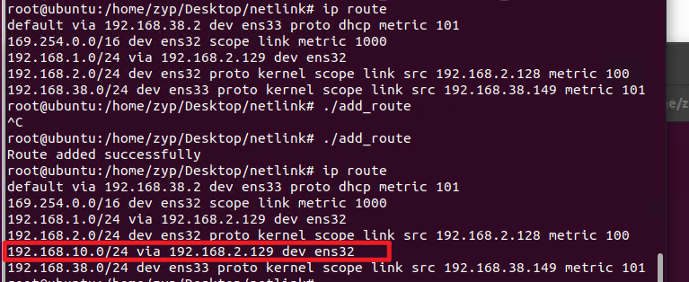

## 一、引入
ip route可以向内核添加路由表，Frrouting软件也可以自主下发路由表。在网络协议栈以及四表五链的介绍中，可以看到，数据包需要转发到其他主机时由**FORWARD**通过查找路由表进行处理。路由表在内核中进行存储。本文将揭秘ip route以及Frroutiong是如何修改内核路由表的。

FRRouting（FRR）通过其内部的 **Zebra** 守护进程来修改 Linux 内核的路由表。Zebra 是 FRR 中的核心守护进程，它与各个路由协议守护进程（如 BGP、OSPF、RIP 等）协同工作，将计算好的路由更新同步到 Linux 内核的路由表中。Zebra 通过与 Linux 内核的 **Netlink** 接口进行通信，使用 `NETLINK_ROUTE` 协议族与内核交换路由信息。
## 二、netlink简介
Netlink 是 Linux 内核与用户空间通信的一种机制，专门设计用于操作内核数据结构的消息传递机制。它在用户空间进程与内核之间提供了双向的通信通道，主要用于网络子系统的管理，比如路由表、网络接口配置、地址管理等操作。
### 2.1 Netlink 的基本概念
Netlink 是一种 socket 类型，用户空间的应用程序可以通过它向内核发送消息，同时内核也可以向用户空间发送消息。这种机制通过标准的 socket API 实现，并且有专门的协议族供不同类型的任务使用。
- **协议族**：Netlink 支持不同的协议族，每个族处理特定的任务，比如 `NETLINK_ROUTE` 用于网络管理，`NETLINK_GENERIC` 提供通用消息传递等。
- **双向通信**：Netlink 套接字是全双工的，意味着用户空间和内核空间都可以发送和接收消息。
- **异步消息**：Netlink 消息的通信是异步的，用户空间程序发送消息后，内核可能会稍后回应，不需要立即等待响应。
### 2.2 Netlink 消息格式
Netlink 消息使用结构化的格式进行传输，主要由两个部分构成：
- **消息头（`nlmsghdr`）**：包含消息的元数据，如消息长度、类型、标志、序列号等。
- **消息体**：根据不同的协议族，消息体的格式有所不同。比如，`RTM_NEWROUTE` 消息体中包含 `rtmsg` 结构体，用于表示路由的元数据。
#### `nlmsghdr` 结构
```c
struct nlmsghdr {
    __u32 nlmsg_len;    // 整个消息的长度
    __u16 nlmsg_type;   // 消息类型
    __u16 nlmsg_flags;  // 消息标志，如 NLM_F_REQUEST、NLM_F_ACK 等
    __u32 nlmsg_seq;    // 消息序列号，用于跟踪请求和响应的匹配
    __u32 nlmsg_pid;    // 消息的发送者 ID（通常是用户进程的 PID）
};
```
- `nlmsg_type`：定义消息的类型。例如 `RTM_NEWROUTE` 表示新建一个路由表项，`RTM_DELROUTE` 表示删除一个路由表项。
- `nlmsg_flags`：定义操作的模式，常见标志包括：
  - `NLM_F_REQUEST`：请求类型的消息。
  - `NLM_F_ACK`：请求内核确认操作是否成功。
  - `NLM_F_CREATE`：创建一个新的对象（如路由表项）。
  - `NLM_F_EXCL`：如果对象已经存在则报错。
#### `rtmsg` 结构（适用于 `NETLINK_ROUTE`）
在处理路由表项时，消息体包含 `rtmsg` 结构，用于描述路由信息。

```c
struct rtmsg {
    unsigned char rtm_family;   // 地址族，如 AF_INET 或 AF_INET6
    unsigned char rtm_dst_len;  // 目的地址前缀的长度
    unsigned char rtm_src_len;  // 源地址前缀的长度
    unsigned char rtm_tos;      // 服务类型
    unsigned char rtm_table;    // 路由表编号
    unsigned char rtm_protocol; // 路由来源协议
    unsigned char rtm_scope;    // 路由的范围
    unsigned char rtm_type;     // 路由类型，如 RTN_UNICAST
    unsigned rtm_flags;         // 路由标志
};
```

### 2.3 Netlink 工作流程
Netlink 的工作流程可以分为以下几步：
#### 1. **创建 Netlink Socket**
Netlink 通信首先需要通过 `socket(AF_NETLINK, SOCK_RAW, NETLINK_ROUTE)` 创建一个 Netlink 套接字。该套接字将用于在用户空间和内核之间传递消息。
#### 2. **构建 Netlink 消息**
用户空间程序需要构建一条 Netlink 消息，这条消息包含消息头（`nlmsghdr`）和实际的数据内容。数据内容根据具体的协议族（如 `NETLINK_ROUTE`）而不同，例如操作路由表时需要 `rtmsg` 结构。
#### 3. **发送 Netlink 消息**
用户空间通过 `sendto` 或 `sendmsg` 系统调用将构造好的消息发送到内核。Netlink 消息的接收端是内核的特定模块（如路由子系统）。
#### 4. **内核处理消息**
内核根据收到的消息进行相应的操作。例如，当收到 `RTM_NEWROUTE` 消息时，内核会更新路由表。如果消息需要返回响应（如操作成功或失败的确认），内核将通过 Netlink 再向用户空间发送消息。
#### 5. **用户空间接收响应**
用户空间可以通过 `recv` 或 `recvmsg` 接口接收来自内核的消息，检查操作是否成功或获取其他反馈信息。
### 2.4 Netlink 消息的封装

为了确保消息体的扩展性，Netlink 使用类型-长度-值（TLV）格式封装消息体的属性信息。这些属性信息通过 `rtattr` 结构来表示：

```c
struct rtattr {
    unsigned short rta_len;  // 属性的总长度
    unsigned short rta_type; // 属性类型
    // 属性值紧跟在 rta 结构之后
};
```
通过 `RTA_DATA` 宏可以访问属性值，通过 `RTA_LENGTH(len)` 获取该属性的长度。
常见的属性类型包括：
- `RTA_DST`：目标地址
- `RTA_GATEWAY`：网关地址
- `RTA_OIF`：出接口索引
### 2.5 Netlink 的优点
Netlink 在设计上具有许多优点，使其非常适合内核和用户空间之间的网络配置和控制：
- **灵活性**：Netlink 使用可扩展的消息格式，允许根据需求动态添加属性。
- **高效性**：Netlink 通过单一机制支持多种网络管理任务，减少了多种 API 的复杂性。
- **双向通信**：Netlink 支持内核和用户空间的双向通信，用户空间可以发出请求，内核可以主动发送事件通知。
- **异步通信**：由于消息可以异步处理，因此 Netlink 提供了更高的并发性能。
### 2.6 Netlink 的常见使用场景
Netlink 最常用于网络相关的任务，特别是网络子系统的管理：
- **路由表管理**：通过 Netlink 可以动态添加、删除或修改路由表项。路由守护进程（如 `bird`、`quagga`）依赖于 Netlink 来与内核交换路由信息。
- **网络接口配置**：可以通过 Netlink 配置网络接口的状态（启用或禁用接口）以及 IP 地址分配。
- **流量控制和 QoS**：通过 `NETLINK_ROUTE` 的 `TC` 子系统，管理员可以配置流量控制、队列规则等。

## 三、实际测试
### 3.1 测试代码
```c
#include <stdio.h>
#include <stdlib.h>
#include <string.h>
#include <unistd.h>
#include <arpa/inet.h>
#include <linux/netlink.h>
#include <linux/rtnetlink.h>
#include <sys/socket.h>
#include <net/if.h>

#define BUFSIZE 8192

// Function to add attributes to the Netlink message
// 这里定义了套接字 `sock`，一个 `sockaddr_nl` 结构 `nladdr` 用于指定 Netlink 地址，
//以及一个请求消息 `req`，其中包括 `nlmsghdr`（Netlink 消息头）和 `rtmsg`（路由消息）。
void addattr_l(struct nlmsghdr *nlh, int maxlen, int type, const void *data, int alen) {
    int len = RTA_LENGTH(alen);
    struct rtattr *rta;

    if (NLMSG_ALIGN(nlh->nlmsg_len) + len > maxlen) {
        fprintf(stderr, "addattr_l: message exceeded bound of %d\n", maxlen);
        exit(EXIT_FAILURE);
    }

    rta = (struct rtattr *)(((char *)nlh) + NLMSG_ALIGN(nlh->nlmsg_len));
    rta->rta_type = type;
    rta->rta_len = len;
    memcpy(RTA_DATA(rta), data, alen);
    nlh->nlmsg_len = NLMSG_ALIGN(nlh->nlmsg_len) + len;
}

int main() {
    int sock;
    struct sockaddr_nl nladdr;
    struct {
        struct nlmsghdr nlh;
        struct rtmsg rtm;
        char buf[BUFSIZE];
    } req;

    // Create Netlink socket
    sock = socket(AF_NETLINK, SOCK_RAW, NETLINK_ROUTE);
    if (sock < 0) {
        perror("socket");
        exit(EXIT_FAILURE);
    }

    memset(&nladdr, 0, sizeof(nladdr));
    nladdr.nl_family = AF_NETLINK;

    // Initialize request
    memset(&req, 0, sizeof(req));
    req.nlh.nlmsg_len = NLMSG_LENGTH(sizeof(struct rtmsg));
    req.nlh.nlmsg_type = RTM_NEWROUTE;
    req.nlh.nlmsg_flags = NLM_F_REQUEST | NLM_F_CREATE | NLM_F_EXCL;
    req.nlh.nlmsg_seq = 1;
    req.nlh.nlmsg_pid = getpid();

    // Set up route message
    req.rtm.rtm_family = AF_INET;
    req.rtm.rtm_table = RT_TABLE_MAIN;
    req.rtm.rtm_protocol = RTPROT_BOOT;
    req.rtm.rtm_scope = RT_SCOPE_UNIVERSE;
    req.rtm.rtm_type = RTN_UNICAST;
    req.rtm.rtm_dst_len = 24; // 192.168.10.0/24

    // Add destination attribute (192.168.10.0)
    struct in_addr dst;
    inet_pton(AF_INET, "192.168.10.0", &dst);
    addattr_l(&req.nlh, sizeof(req), RTA_DST, &dst, sizeof(dst));

    // Add gateway attribute (192.168.10.1)
    struct in_addr gw;
    inet_pton(AF_INET, "192.168.1.129", &gw);
    addattr_l(&req.nlh, sizeof(req), RTA_GATEWAY, &gw, sizeof(gw));

    // Add output interface (eth0)
    int ifindex = if_nametoindex("ens32");
    if (ifindex == 0) {
        perror("if_nametoindex");
        close(sock);
        exit(EXIT_FAILURE);
    }
    addattr_l(&req.nlh, sizeof(req), RTA_OIF, &ifindex, sizeof(ifindex));

    // Send the message to kernel
    if (sendto(sock, &req, req.nlh.nlmsg_len, 0, (struct sockaddr *)&nladdr, sizeof(nladdr)) < 0) {
        perror("sendto");
        close(sock);
        exit(EXIT_FAILURE);
    }

    // Receive kernel response (optional, for confirmation)
    char buffer[BUFSIZE];
    int len = recv(sock, buffer, sizeof(buffer), 0);
    if (len < 0) {
        perror("recv");
        close(sock);
        exit(EXIT_FAILURE);
    }

    // Optionally, parse the kernel response to check the result
    printf("Route added successfully\n");

    // Close socket
    close(sock);

    return 0;
}
```
 `void addattr_l(struct nlmsghdr *nlh, int maxlen, int type, const void *data, int alen);
 `nlh`:指向 Netlink 消息头的指针。
 `maxlen`:表示消息的最大长度
 `type`:表示要添加的属性类型。
 `data`:指向数据的指针。
`alen`: 表示要添加的数据的长度。
`addattr_l()` 函数的作用是向 Netlink 消息中添加一个属性。


### 3.2 实现结果
实现功能：向ip route写入目的网段为192.168.10.0的流表。
经过编译运行后，通过ip route可以发现路由表添加成功。
运行前后对比：

可以观察到路由表添加成功。
注意：如果添加的路由表是不合法的，会添加失败。

## 4. netlink的内核实现
### 4.1. **Netlink 的内核实现核心结构**
在内核中，`Netlink` 使用了一些关键的数据结构来管理和操作消息通信。主要的结构包括：
#### a. **`struct sock` 和 `struct netlink_sock`**
每个 `Netlink` 套接字在内核中通过 `struct sock` 表示，这与其他类型的套接字（如 TCP、UDP）是类似的。对于 `Netlink`，具体实现中是 `struct netlink_sock`，它是 `struct sock` 的一个子结构，专门用于 `Netlink` 套接字。
```c
struct netlink_sock {
    struct sock sk;
    struct netlink_table *table;
    struct mutex *cb_mutex;
    struct netlink_callback *cb;
    struct mutex *cb_def_mutex;
    struct netlink_callback *cb_def;
    struct netlink_kernel_cfg cfg;
};
```
`netlink_sock` 负责管理 `Netlink` 套接字的各种状态和配置，例如消息队列、内核回调函数、PID 等。
#### b. **`struct nlmsghdr`**
`nlmsghdr` 是 `Netlink` 消息头部的结构，所有通过 `Netlink` 传输的消息都必须带有这个头部，它包含了消息的长度、类型、标志、序列号等信息。
```c
struct nlmsghdr {
    __u32 nlmsg_len;   // 消息的总长度（包括头部和消息体）
    __u16 nlmsg_type;  // 消息类型（如 RTM_NEWROUTE，表示添加路由）
    __u16 nlmsg_flags; // 消息的标志位（如 NLM_F_REQUEST，表示请求消息）
    __u32 nlmsg_seq;   // 序列号，用于跟踪消息的请求和响应
    __u32 nlmsg_pid;   // 发送者的 PID（用户空间进程的 PID 或 0 代表内核）
};
```
#### c. **`struct netlink_table`**
`netlink_table` 是内核中 `Netlink` 套接字的注册表，用于管理不同的 `Netlink` 套接字协议族。例如，`NETLINK_ROUTE` 就是一个特定的协议族，负责路由表的管理。
```c
struct netlink_table {
    unsigned int hash;
    struct hlist_head *mc_list;
    struct listeners *listeners;
    struct module *module;
    const struct nla_policy *policy;
};
```

`Netlink` 协议族通过 `netlink_table` 进行注册，不同协议族可以有不同的消息处理函数和规则。
### 4.2  **Netlink 套接字的工作流程**
#### a. **创建 Netlink 套接字**
当用户空间通过 `socket(AF_NETLINK, SOCK_RAW, NETLINK_ROUTE)` 创建一个 `Netlink` 套接字时，内核调用 `netlink_create()` 函数，该函数会初始化 `struct sock` 和 `struct netlink_sock` 结构，并将套接字关联到相应的 `Netlink` 协议族上。
```c
int netlink_create(struct net *net, struct socket *sock, int protocol, int kern)
{
    struct sock *sk;
    struct netlink_sock *nlk;

    sk = sk_alloc(net, PF_NETLINK, GFP_KERNEL, &netlink_proto, kern);
    nlk = netlink_sk(sk);
    ...
}
```
#### b. **发送 Netlink 消息**
当用户空间调用 `sendto()` 发送 `Netlink` 消息时，内核通过 `netlink_sendmsg()` 函数处理该消息。这个函数负责将用户空间构造的 `Netlink` 消息传递给内核相应的协议处理函数。例如，`NETLINK_ROUTE` 协议族的消息最终会交给路由子系统处理。
```c
int netlink_sendmsg(struct socket *sock, struct msghdr *msg, size_t len)
{
    struct sock *sk = sock->sk;
    struct netlink_sock *nlk = netlink_sk(sk);

    // 将消息插入发送队列或直接处理
    netlink_unicast(nlk->sk, skb, portid, type, 0);
}
```
在 `netlink_unicast()` 中，消息被放入内核的接收队列中，等待相应的处理函数处理。
#### c. **接收 Netlink 消息**
当内核接收到来自用户空间的 `Netlink` 消息后，会通过协议处理函数处理这个消息。例如，处理 `NETLINK_ROUTE` 消息时，内核会调用 `rtnetlink_rcv()` 来解析消息并执行路由相关操作。
```c
static void rtnetlink_rcv(struct sk_buff *skb)
{
    struct nlmsghdr *nlh = nlmsg_hdr(skb);

    // 处理不同类型的路由消息
    switch (nlh->nlmsg_type) {
        case RTM_NEWROUTE:
            rtnl_newroute(skb, nlh);
            break;
        case RTM_DELROUTE:
            rtnl_delroute(skb, nlh);
            break;
        // 其他类型...
    }
}
```
在这个例子中，如果消息类型是 `RTM_NEWROUTE`，内核将调用 `rtnl_newroute()` 来添加新的路由。
#### d. **内核向用户空间发送消息**
内核也可以通过 `Netlink` 主动向用户空间发送消息。例如，当网络接口状态发生变化时，内核可以通过 `NETLINK_ROUTE` 向用户空间发送通知。这个过程通过 `netlink_broadcast()` 实现。
```c
void netlink_broadcast(struct sock *ssk, struct sk_buff *skb, u32 pid, u32 group, gfp_t allocation)
{
    struct netlink_sock *nlk = netlink_sk(ssk);
    // 遍历所有套接字，广播消息
    for (i = 0; i < MAX_SOCKETS; i++) {
        netlink_sendmsg(nlk, skb, pid, group);
    }
}
```
内核会将消息广播到所有监听特定 `Netlink` 组（如网络事件组）的用户空间进程。
### 4.3 **Netlink 协议族的实现**
`Netlink` 支持多种不同的协议族，每个协议族都有特定的功能。常见的 `Netlink` 协议族包括
- **`NETLINK_ROUTE`**：用于路由表、地址、邻居、链路层管理等网络配置任务。它是最常用的 `Netlink` 协议族之一，`iproute2` 等工具使用这个协议族进行网络管理。
- **`NETLINK_GENERIC`**：一个通用协议族，用于用户定义的 `Netlink` 通信。用户可以定义自定义的 `Netlink` 命令来处理专用任务。
- **`NETLINK_NETFILTER`**：用于和 `Netfilter` 子系统（如 `iptables`）进行通信，管理防火墙规则和网络地址转换（NAT）。
- **`NETLINK_SOCK_DIAG`**：用于从内核中查询 socket 诊断信息，帮助用户调试和诊断网络问题。
每个协议族在内核中都有对应的处理程序。以 `NETLINK_ROUTE` 为例，内核中的 `rtnetlink` 模块负责处理所有与路由相关的 `Netlink` 消息。
