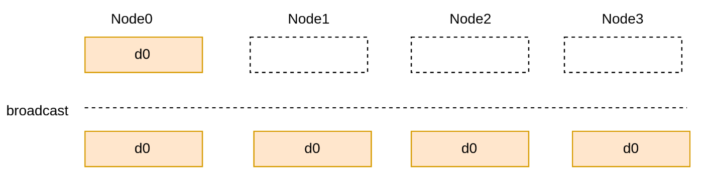
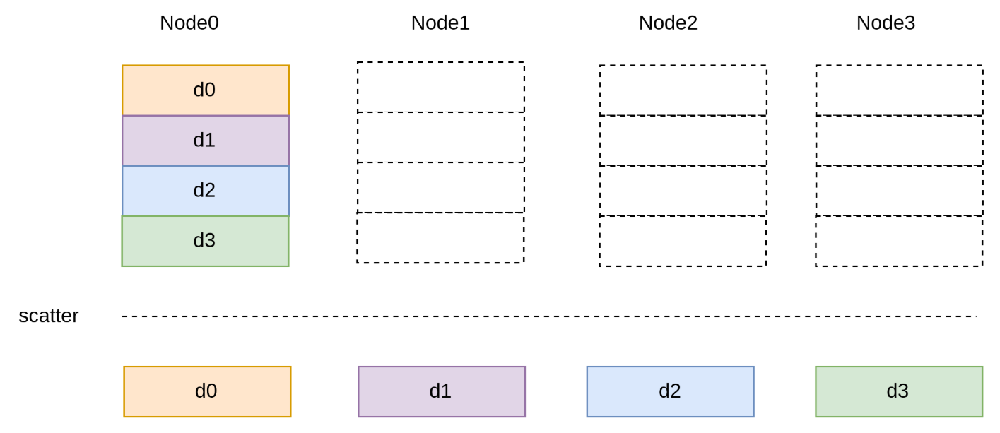
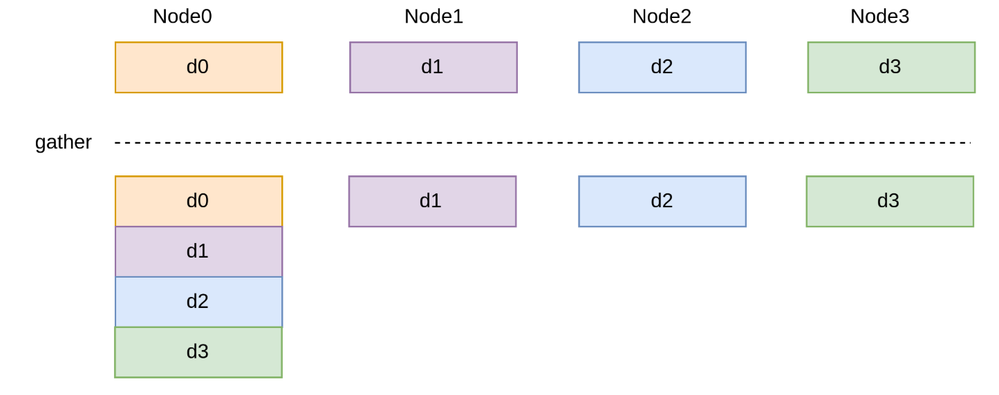
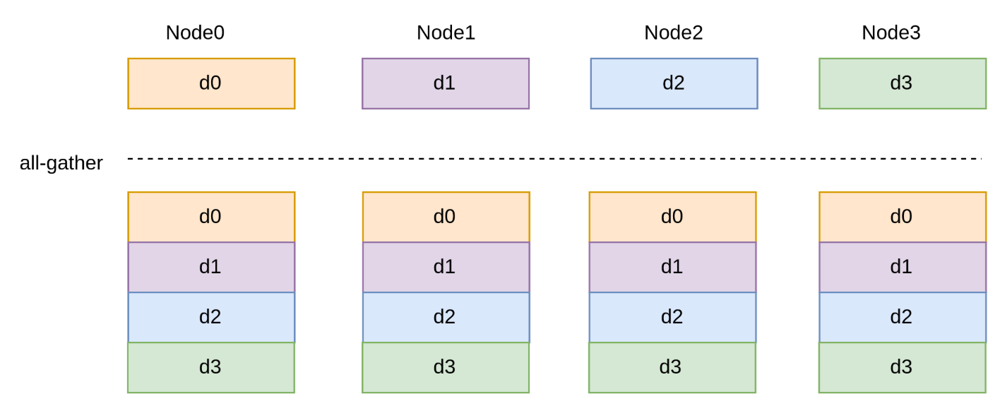
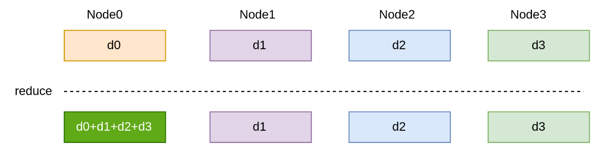
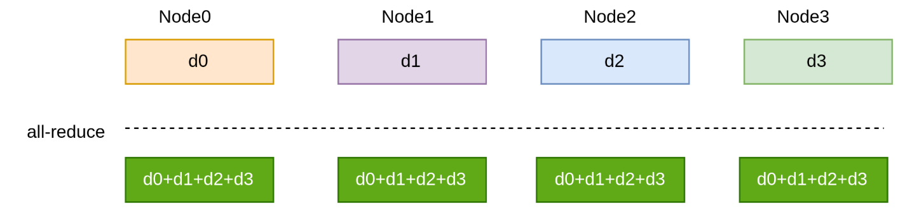
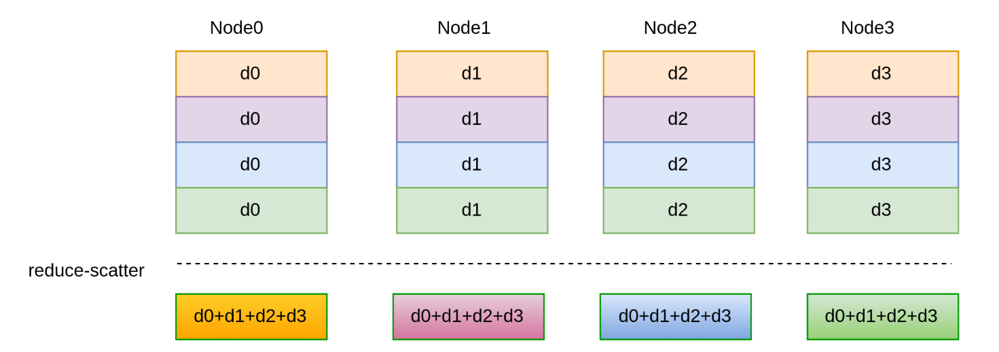
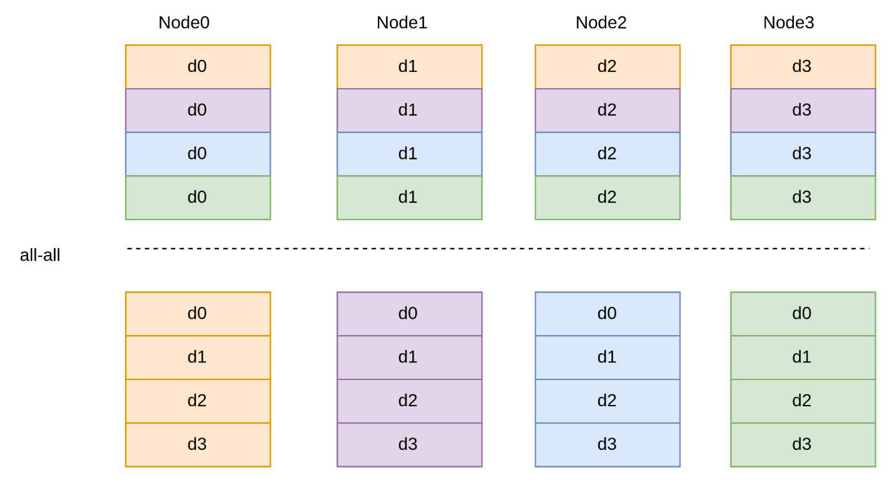

# 集合通信

集合通信（Collective Communication）是指在并行计算或分布式系统中，多个进程或计算节点之间进行的数据交换操作，通常是为了协调计算、同步状态或共享数据。与点对点通信不同，集合通信涉及多个节点，并且通常是多个节点共同参与的操作。集合通信通常包括一些基本的操作，如广播、聚集、归约、分发等。

## 通信原语

### broadcast
在并行计算领域，广播（Broadcast）用于将数据从一个进程或节点发送到所有其他进程或节点。通常由一个源进程或节点发送数据，然后所有其他进程或节点都接收相同的数据。
用途：广播通常用于在并行计算中将全局数据分发给所有参与者，以便它们可以共享相同的信息



### scatter
在并行计算领域，分散（scatter）用于将数据从一个进程或节点发送到多个进程或节点。通常由一个源进程或节点发送数据，然后所有其他进程或节点都接收部分数据。
用途：分散通常用于将全局数据分配给各个参与者，以便它们可以分别处理自己的部分数据。



### gather
在并行计算领域，收集（gather）用于将来自多个进程或节点的数据收集到单个进程或节点中。结果是将来自各个进程或节点的数据聚合到一个目标进程或节点中。
用途：收集通常用于在并行计算中汇总数据，进行统计分析或在单个节点上进行处理。



### all-gather
在并行计算领域，全收集（all-gather）类似于收集操作，但不同之处在于它将来自所有进程或节点的数据收集到所有其他进程或节点中，而不仅仅是一个目标进程或节点。
用途：全收集通常用于在分布式计算中共享数据，进行全局汇总或进行全局同步。



### reduce
在并行计算领域，归约（reduce）用于将来自多个进程或节点的数据合并成单个值。通常由一个目标进程或节点执行归约操作，并将来自其他进程或节点的数据聚合成一个结果。

用途：归约通常用于在并行计算中汇总数据，计算全局统计量或合并各个部分的计算结果。



### all-reduce
在并行计算领域，全归约（all-reduce）类似于归约操作，但不同之处在于它将来自所有进程或节点的数据合并成单个值，并将结果分发给所有其他进程或节点。

用途：全归约通常用于在分布式计算中计算全局统计量，合并全局计算结果或进行全局同步。



### reduce-scatter
在并行计算领域，归约-分散（reduce-scatter）结合了归约和分散操作。它首先将来自多个进程或节点的数据归约成单个值，然后将结果分散到所有进程或节点中。

用途：归约-分散通常用于将全局计算结果分发给各个参与者，以便它们可以在本地处理部分结果。



### all-all
在并行计算领域，全-全（all-all）它在所有进程或节点之间进行全局数据交换。每个进程或节点都向所有其他进程或节点发送数据，并接收来自所有其他进程或节点的数据。

用途：全-全通常用于实现全局同步、全局数据交换或分布式计算中的其他全局操作。



## 集合通信工具


**MPI**（Message Passing Interface）、**NCCL**（NVIDIA Collective Communication Library）和**Gloo**是三种常见的分布式通信库。

### 1. **MPI（Message Passing Interface）**
[Tutorials](https://mpitutorial.com/tutorials/mpi-introduction/zh_cn/])
#### 特点：
- **底层通信协议**：MPI是最为广泛使用的并行计算通信库，它定义了进程间如何通过消息进行通信。MPI提供了丰富的功能，包括点对点通信（send/receive）、集合通信（广播、聚集、归约等）、同步操作等。
- **通用性强**：MPI支持多种平台，包括分布式内存、共享内存的计算机集群，适用于广泛的应用场景，不限于深度学习。
- **高效性**：MPI通过直接与硬件进行交互，提供高效的通信，特别是在高性能计算（HPC）领域。
- **灵活性**：MPI的API非常灵活，允许开发者在点对点通信、集合通信等方面进行精细的控制。
  
#### 用法：
- **基本通信**：使用`MPI_Send`和`MPI_Recv`来进行点对点的消息传递。
- **集合通信**：例如，使用`MPI_Bcast`进行广播，`MPI_Reduce`进行归约，`MPI_Gather`进行数据收集。
- **初始化与终结**：使用`MPI_Init`初始化MPI环境，`MPI_Finalize`终结MPI环境。
  
  示例代码（广播）：
  ```c
  #include <mpi.h>

  int main(int argc, char** argv) {
      MPI_Init(&argc, &argv);

      int rank;
      MPI_Comm_rank(MPI_COMM_WORLD, &rank);
      int data = 0;
      if (rank == 0) {
          data = 100; // Root process
      }
      MPI_Bcast(&data, 1, MPI_INT, 0, MPI_COMM_WORLD); // Broadcast data
      printf("Rank %d received data %d\n", rank, data);

      MPI_Finalize();
      return 0;
  }
  ```

#### 使用场景：
- **HPC（高性能计算）**：MPI在科学计算、数值模拟等高性能计算任务中广泛使用。
- **大规模并行计算**：适用于需要多节点、分布式内存系统的计算场景。
- **非深度学习场景**：适用于传统的并行计算任务，不仅限于机器学习或深度学习。

#### 优缺点：
- **优点**：
  - 灵活性高，支持广泛的并行计算模式。
  - 在异构计算环境中表现优异。
- **缺点**：
  - 编程复杂，需要开发者管理细节（如进程同步、通信模式选择等）。
  - 相较于NCCL和Gloo，MPI在GPU通信优化上较弱，尤其在深度学习任务中不如NCCL高效。

---

### 2. **NCCL（NVIDIA Collective Communication Library）**

[Documentation](https://docs.nvidia.com/deeplearning/nccl/user-guide/docs/index.html)

#### 特点：
- **专为GPU优化**：NCCL是NVIDIA开发的专门用于GPU间高效通信的库。它利用NVIDIA的硬件加速技术，特别优化了多GPU通信，能够在分布式深度学习中提供高速、低延迟的集合通信。
- **支持多种通信模式**：包括广播（broadcast）、归约（reduce）、全归约（all-reduce）、聚集（gather）等常用的集合通信操作。
- **与CUDA集成**：NCCL直接与CUDA环境集成，可以直接在GPU上运行，减少CPU干预，提供更高的性能。
- **高效的全归约**：NCCL提供高效的全归约操作，特别适用于分布式深度学习中的梯度同步（例如在训练过程中进行梯度的All-Reduce）。

#### 用法：
- NCCL的使用通常通过集成到深度学习框架中（如TensorFlow、PyTorch）来简化，开发者可以直接调用高级API，而不需要自己处理低层的通信细节。

  示例代码（NCCL进行全归约）：
  ```cpp
  #include <nccl.h>
  ncclComm_t comm;
  ncclUniqueId id;
  // 初始化nccl通信
  ncclGetUniqueId(&id);
  ncclCommInitRank(&comm, numDevices, id, rank);

  float* sendbuf = ...;  // GPU上的数据
  float* recvbuf = ...;  // GPU上的数据
  ncclAllReduce(sendbuf, recvbuf, size, ncclFloat, ncclSum, comm, cudaStream);

  ncclCommDestroy(comm);  // 销毁通信
  ```

#### 使用场景：
- **深度学习训练**：NCCL特别适合在多GPU环境下进行深度学习训练，能够在多个GPU之间高效同步数据。
- **NVIDIA硬件加速**：如果使用的是NVIDIA的GPU硬件，NCCL能够最大化利用其硬件加速优势。
- **大规模分布式训练**：NCCL支持多节点、多GPU之间的通信，适用于大规模分布式深度学习。

#### 优缺点：
- **优点**：
  - 专为GPU优化，能够充分发挥NVIDIA硬件的优势。
  - 高效的集合通信操作，特别适合深度学习的分布式训练。
  - 简化了通信操作，集成到深度学习框架中易于使用。
- **缺点**：
  - 只适用于NVIDIA硬件，无法跨平台使用（如CPU或其他GPU厂商的硬件）。

---

### 3. **Gloo**

#### 特点：
- **轻量级、高效的集合通信库**：Gloo是Facebook开发的一个集合通信库，特别为机器学习应用中的分布式训练设计，尤其是PyTorch。
- **支持CPU和GPU**：Gloo支持在CPU和GPU集群之间进行高效的集合通信。
- **灵活性和易用性**：相比MPI，Gloo更加轻量，API设计简洁，易于集成到现有的机器学习框架（如PyTorch）中。
- **跨平台支持**：除了NCCL专为NVIDIA硬件优化外，Gloo还可以在多种硬件和平台上运行（包括CPU和多个GPU平台）。

#### 用法：
- Gloo集成在如PyTorch等机器学习框架中，通常用户不需要直接操作底层代码，框架会自动使用Gloo进行分布式通信。
  
  示例代码（PyTorch中使用Gloo进行分布式训练）：
  ```python
  import torch
  import torch.distributed as dist

  dist.init_process_group(backend='gloo', rank=rank, world_size=world_size)

  tensor = torch.ones(1)
  dist.all_reduce(tensor, op=dist.reduce_op.SUM)  # 使用Gloo进行All-Reduce

  print(tensor)
  ```

#### 使用场景：
- **分布式深度学习**：特别适用于PyTorch等框架中的分布式训练。
- **中小规模集群**：Gloo适合中小规模的训练任务，相比MPI更轻量，适用于不需要极端优化的情况。
- **支持多平台**：适用于多平台环境，包括多GPU和多CPU。

#### 优缺点：
- **优点**：
  - 与PyTorch等深度学习框架无缝集成。
  - 轻量级，易于配置和使用。
  - 支持CPU和GPU，跨平台兼容。
- **缺点**：
  - 在GPU集群的性能上通常不如NCCL。
  - 对于大规模分布式训练，可能没有MPI那样高效。

---

### 区别总结

| 特性                     | **MPI**                                       | **NCCL**                                          | **Gloo**                                         |
|--------------------------|-----------------------------------------------|---------------------------------------------------|-------------------------------------------------|
| **平台/硬件支持**        | 通用，支持CPU和GPU                           | 专为NVIDIA GPU优化，依赖CUDA                    | 支持CPU和GPU，跨平台                          |
| **性能优化**             | 高性能，但在GPU通信上不如NCCL优化            | 专为GPU优化，尤其是在多GPU通信中提供极高性能    | 轻量级优化，适用于中小规模集群，性能适中      |
| **编程复杂度**           | 高，需开发者管理通信细节                    | 简单，集成于深度学习框架，开发者几乎不需要干预   | 简单，易于集成到PyTorch等框架                |
| **应用场景**             | 高性能计算（HPC）、传统并行计算

任务            | 分布式深度学习，尤其是多GPU训练                 | 中小规模分布式深度学习，尤其适用于PyTorch    |
| **适用范围**             | 通用，大规模集群，支持多种计算任务            | 主要用于深度学习，特别是NVIDIA硬件上的训练      | 适用于PyTorch，支持多平台的分布式训练        |

### 总结

- **MPI**：适合传统的并行计算、HPC任务，通用性强，支持各种平台，但编程复杂度较高，且不针对GPU优化。
- **NCCL**：专为NVIDIA GPU优化，适合大规模分布式深度学习任务，尤其是在多GPU环境下，提供高效的集合通信。
- **Gloo**：轻量级的集合通信库，特别适用于PyTorch等框架，支持CPU和GPU，适用于中小规模的分布式训练任务。

根据你的具体需求（如使用的硬件平台、计算任务的规模以及使用的深度学习框架），选择合适的通信库能显著提升训练效率和可扩展性。