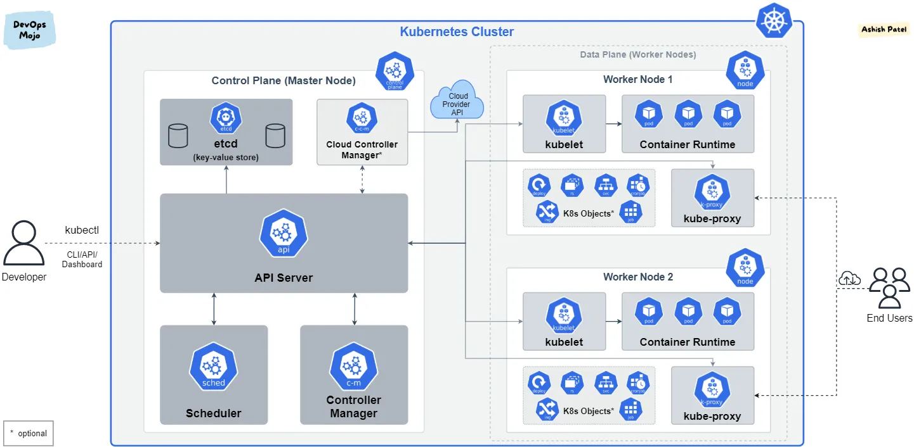
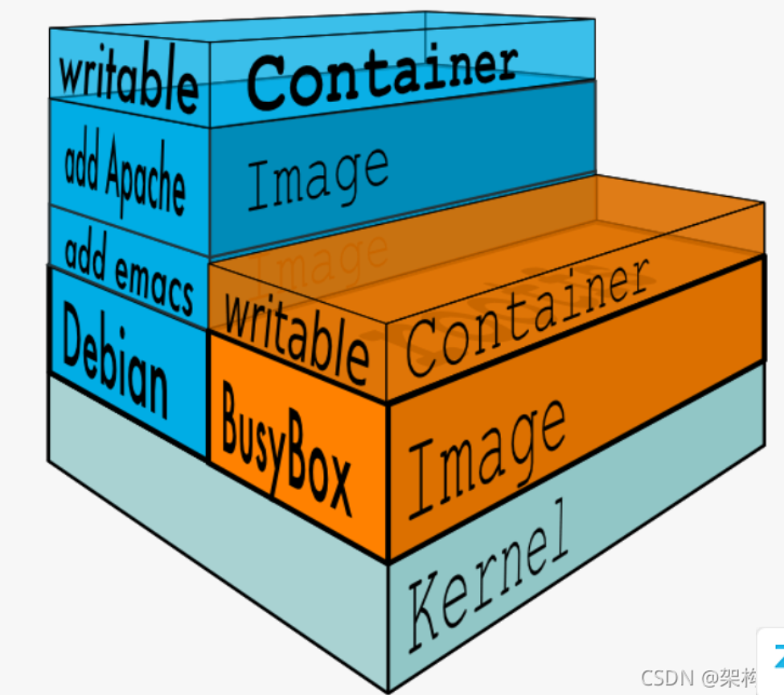

## 一、容器技术简介

**容器技术**是一种轻量级的虚拟化技术，用来在同一操作系统内核上运行多个隔离的用户空间实例（即容器）。它允许开发者将应用程序及其依赖环境打包在一起，并在任何兼容的系统上轻松部署和运行。容器与传统的虚拟机不同，容器共享宿主机的内核，不需要额外的操作系统实例，从而实现资源的高效利用和快速启动。

### 1. **容器技术的定义**
容器技术是一种操作系统级的虚拟化，提供了进程级别的隔离。每个容器都包含了应用程序的代码、运行时库、系统工具、系统配置文件等，确保无论在哪台机器上运行，应用都能在容器内运行得一致。

### 2. **容器的关键特性**
- **轻量级**：容器共享宿主机的内核，因此与虚拟机相比，容器不需要虚拟化整个操作系统，从而大幅减小了资源开销。
- **快速启动**：由于不需要启动完整的操作系统实例，容器的启动时间通常是秒级或毫秒级，远远快于虚拟机。
- **一致性**：容器打包了应用程序及其依赖环境，因此无论是在开发环境、测试环境，还是生产环境中运行，容器内的应用程序行为都是一致的。
- **资源隔离**：通过使用操作系统内核的**namespace**和**cgroups**技术，容器之间的进程、文件系统、网络和资源使用是互相隔离的。
- **可移植性**：容器将应用程序及其依赖打包为标准化的镜像，可以在任何支持容器的主机上运行，确保跨平台的兼容性。

### 3. **容器技术的历史和演变**
容器技术的概念并不是新兴的，它起源于Linux内核中的一些基础功能。以下是容器技术的演变历程：
- **Chroot（1982年）**：最早的容器化概念之一，`chroot` 允许在一个进程中改变根目录，从而限制进程对文件系统的访问范围。
- **Linux VServer（2001年）**：这是早期的操作系统级虚拟化技术，能够在Linux上创建多个虚拟化环境，类似于容器。
- **OpenVZ（2005年）**：OpenVZ是基于Linux内核的容器技术，它引入了进程隔离和资源限制，进一步提升了容器的隔离能力。
- **LXC（Linux Containers，2008年）**：LXC 是一种基于Linux内核的容器实现，利用了cgroups和namespace技术，使得容器可以实现与虚拟机类似的隔离效果。
- **Docker（2013年）**：Docker的出现标志着容器技术的普及。它通过引入易用的CLI工具、镜像打包和发布机制，使得容器在开发、测试和生产环境中的应用更加方便和广泛。
- **Kubernetes（2014年）**：Kubernetes是一个开源的容器编排平台，用于自动化部署、扩展和管理容器化应用，解决了容器大规模管理和编排的问题。
### 4. **容器与虚拟机的比较**
虽然容器和虚拟机都提供了环境隔离，但它们在实现原理和资源消耗上有明显的区别：

| 特性        | 容器                 | 虚拟机                |
| --------- | ------------------ | ------------------ |
| **隔离方式**  | 操作系统级别，进程级隔离       | 硬件级别，完全虚拟化操作系统     |
| **内核**    | 共享宿主机内核            | 每个虚拟机有自己的操作系统和内核   |
| **启动速度**  | 快速，秒级或毫秒级          | 慢，通常在数分钟内          |
| **资源利用率** | 高效，轻量级             | 较重，运行完整的操作系统       |
| **存储开销**  | 共享基础镜像，文件系统分层      | 每个虚拟机需要完整的磁盘镜像     |
| **使用场景**  | 微服务架构、DevOps、云原生应用 | 运行多种操作系统或需要完全隔离的场景 |
**举例说明：**
在Ubuntu 22.04上运行Ubuntu 16.04的Docker镜像时，虽然两者的内核版本不一致，Docker的隔离机制使得这种不一致不会对容器运行产生太大影响。原因在于，Docker使用了Linux内核的**namespace**和**cgroups**机制来隔离容器内的进程、文件系统、网络等资源，但容器本身依然使用宿主机的内核。
而在Ubuntu 22.04宿主机上运行Ubuntu 16.04的Docker虚拟机时，wmware等虚拟化软件模拟整套硬件环境，虚拟机与宿主机内核互相独立。

## 二、容器技术的底层原理

容器的底层原理是基于操作系统的内核级功能实现的，主要依赖于**namespace**（命名空间）和**cgroups**（控制组），加上**文件系统隔离**和**网络虚拟化**等技术。通过这些技术，容器能够提供进程级别的隔离，让每个容器看起来像是独立的系统环境，尽管它们共享同一个宿主机的内核。

以下是实现容器的主要底层原理及其相关机制：
### 1. **Namespace（命名空间）**
命名空间是Linux内核提供的功能，用来隔离容器中进程的全局系统资源，使每个容器都有自己独立的视角，认为自己运行在独立的系统中。Linux的命名空间机制包括以下几种类型，每种类型负责隔离不同的系统资源：

- **PID Namespace（进程ID命名空间）**：
  - 隔离进程ID号，使每个容器有独立的进程ID空间。
  - 容器内的进程只能看到自己命名空间中的进程，看不到宿主机或其他容器中的进程。

- **UTS Namespace（主机名和域名命名空间）**：
  - 隔离系统的主机名和NIS域名。
  - 每个容器可以拥有自己的主机名和域名，和宿主机或其他容器无关。

- **Mount Namespace（挂载命名空间）**：
  - 隔离文件系统挂载点。
  - 容器可以有自己独立的文件系统视图，决定哪些目录是可见的，哪些设备或文件系统可以被挂载。

- **Network Namespace（网络命名空间）**：
  - 隔离网络资源，如网络接口、IP地址、路由表、端口等。
  - 每个容器可以有自己的虚拟网络接口和IP地址，容器之间的网络可以通过虚拟桥接、NAT或其他网络配置来实现隔离和通信。

- **IPC Namespace（进程间通信命名空间）**：
  - 隔离进程间的通信资源，比如信号量、消息队列、共享内存等。
  - 容器内部的进程只能与同一命名空间中的其他进程通信。

- **User Namespace（用户命名空间）**：
  - 隔离用户和用户组ID，使得容器中的用户可以与宿主机隔离。
  - 容器内部的root用户可以映射为宿主机中的非特权用户，从而提高安全性。

通过这些命名空间技术，容器能够实现系统资源的隔离和虚拟化，每个容器都像是运行在一个独立的系统中。

### 2. **Cgroups（控制组）**
控制组（cgroups）是Linux内核提供的一种机制，用来限制、隔离和监控进程组对系统资源的使用。cgroups主要用于控制CPU、内存、网络带宽等资源的分配，确保容器之间资源的公平使用和隔离。

- **CPU限制**：通过设置cgroups，可以为每个容器分配一定比例的CPU资源。比如，可以将某个容器的CPU利用率限制在50%以内，防止某个容器耗尽宿主机的CPU资源。
  
- **内存限制**：cgroups允许限制容器所能使用的最大内存，防止某个容器占用过多内存而影响其他容器或宿主机的性能。

- **I/O限制**：cgroups还可以限制容器对磁盘I/O的使用，防止某个容器过度使用磁盘资源。

- **网络带宽限制**：通过cgroups，可以限制容器的网络流量带宽，确保网络资源的公平分配。

通过cgroups，管理员可以为每个容器分配不同的资源配额，并实时监控它们的资源使用情况，保证系统的稳定性和公平性。

### 3. **Union File System（联合文件系统）**
联合文件系统是一种分层的文件系统，允许多个文件系统层叠加在一起，为容器提供轻量级的存储机制。容器镜像使用联合文件系统来共享只读的基础层（例如操作系统层），并在此之上叠加读写层。

- **镜像分层**：容器镜像分为多个层，每个层可能包含基础的操作系统文件、库文件和应用程序。底层的镜像是只读的，减少了重复数据的存储。
  
- **写时复制（Copy-on-Write）**：当容器运行时，它在只读的基础层之上创建一个读写层。容器可以在读写层中修改文件或写入数据，而不会影响底层的只读层。这种方式既节省了空间，又提高了容器启动速度。

- **轻量级快照**：由于文件系统分层，创建容器的过程非常快，只需在现有的镜像层上创建新的读写层即可。这种特性也使得容器启动和销毁非常轻便。

Docker通常使用OverlayFS、AUFS或其他类似的联合文件系统来实现容器的文件系统隔离。

### 4. **网络虚拟化**
容器网络通过虚拟网络设备和网络命名空间实现隔离和虚拟化。每个容器有自己的网络栈（IP地址、端口、路由表等），但这些网络栈可以通过虚拟网络设备与宿主机网络连接。

- **虚拟以太网对（veth pairs）**：每个容器可以分配一个虚拟以太网设备（veth），通过这个设备与宿主机或其他容器通信。通常，宿主机会通过虚拟桥接（如Docker默认的`docker0`桥）将多个容器连接到同一个网络。

- **网络模型**：Docker容器网络支持多种模式，包括桥接网络（bridge）、主机网络（host）、覆盖网络（overlay）等，用户可以根据需求配置容器间的网络通信方式。

- **端口映射**：容器可以通过端口映射将内部的服务暴露到宿主机，从而与外部网络通信。

## 二、docker特性

### docker的镜像分层机制

Docker 的**镜像分层机制**是 Docker 镜像的一个核心特性，允许通过分层结构高效地构建、共享和管理容器镜像。这一机制利用了**联合文件系统（UnionFS）** 的特性，能够将多个只读层合并成一个文件系统，并且通过写时复制（Copy-on-Write）的方式实现数据共享与隔离。
Docker 镜像由多个**只读层（read-only layers）** 组成，每一层通常是通过 Dockerfile 中的一条指令生成的。每当你在 Dockerfile 中执行一条指令（如 `RUN`、`COPY`、`ADD` 等），Docker 就会创建一层新的只读层。这些层叠加在一起，形成了完整的 Docker 镜像。
镜像的分层机制带来了几个重要的好处：
- **减少冗余**：如果多个镜像使用相同的基础层（如同一个操作系统层），这些镜像可以共享相同的层，而无需重复存储，节省了磁盘空间。
- **提高构建效率**：Docker 在构建镜像时可以使用缓存。如果某一层已经构建过且未发生变化，Docker 就会直接复用这一层，而无需重新执行指令，这极大地提高了镜像构建的速度。

## 参考
https://www.redhat.com/zh/topics/containers
https://www.cnblogs.com/crazymakercircle/p/15400946.html