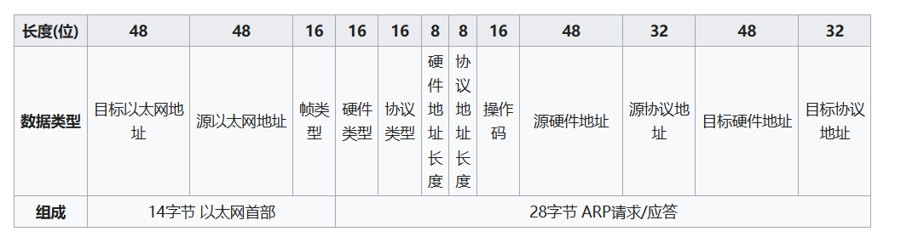

## 一、什么是ARP协议
ARP协议是“Address Resolution Protocol”（地址解析协议）的缩写。
在以太网环境中，数据的传输所依懒的是MAC地址而非IP地址，而将已知IP地址转换为MAC地址的工作是由ARP协议来完成的。
在局域网中，网络中实际传输的是“帧”，帧里面是有目标主机的MAC地址的。在以太网中，一个主机和另一个主机进行直接通信，必须要知道目标主机的MAC地址。但这个目标MAC地址是如何获得的呢？它就是通过地址解析协议获得的。
所谓“地址解析”就是主机在发送帧前将目标IP地址转换成目标MAC地址的过程。ARP协议的基本功能就是通过目标设备的IP地址，查询目标设备的MAC地址，以保证通信的顺利进行。

## 二、ARP的工作流程

#### 1. **ARP 请求（ARP Request）**
当主机 A 想与主机 B 通信时，它只知道主机 B 的 IP 地址，但不知道主机 B 的 MAC 地址。此时，主机 A 会发送一个广播消息，询问网络中是否有主机拥有该 IP 地址，并请求提供其 MAC 地址。
- **广播地址**：ARP 请求使用的是广播方式发送，其目标 MAC 地址为 `FF:FF:FF:FF:FF:FF`，这表示网络中的所有设备都会接收到该消息。
- **请求内容**：ARP 请求报文包含了主机 A 的 IP 地址和 MAC 地址，以及目标 IP 地址（即主机 B 的 IP 地址），但此时目标 MAC 地址未知。
#### 2. **ARP 回复（ARP Reply）**
当网络中的主机 B 接收到 ARP 请求后，会检查该请求中的目标 IP 地址。如果目标 IP 地址与自己的 IP 地址匹配，主机 B 就会发送一个 ARP 回复报文，告知主机 A 它的 MAC 地址。
- **单播回复**：ARP 回复是通过单播方式发送的，主机 B 将 ARP 回复直接发送给主机 A，包含主机 B 的 MAC 地址。
- **缓存更新**：主机 A 在收到 ARP 回复后，会将主机 B 的 IP 地址和对应的 MAC 地址存储到本地的 ARP 缓存中，方便后续通信。
#### 3. **数据传输**
一旦主机 A 获得了主机 B 的 MAC 地址，它就可以使用此 MAC 地址将数据报发送给主机 B。通信过程中的每个数据包都将使用以太网帧来封装，源和目的 MAC 地址分别是主机 A 和主机 B 的 MAC 地址。
#### 4. **ARP 缓存**
为了提高效率，ARP 使用了一个本地缓存（ARP Cache）来存储已经解析过的 IP 地址与对应的 MAC 地址。每当主机需要向某个 IP 地址发送数据时，首先会检查缓存中是否已经存在对应的 MAC 地址，如果存在则直接使用，避免重复发送 ARP 请求。
- **缓存超时**：ARP 缓存中的条目不是永久有效的，通常有一个超时时间（例如几分钟）。如果条目过期，需要再次发送 ARP 请求重新解析。ARP缓存表采用老化机制，在一段时间内如果表中的某一行没有使用，就会被删除，这样可减少缓存表的长度，加快查询速度。
#### 5. **ARP 的广播与单播**
- **ARP 请求**：通过广播方式发送，所有设备都可以接收到此消息。
- **ARP 回复**：通过单播方式发送，只发送给发出 ARP 请求的设备。

## 三、ARP报文格式

- 硬件类型（HTYPE）：如以太网（0x0001）、[分组无线网](https://zh.wikipedia.org/wiki/%E5%B0%81%E5%8C%85%E7%84%A1%E7%B7%9A%E9%9B%BB "数据包无线电")。
- 协议类型（PTYPE）：如[网际协议](https://zh.wikipedia.org/wiki/%E7%BD%91%E9%99%85%E5%8D%8F%E8%AE%AE "网际协议")(IP)（0x0800）、[IPv6](https://zh.wikipedia.org/wiki/IPv6 "IPv6")（0x86DD）。
- 硬件地址长度（HLEN）：每种硬件地址的字节长度，一般为6（以太网）。
- 协议地址长度（PLEN）：每种协议地址的字节长度，一般为4（IPv4）。
- 操作码：1为ARP请求，2为ARP应答，3为[RARP](https://zh.wikipedia.org/wiki/%E9%80%86%E5%9C%B0%E5%9D%80%E8%A7%A3%E6%9E%90%E5%8D%8F%E8%AE%AE "逆地址解析协议")请求，4为RARP应答。
- 源硬件地址（Sender Hardware Address，简称SHA）：n个字节，n由硬件地址长度得到，一般为发送方MAC地址。
- 源协议地址（Sender Protocol Address，简称SPA）：m个字节，m由协议地址长度得到，一般为发送方IP地址。
- 目标硬件地址（Target Hardware Address，简称THA）：n个字节，n由硬件地址长度得到，一般为目标MAC地址。
- 目标协议地址（Target Protocol Address，简称TPA）：m个字节，m由协议地址长度得到，一般为目标IP地址。



## 四、linux下修改arp表项

在 Linux（Ubuntu）系统中，可以通过命令行工具 `ip` 和 `arp` 来操作 ARP 表，包括增、删、改、查 ARP 表项。

### 1. **查询 ARP 表项**

可以使用以下命令来查看当前系统的 ARP 表：
#### 使用 `ip` 命令：
```bash
ip neigh show
```
#### 使用 `arp` 命令：
```bash
arp -n
```
> `-n` 参数表示以数字形式显示 IP 地址而不是主机名。

输出示例：
```bash
192.168.1.1 dev eth0 lladdr aa:bb:cc:dd:ee:ff REACHABLE
192.168.1.2 dev eth0 lladdr 11:22:33:44:55:66 STALE
```
### 2. **添加 ARP 表项**
可以通过 `ip` 或 `arp` 命令手动添加一个 ARP 表项，将一个 IP 地址映射到一个指定的 MAC 地址。
#### 使用 `ip` 命令：
```bash
sudo ip neigh add 192.168.1.10 lladdr aa:bb:cc:dd:ee:ff dev eth0
```
- `192.168.1.10`：目标 IP 地址。
- `lladdr`：指定 MAC 地址（链路层地址）。
- `dev eth0`：指定网络接口（替换为实际的接口名称）。
#### 使用 `arp` 命令：
```bash
sudo arp -s 192.168.1.10 aa:bb:cc:dd:ee:ff
```
- `-s`：表示设置一个静态 ARP 表项。
### 3. **删除 ARP 表项**
可以通过以下命令删除指定的 ARP 表项。
#### 使用 `ip` 命令：
```bash
sudo ip neigh del 192.168.1.10 dev eth0
```
- `192.168.1.10`：要删除的 IP 地址。
- `dev eth0`：指定网络接口。
#### 使用 `arp` 命令：
```bash
sudo arp -d 192.168.1.10
```
- `-d`：表示删除 ARP 表项。
### 4. **修改（更新）ARP 表项**
如果需要更新现有的 ARP 表项（例如修改一个 IP 地址对应的 MAC 地址），可以使用以下方法：
#### 使用 `ip` 命令：
首先删除现有的 ARP 表项，然后重新添加一个新的表项。
```bash
sudo ip neigh replace 192.168.1.10 lladdr aa:bb:cc:dd:ee:ff dev eth0
```
`replace` 可以直接修改现有表项，或者在表项不存在时添加新的表项。
#### 使用 `arp` 命令：
手动删除旧的表项，再添加新的表项。
```bash
sudo arp -d 192.168.1.10
sudo arp -s 192.168.1.10 aa:bb:cc:dd:ee:ff
```
### 5. **清空整个 ARP 表**
清空整个 ARP 表，可以使用以下命令：
#### 使用 `ip` 命令：
```bash
sudo ip -s -s neigh flush all
```
这将删除所有 ARP 表项。
### 6. **动态和静态 ARP 表项**

- **动态 ARP 表项** 是系统自动生成的，通常根据通信需要动态添加。
- **静态 ARP 表项** 是用户手动添加的，保存在系统中，直到手动删除。静态表项不会超时失效。

通过上述命令添加的 ARP 表项默认都是**静态**的，手动添加的静态 ARP 表项可以防止系统在网络中断时自动更新这些表项。


## 参考
1. [RFC 826 - An Ethernet Address Resolution Protocol: Or Converting Network Protocol Addresses to 48.bit Ethernet Address for Transmission on Ethernet Hardware (ietf.org)](https://datatracker.ietf.org/doc/html/rfc826)
2. [地址解析协议 - 维基百科，自由的百科全书 (wikipedia.org)](https://zh.wikipedia.org/wiki/%E5%9C%B0%E5%9D%80%E8%A7%A3%E6%9E%90%E5%8D%8F%E8%AE%AE#:~:text=%E6%97%A0%E5%9B%9E%E6%8A%A5%E7%9A%84ARP%EF%BC%88gr)
3. [ARP协议详解 ------- 一看就懂-CSDN博客](https://blog.csdn.net/xiaoxiaoxiexies/article/details/120211303#:~:text=ARP%E5%8D%8F%E8%AE%AE%EF%BC%8C%E5%85%A8%E7%A7%B0%E6%98%AFA)
4. [一文详解 ARP 协议 - 程序员cxuan - 博客园 (cnblogs.com)](https://www.cnblogs.com/cxuanBlog/p/14265315.html)