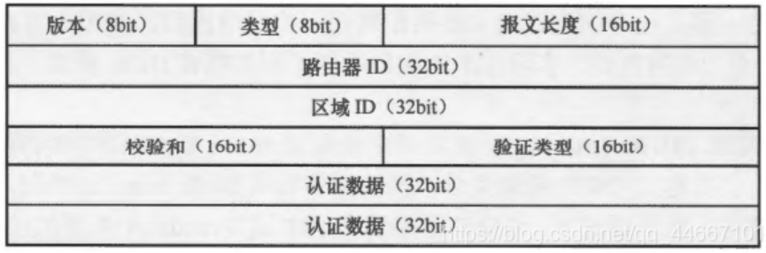
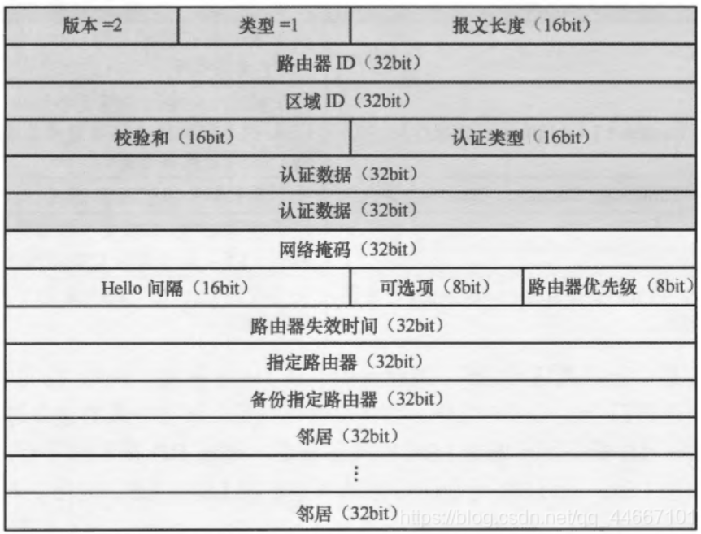
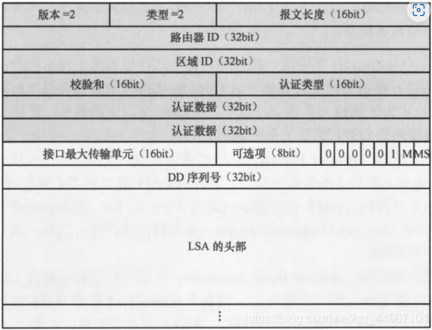
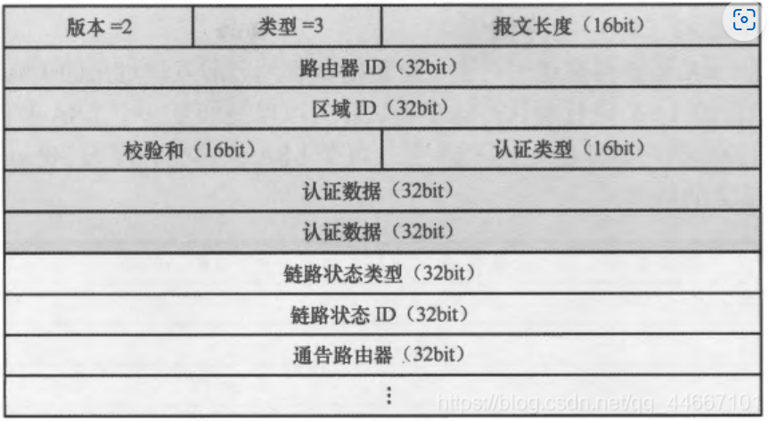
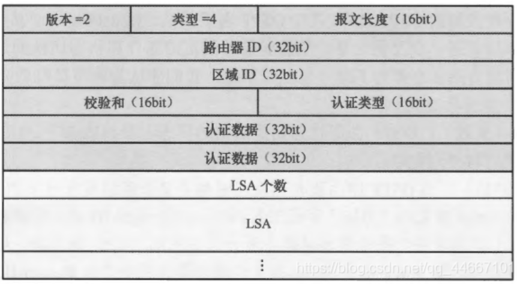
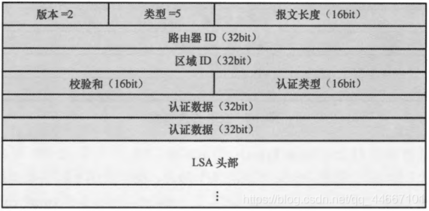
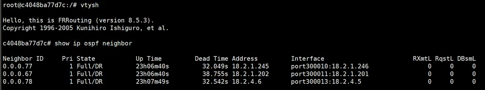

# OSFP 五种报文与七个状态

在 OSPF 中，五种报文和七种状态机密切相关。五种 OSPF 报文用于在路由器之间交换信息，而 OSPF 状态机则描述了邻居关系从初始建立到最终完全同步的过程。理解它们之间的关系有助于深入理解 OSPF 的工作机制。下面详细分析 OSPF 五种报文和七种状态机的关系。

OSPF（Open Shortest Path First）协议是一种链路状态路由协议，它通过交换多种报文来建立和维护网络的拓扑结构。OSPF 中的报文可以分为几种类型，每种类型都有特定的功能和作用。以下是 OSPF 报文的类型及其详细解释：

## OSPF五种报文

  OSPF报文头部
  

#### 1. **Hello 报文**
   - **作用**：用于发现和维护邻居关系。
   - **功能**：
     - Hello 报文是 OSPF 最基础的报文，用于发现 OSPF 路由器之间的邻居关系，并确保邻居之间的连通性。
     - 路由器通过周期性地发送 Hello 报文，通知其他路由器它的存在，并验证网络中的其他 OSPF 路由器是否仍然活跃。
     - 在 DR/BDR 选举中，Hello 报文也用于选举指定路由器（DR）和备份指定路由器（BDR）。
   - **主要字段**：
     - **Router ID**：发送报文的路由器的标识符。
     - **Hello Interval**：发送 Hello 包的时间间隔。
     - **Dead Interval**：在指定时间内未接收到 Hello 报文时，邻居被认为失效。
     - **邻居列表**：此路由器已知的邻居路由器的 ID 列表。
     - **区域 ID（Area ID）**：指定此路由器属于的 OSPF 区域。

   - **使用场景**：路由器发送 Hello 报文，定期确认和更新邻居关系，确保网络拓扑的变化可以被及时发现。
  

---

#### 2. **Database Description (DD) 报文**
   - **作用**：用于邻居之间交换链路状态数据库（LSDB）的摘要信息。
   - **功能**：
     - 当两个 OSPF 路由器之间建立邻接关系时，DD 报文用于同步它们的链路状态数据库。DD 报文包含链路状态信息的概要，帮助路由器判断它们的数据库是否同步。
     - 主路由器和从路由器通过交换 DD 报文来启动数据库同步过程。
   - **主要字段**：
     - **MTU**：链路上的最大传输单元，用于检查链路上的 MTU 一致性。
     - **Options**：用于携带 OSPF 配置选项的字段。
     - **I (Initial) 位**：用于标识 DD 序列的第一个包。
     - **M (More) 位**：指示是否有更多的 DD 包需要传输。
     - **MS (Master/Slave) 位**：标识此路由器是否为主路由器或从路由器。
     - **链路状态描述（LSA Header）**：包含每个链路状态广告（LSA）的简要描述信息。

   - **使用场景**：用于 OSPF 邻居在建立邻接关系时交换链路状态信息的摘要，确保路由器具有相同的 LSDB 基本结构。
  

---

#### 3. **Link-State Request (LSR) 报文**
   - **作用**：用于请求缺失或过期的链路状态广告（LSA）。
   - **功能**：
     - 当路由器在收到 DD 报文后，发现自己缺少某些链路状态信息时，会通过发送 LSR 报文向邻居请求这些信息。
     - LSR 报文包含请求的 LSA 的类型和标识符，确保路由器获取最新的链路状态信息。
   - **主要字段**：
     - **LSA Type**：指定请求的链路状态的类型（例如 Router LSA、Network LSA 等）。
     - **Link-State ID**：标识链路状告的具体链路状态条目。
     - **Advertising Router**：生成此链路状态的路由器的 Router ID。

   - **使用场景**：当路由器发现 LSDB 中缺少某些 LSA 或某些 LSA 需要更新时，会发送 LSR 请求邻居提供这些信息。
  

---

#### 4. **Link-State Update (LSU) 报文**
   - **作用**：用于发送一个或多个链路状态广告（LSA）。
   - **功能**：
     - LSU 报文携带一个或多个 LSA，是 OSPF 中传输链路状态信息的主要机制。
     - 当路由器接收到 LSR 报文后，会使用 LSU 报文来响应并发送请求的 LSA。
     - 当网络中的链路状态发生变化时，路由器会通过 LSU 报文将新的 LSA 传播给邻居。
   - **主要字段**：
     - **Number of LSAs**：表示该 LSU 报文中包含的 LSA 数量。
     - **LSA List**：具体包含的 LSA 列表，每个 LSA 描述了网络的某个链路状态信息。
   
   - **使用场景**：当路由器需要更新或传播链路状态信息时，它会使用 LSU 报文来发送最新的 LSA。
  

---

#### 5. **Link-State Acknowledgment (LSAck) 报文**
   - **作用**：用于确认接收到的 LSA。
   - **功能**：
     - 为了确保 OSPF 的可靠性，每当一个路由器收到 LSU 报文中的 LSA 时，它需要发送 LSAck 报文进行确认，表示该 LSA 已成功接收。
     - LSAck 报文用于避免 LSU 报文的丢失或重复传输。
   - **主要字段**：
     - **LSA Header**：用于确认的 LSA 的头部信息，表示确认了哪个 LSA。

   - **使用场景**：LSAck 报文用于确保链路状态广告的可靠传输，避免 LSA 的丢失或重复。
  

---

| 报文类型               | 功能描述                                                                                   |
|------------------------|--------------------------------------------------------------------------------------------|
| **Hello**               | 发现、建立和维护 OSPF 邻居关系，进行 DR/BDR 选举                                           |
| **Database Description (DD)** | 交换链路状态数据库的摘要信息，确保邻居之间的数据库同步                                     |
| **Link-State Request (LSR)**   | 请求缺失或过期的链路状态广告                                                          |
| **Link-State Update (LSU)**    | 传播一个或多个链路状态广告（LSA），用于更新邻居的链路状态数据库                        |
| **Link-State Acknowledgment (LSAck)** | 确认接收到的 LSA，以确保 OSPF 网络中的信息传输是可靠的                             |

### OSPF 七种状态机

#### 1. **Down 状态**
   - **描述**：这是 OSPF 邻居关系的初始状态，路由器没有收到邻居的 Hello 报文，邻居关系还未开始建立。
   - **相关报文**：在这个状态下，路由器尚未发送或接收到任何报文。路由器会周期性地发送 **Hello 报文** 尝试发现邻居。

#### 2. **Attempt 状态**
   - **描述**：此状态仅用于 NBMA 网络中，路由器主动尝试联系邻居，通过手动配置已知的邻居发送 Hello 报文。
   - **相关报文**：路由器发送 **Hello 报文**，期望与邻居建立联系。

#### 3. **Init 状态**
   - **描述**：路由器已经收到邻居的 Hello 报文，但 Hello 报文中还没有包含本路由器的 Router ID，表示邻居还未确认此路由器的存在。
   - **相关报文**：此时收到邻居的 **Hello 报文**，但还没有建立双向通信。

#### 4. **2-Way 状态**
   - **描述**：当路由器在收到的 Hello 报文中看到自己的 Router ID，表示双向通信建立。这是 OSPF 邻居建立过程中的一个关键状态。在广播和 NBMA 网络中，路由器在此状态下会进行 DR/BDR 选举。
   - **相关报文**：**Hello 报文** 继续在此阶段交换，用于维持邻居关系以及在广播网络中选举 DR 和 BDR。
   - **重要事件**：如果路由器是 DR 或 BDR，邻接关系将继续向下一个状态发展；否则，邻居关系保持在 2-Way 状态。

#### 5. **ExStart 状态**
   - **描述**：路由器和邻居准备交换链路状态数据库（LSDB）的概要信息。在这个阶段，路由器和邻居协商谁是主（Master）谁是从（Slave），以便交换链路状态信息。
   - **相关报文**：
     - **DD 报文**：此时路由器开始通过 **Database Description (DD) 报文** 交换 LSDB 的概要信息。第一批 DD 包决定主从关系（Master/Slave）。

#### 6. **Exchange 状态**
   - **描述**：在这个状态中，路由器与邻居继续交换 DD 报文，详细描述每个 LSA 的概要信息。双方将确认哪些 LSA 是最新的，哪些需要请求更新。
   - **相关报文**：
     - **DD 报文**：继续交换。
     - **LSR 报文**：如果发现 LSDB 中有信息缺失，路由器会发送 **Link-State Request (LSR) 报文** 请求邻居提供详细的 LSA。

#### 7. **Loading 状态**
   - **描述**：路由器在 Loading 状态下请求并接收缺失的 LSA，以便完成链路状态数据库的同步。此状态下，路由器已经知道需要哪些 LSA，并向邻居发送请求。
   - **相关报文**：
     - **LSR 报文**：路由器向邻居请求缺失的 LSA。
     - **LSU 报文**：邻居收到 LSR 后，发送 **Link-State Update (LSU) 报文** 进行响应，提供请求的 LSA。
     - **LSAck 报文**：收到 LSU 后，路由器会发送 **Link-State Acknowledgment (LSAck) 报文** 确认收到的 LSA。

#### 8. **Full 状态**
   - **描述**：这是 OSPF 邻居关系的最终状态，路由器与邻居的链路状态数据库（LSDB）已经完全同步。双方可以开始基于最新的 LSDB 进行路由计算。
   - **相关报文**：
     - **LSA、LSU 报文**：在 Full 状态下，OSPF 路由器会根据网络拓扑的变化定期更新 LSA，并使用 **LSU 报文** 进行传播。
     - **LSAck 报文**：仍然需要在接收到的 LSU 报文后使用 **LSAck 报文** 确认。

#### 观测方式
在Frrouting中，通过
```
vtysh
show ip ospf neighbor
```
可以观测邻居节点的建立情况

通过命令显示了该路由器的邻居ID、状态等信息。
值得注意的是，该路由器的所有neighbor都为 Full/DR，意味着每条邻居链路的OSPF状态都为最终状态，并且每个邻居路由器都为DR。这是因为网络中每个路由器都与其他多个路由器通过单独的物理链路或逻辑子网连接，并且这些链路是以太网（广播型）网络，每个子网上都可能会有一个独立的 DR 选举过程。
