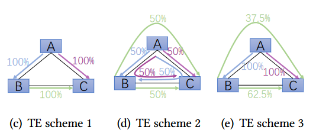

## FIGRET
FIGRET: Fine-Grained Robustness-Enhanced Traffic Engineering

### 一句话概述
FIGRET通过根据不同源-目的对的流量特征提供不同程度的鲁棒性增强，提供了一种流量工程的新方法。通过利用突发感知损失函数和深度学习技术，FIGRET能够高效地产生高质量的流量工程解决方案。

### 流量工程--处理突发流量面临的困难
流量工程中的一个主要挑战是管理突发流量。考虑到中央控制器在收集流量需求、计算新的流量工程解决方案以及更新转发规则时引入的延迟，一个流量工程系统应在实际流量到来之前，基于历史数据预计算网络配置。然而，真实网络流量本身的动态性和不可预测性使得流量预测变得非常困难。如果对流量突发准备不足，可能会导致严重的网络拥塞，进而导致延迟增加、丢包率升高以及网络吞吐量下降。因此，提高对突发流量的鲁棒性是至关重要的。
#### 现有流量工程的方法

现有的流量突发感知流量工程方案通常以牺牲正常情况下的网络性能为代价来处理流量突发问题（如图d）。现有的流量工程方案将所有流量视为突发流量，并旨在通过将流量分配到不同路径上来增强对三种突发情况的鲁棒性。在处理正常情况时，流量工程方案2的MLU为`max{(1×0.5+1×0.5+1×0.5)/2, (1×0.5+1×0.5+1×0.5)/2, (1×0.5+1×0.5+1×0.5)/2}= 0.75`，而在处理三种突发情况时，其MLU为 `max{(4×0.5+1×0.5+1×0.5)/2, (4×0.5+1×0.5+1×0.5)/2, (4×0.5+1×0.5+1×0.5)/2 } = 1.5`。也就是说，流量工程方案2在处理突发流量时表现出比流量工程方案1更好的鲁棒性，但在正常情况下的性能有所下降。总体而言，这种一刀切的方法要么导致网络无法应对突发流量，要么增强了对突发流量的处理能力，但却以牺牲非突发情况下的性能为代价。
#### motivation：如何解决上述问题
更有效的方法是根据每个源-目的对的独特特征来区分对待。图3(e)说明了这一点。流量工程方案3专门处理B→C之间的突发流量，为B→C的流量选择两条路径。而对于A→B和A→C，它选择直接路径。在流量工程方案3中，正常情况下的MLU为 `max{(1×0.375+1)/2, (1×0.375+1)/2, (1×0.625)/2}=0.6875`；当处理突发流量情况1或2时，MLU为`max{(1×0.375+4)/2, (1×0.375+1)/2, (1×0.625)/2 } = 2.1875`；处理突发流量情况3时，MLU为 `max{(4×0.375+1)/2, (4×0.375+1)/2, (4×0.625)/2 }=1.25`。可以观察到，虽然流量工程方案3在处理突发流量情况1/2时的鲁棒性不如流量工程方案2，但在正常情况和突发流量情况3下的表现都优于流量工程方案2。如果A→B和A→C的流量需求从未经历流量突发，那么流量工程方案3将比流量工程方案2更合适。也就是说，如果某个流量需求始终保持稳定，那么服务该流量需求的路径的鲁棒性就不需要过多关注（类似于流量工程方案3不考虑A → B和A → C路径的鲁棒性）。

### FIGRET设计

#### 设计指标
##### 最小化最大链路利用率
流量工程的典型目标（gemini）；
MLU是衡量吞吐量和网络对流量模式变化的弹性的合理代理指标。高MLU表明许多链路可能面临过载的危险，导致数据包丢失、流完成时间增加以及吞吐量下降。

##### 路径敏感度
路径敏感度为端到端流量分配到该链路的比例，与链路容量的比值。
$𝑆_{𝑝} = 𝑟_{𝑝}/𝐶_{𝑝}$
路径敏感度越高，对于突发流量越敏感。

#### 设计目标
在历史流量数据 $𝐷_{1}, . . . , 𝐷_{𝑡−1}$ 和TE配置 $𝑅_{𝑡}$ 之间建立映射,同时达到最小化最大链路利用率和降低路径敏感度的目标。

#### 实现方式
由于端到端的TE方法，没有显式地求解方式，本文采用FCN实现TE配置 $𝑅_{𝑡}$ 的获取。

FCN训练的输入为hist长度的流量矩阵，输出为各商品流在不同路径上的分流比。
分流比为代表下一时刻实际流量的分布情况。
结合下一时刻的实际流量，计算最大链路利用率与链路敏感度，生成loss值。
通过loss不断迭代神经网络。